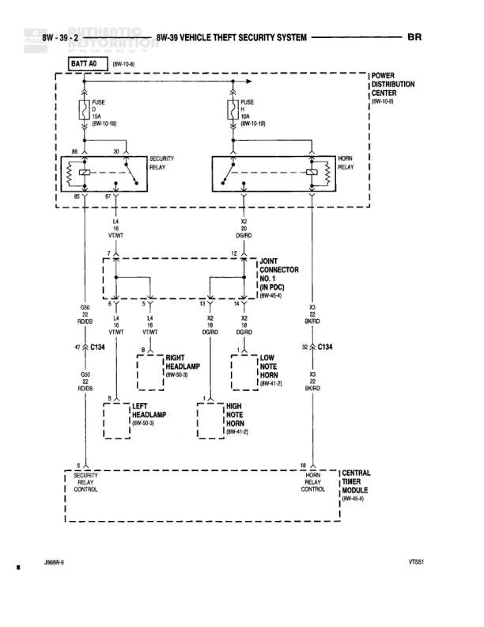

# VEHICLE THEFT SECURITY SYSTEM

**Notes:** This diagram shows the vehicle theft security system including security relay controlling headlamps and horn relay controlling horns. System is powered from BATT A0 through 10A fuses. Central Timer Module (8W-60-6) provides timing control for the security functions.

## Components

| Component | Ref | Connectors | Notes |
|-----------|-----|------------|-------|
| BATT A0 | 8W-10-10 |  | Battery feed source |
| FUSE 10A | 8W-10-16 |  | 10A fuse protecting security relay circuit |
| FUSE 10A | 8W-10-19 |  | 10A fuse protecting horn relay circuit |
| SECURITY RELAY | Power Distribution Center | 86, 30 | Controls power to headlamp and horn circuits |
| HORN RELAY | Power Distribution Center |  | Controls horn activation |
| POWER DISTRIBUTION CENTER | 8W-10-8 |  | Houses relays and fuses |
| JOINT CONNECTOR NO. 1 | 8W-PDC (8W-8-4) | 7, 13, 14, K2, X2 | Main connection junction |
| RIGHT HEADLAMP | 8W-40-3 |  | Right side headlamp |
| LEFT HEADLAMP | 8W-40-3 |  | Left side headlamp |
| LOW NOTE HORN | 8W-41-5 |  | Low frequency horn |
| HIGH NOTE HORN | 8W-41-5 |  | High frequency horn |
| SECURITY ALARM CONTROL |  |  | Main security system control module |
| HORN RELAY CONTROL |  |  | Horn relay control circuit |
| CENTRAL TIMER MODULE | 8W-60-6 |  | Controls timing functions |

## Wires

| From | To | Wire Code | Gauge | Color | Notes |
|------|-----|-----------|-------|-------|-------|
| BATT A0 | FUSE 10A (8W-10-16) | None | None | None | Battery feed to security relay fuse |
| FUSE 10A (8W-10-16) | SECURITY RELAY pin 86 | None | None | None | Fused power to security relay |
| BATT A0 | FUSE 10A (8W-10-19) | None | None | None | Battery feed to horn relay fuse |
| FUSE 10A (8W-10-19) | HORN RELAY | None | None | None | Fused power to horn relay |
| SECURITY RELAY pin 30 | JOINT CONNECTOR NO. 1 pin 13 | L4 | None | VT/WT | Violet with White tracer |
| SECURITY RELAY | JOINT CONNECTOR NO. 1 pin 7 | None | None | None | Connection from security relay |
| HORN RELAY | JOINT CONNECTOR NO. 1 pin K2 | L4 | None | DG/RD | Dark Green with Red tracer |
| JOINT CONNECTOR NO. 1 pin 7 | C134 pin 67 | None | None | None | To headlamp circuit |
| JOINT CONNECTOR NO. 1 pin 14 | C134 pin 8 | L4 | None | VT/WT | Violet with White tracer to headlamps |
| JOINT CONNECTOR NO. 1 pin K2 | C134 pin 32 | L4 | None | DG/RD | Dark Green with Red tracer to horns |
| JOINT CONNECTOR NO. 1 pin X2 | C134 | None | None | BK/RD | Black with Red tracer |
| C134 pin 67 | RIGHT HEADLAMP | None | None | None | To right headlamp |
| C134 pin 67 | LEFT HEADLAMP | None | None | None | To left headlamp |
| C134 pin 32 | LOW NOTE HORN | None | None | None | To low note horn |
| C134 pin 32 | HIGH NOTE HORN | None | None | None | To high note horn |
| SECURITY ALARM CONTROL | SECURITY RELAY | None | None | None | Control signal to security relay |
| HORN RELAY CONTROL | HORN RELAY | None | None | None | Control signal to horn relay |
| CENTRAL TIMER MODULE | HORN RELAY CONTROL | None | None | None | Timer control connection |

## Splices & Grounds

| ID | Type | Location | Wires Connected | Notes |
|----|------|----------|-----------------|-------|
| G50 | ground | Near Joint Connector No. 1 pin 7 | Z2 | Ground for headlamp circuit |
| G50 | ground | Near Joint Connector No. 1 pin 14 | Z2 | Ground for headlamp circuit |
| G50 | ground | Near Joint Connector No. 1 pin K2 | Z2 | Ground for horn circuit |

## Cross-References

- 8W-10-10
- 8W-10-16
- 8W-10-19
- 8W-10-8
- 8W-8-4
- 8W-40-3
- 8W-41-5
- 8W-60-6
