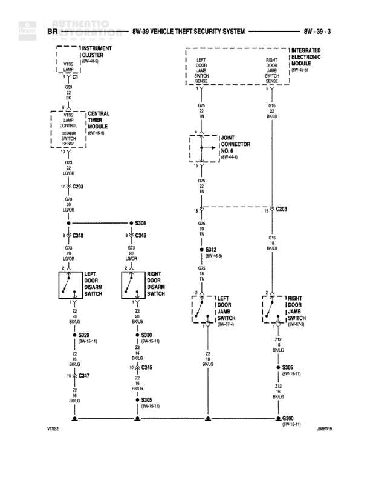

# VEHICLE THEFT SECURITY SYSTEM

**Notes:** This diagram shows the Vehicle Theft Security System (VTSS) with connections to door jamb switches, ajar switches, and the central timer module. The system monitors door status and controls door lock operations. Ground points VT882 and 2W8W-9 are shown at bottom.

## Components

| Component | Ref | Connectors | Notes |
|-----------|-----|------------|-------|
| Instrument Cluster | 8W-40-5 | C1 | VTSS lamp output |
| Central Timer Module | 8W-61-5 | C203 | Controls door locks via DR/ON switch |
| Left Door Jamb Switch | 8W-44-4 |  | None |
| Right Door Jamb Switch | 8W-44-4 |  | None |
| Integrated Electronic Module | 8W-44-6 |  | IEM-4.0 |
| Joint Connector | 8W-44-6 | C203 | None |
| Left Door Ajar Switch | 8W-45-11 |  | None |
| Right Door Ajar Switch | 8W-45-11 |  | None |
| Left Front Door Jamb Switch | 8W-47-4 |  | None |
| Right Front Door Jamb Switch | 8W-47-3 |  | None |

## Wires

| From | To | Wire Code | Gauge | Color | Notes |
|------|-----|-----------|-------|-------|-------|
| Instrument Cluster C1 | Central Timer Module C203 pin 17 | G69 | 22 | BK | VTSS lamp |
| Central Timer Module C203 pin 17 | Splice S348 | G73 | 18 | LG/OR | Left door unlock |
| Splice S348 | Left Door Ajar Switch | G73 | 18 | LG/OR | None |
| Splice S348 | Splice C346 | G73 | 18 | LG/OR | None |
| Splice C346 | Right Door Ajar Switch | G73 | 18 | LG/OR | None |
| Left Door Ajar Switch | Splice S329 | Z2 | 22 | BK/LG | None |
| Right Door Ajar Switch | Splice C345 | Z2 | 22 | BK/LG | None |
| Splice C345 | Splice S305 | Z2 | 22 | BK/LG | None |
| Splice C347 | Splice C345 | Z2 | 22 | BK/LG | None |
| Splice C347 | Splice S329 | Z2 | 22 | BK/LG | None |
| Left Door Jamb Switch | Joint Connector | D75 | 18 | TN | None |
| Right Door Jamb Switch | Joint Connector | D16 | 18 | BK/LG | None |
| Joint Connector | Splice S312 | D75 | 18 | TN | None |
| Joint Connector | Splice C203 pin 18 | D75 | 18 | TN | None |
| Splice S312 | Left Front Door Jamb Switch | D75 | 18 | TN | None |
| Splice C203 pin 18 | Right Front Door Jamb Switch | D75 | 18 | TN | None |
| Left Front Door Jamb Switch | Ground G300 | Z2 | 22 | BK/LG | None |
| Right Front Door Jamb Switch | Splice S305 | Z2 | 22 | BK/LG | None |

## Splices & Grounds

| ID | Type | Location | Wires Connected | Notes |
|----|------|----------|-----------------|-------|
| S308 | splice | Between Central Timer Module and door switches | G73 | None |
| S348 | splice | Left door unlock circuit | G73 | None |
| C346 | splice | Right door unlock circuit | G73 | None |
| S329 | splice | 8W-15-11 | Z2 | Left side ground distribution |
| S330 | splice | 8W-15-11 | Z2 | Right side ground distribution |
| C345 | splice | Right side ground junction | Z2 | None |
| C347 | splice | Ground junction between left and right | Z2 | None |
| S305 | splice | 8W-15-11 | Z2 | None |
| S312 | splice | 8W-45-8 | D75 | None |
| S305 | splice | 8W-15-11 | Z2 | None |
| G300 | ground | 8W-15-11 |  | 2W8W-9 |

## Cross-References

- 8W-40-5
- 8W-61-5
- 8W-44-4
- 8W-44-6
- 8W-45-11
- 8W-47-4
- 8W-47-3
- 8W-15-11
