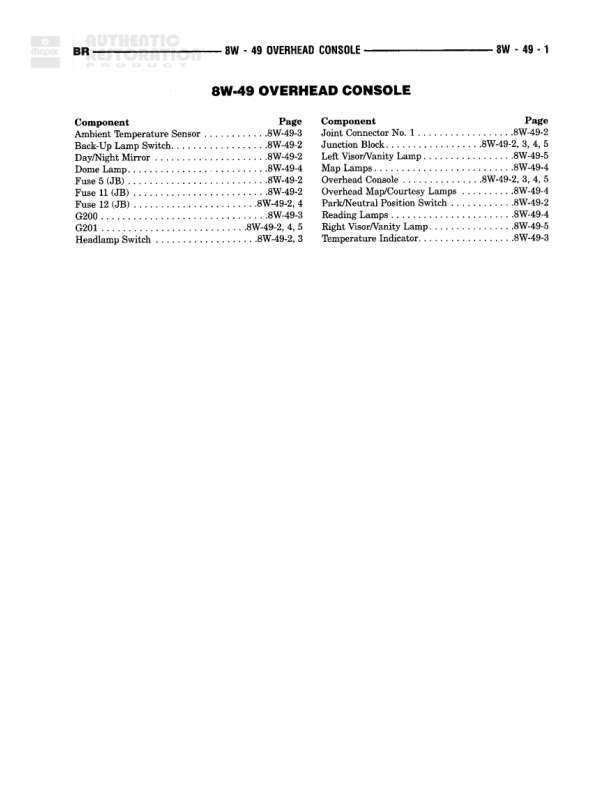

# 8W-40 INSTRUMENT CLUSTER

**Notes:** This is an index page for the 8W-40 Instrument Cluster section, listing all components and their corresponding diagram page references. Actual wiring connections would be shown on the individual sub-diagrams (8W-40-2 through 8W-40-6).

## Components

| Component | Ref | Connectors | Notes |
|-----------|-----|------------|-------|
| Brake Fluid Module | 8W-40-5 |  |  |
| Daytime Running Lamp Module | 8W-40-2, 6 |  |  |
| Fog Lamp Relay No. 2 | 8W-40-6 |  |  |
| Fuse 1 (JB) | 8W-40-4 |  |  |
| Fuse 14 (JB) | 8W-40-4 |  |  |
| Fuse 14 (C/B) | 8W-40-4 |  |  |
| Fuse 17 (JB) | 8W-40-2 |  |  |
| G107 | 8W-40-5 |  | Ground |
| G200 | 8W-40-2 |  | Ground |
| G201 | 8W-40-2, 4, 6 |  | Ground |
| Headlamp Dimmer Switch | 8W-40-6 |  |  |
| Hazard Switch | 8W-40-4 |  |  |
| High Beam Indicator | 8W-40-6 |  |  |
| Instrument Cluster | 8W-40-2, 3, 4, 5, 6 |  |  |
| Integrated Electronic Module | 8W-40-3 |  |  |
| Joint Connector No. 3 | 8W-40-5 |  |  |
| Joint Connector No. 4 | 8W-40-3 |  |  |
| Joint Connector No. 5 | 8W-40-4 |  |  |
| Joint Connector No. 6 | 8W-40-2 |  |  |
| Joint Connector No. 7 | 8W-40-3 |  |  |
| Junction Block | 8W-40-2, 3, 4, 5 |  |  |
| Low Coolant Indicator | 8W-40-5 |  |  |
| Low Washer Fluid Switch | 8W-40-3 |  |  |
| Overdrive Indicator | 8W-40-5 |  |  |
| Park Brake Indicator | 8W-40-2 |  |  |
| Park Brake Switch | 8W-40-2 |  |  |
| Powertrain Control Module | 8W-40-2, 5 |  |  |
| Right Turn Signal Indicator | 8W-40-6 |  |  |
| Speed Control Switch | 8W-40-3 |  |  |
| Turn Signal/Hazard Switch | 8W-40-6 |  |  |
| Viss Indicator | 8W-40-5 |  |  |
| Wait To Start Indicator | 8W-40-2 |  |  |

## Splices & Grounds

| ID | Type | Location | Wires Connected | Notes |
|----|------|----------|-----------------|-------|
| G107 | ground | See diagram 8W-40-5 |  |  |
| G200 | ground | See diagram 8W-40-2 |  |  |
| G201 | ground | See diagrams 8W-40-2, 4, 6 |  |  |

## Cross-References

- 8W-40-2
- 8W-40-3
- 8W-40-4
- 8W-40-5
- 8W-40-6
