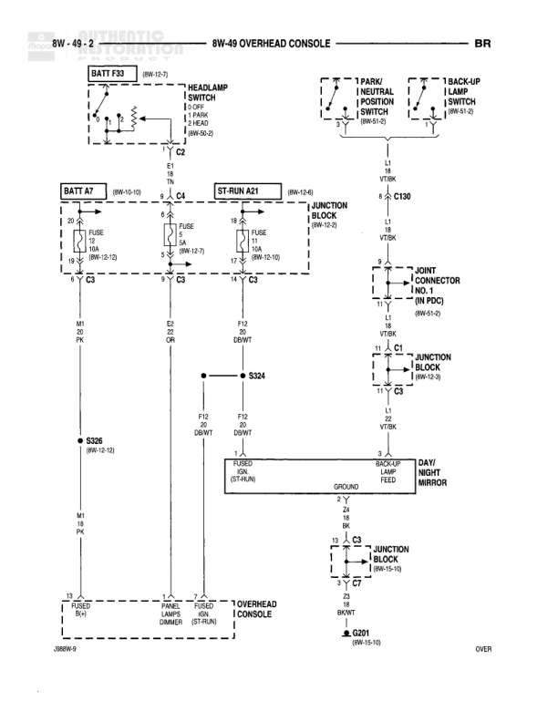

# 8W-40 INSTRUMENT CLUSTER

**Notes:** This diagram shows the instrument cluster wiring for both gas and diesel engines. The Wait to Start indicator is diesel-only (note on right indicator). Ground connections G200 and G201 are referenced. Park brake switch connects through Joint Connector No. 8. Diagram reference: J6BRV-9, IC1 marking at bottom right.

## Components

| Component | Ref | Connectors | Notes |
|-----------|-----|------------|-------|
| ST-RUN A21 | 8W-12-6 | C5 | Junction Block |
| BATT A7 | 8W-10-10 | C8 | Junction Block |
| WAIT TO START INDICATOR |  | C1 | Left indicator in cluster |
| WAIT TO START INDICATOR |  | C1 | Right indicator in cluster |
| PARK BRAKE INDICATOR |  | C1 | Center indicator in cluster |
| INSTRUMENT CLUSTER |  | C1 | Main component |
| JOINT CONNECTOR NO. 8 | 8W-13-10 |  |  |
| PARK BRAKE SWITCH |  | C134 |  |
| POWERTRAIN CONTROL MODULE | 8W-10-38 | C2 |  |
| DAYTIME RUNNING LAMP MODULE | 8W-50-6 |  |  |

## Wires

| From | To | Wire Code | Gauge | Color | Notes |
|------|-----|-----------|-------|-------|-------|
| ST-RUN A21/Pin 3 | C5 Fuse 10A | Q5 | 20 | DB/WT |  |
| BATT A7/Pin 2 | C8 Fuse 10A | F73 | 20 | RD |  |
| C5 | INSTRUMENT CLUSTER C1 | Q5 | 20 | DB/WT | Pin 10 of C1 |
| C8 | INSTRUMENT CLUSTER C1 | F73 | 20 | RD | Pin 8 of C1 |
| WAIT TO START INDICATOR C1 | Ground | G4 | 20 | OR/BK | Left indicator |
| WAIT TO START INDICATOR C1 | Ground | G4 | 20 | OR/BK | Right indicator - Diesel only |
| PARK BRAKE INDICATOR C1 | Ground | G11 | 20 | WT/LG | Pin 2 of C1 |
| INSTRUMENT CLUSTER C1 Pin 9 | Ground | Z1 | 20 | BK/OR |  |
| INSTRUMENT CLUSTER C1 Pin 20 | Ground | Z1 | 20 | BK/LG |  |
| C1 Pin 9 | G200 | Z1 | 20 | BK/OR | 8W-15-6 |
| C1 Pin 20 | G201 | Z1 | 20 | BK/LG | 8W-15-10 |
| C134 | JOINT CONNECTOR NO. 8 | G11 | 13 | WT/LG |  |
| JOINT CONNECTOR NO. 8 | INSTRUMENT CLUSTER C1 Pin 2 | G11 | 20 | WT/LG |  |
| C130 | C134 | G4 | 20 | OR/BK | Diesel only - Pin 10 to Pin 35 |
| C134 Pin 30 | PARK BRAKE SWITCH | G11 | 20 | WT/LG |  |
| POWERTRAIN CONTROL MODULE C2 Pin 20 | C2 connection | G4 | 20 | OR/BK |  |
| DAYTIME RUNNING LAMP MODULE Pin 3 | connection | G11 | 20 | WT/LG |  |

## Splices & Grounds

| ID | Type | Location | Wires Connected | Notes |
|----|------|----------|-----------------|-------|
| C5 | connector | From ST-RUN A21 Junction Block | Q5 | Fuse 10A |
| C8 | connector | From BATT A7 Junction Block | F73 | Fuse 10A |
| G200 | ground | Ground point for Z1 |  | 8W-15-6 |
| G201 | ground | Ground point for Z1 |  | 8W-15-10 |
| C134 | connector | Between Park Brake Switch and other circuits | G4, G11 | Gas and Diesel routing |
| C130 | connector | Diesel circuit only | G4 | Gas not used |

## Cross-References

- 8W-12-6
- 8W-10-10
- 8W-15-6
- 8W-15-10
- 8W-13-10
- 8W-10-38
- 8W-50-6
