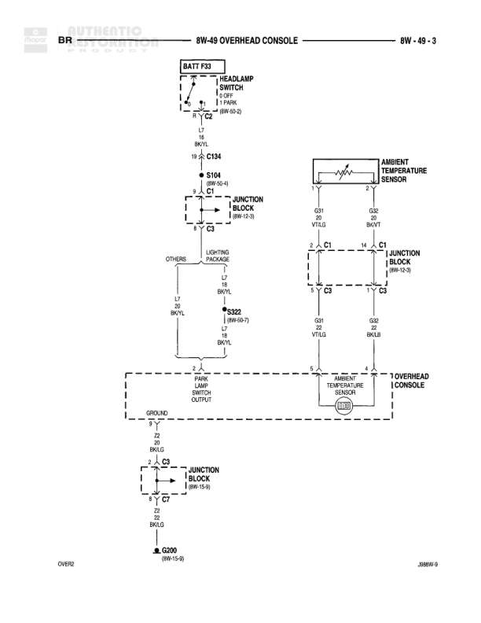

# Instrument Cluster Wiring

**Notes:** Diagram shows instrument cluster wiring including low washer fluid lamp, seat belt lamp, CCD bus connections to integrated electronic module, and associated ground circuits. Power is supplied from battery feed A7 through a 10A fuse in the junction block.

## Components

| Component | Ref | Connectors | Notes |
|-----------|-----|------------|-------|
| Instrument Cluster | 8W-40-3 | C1, C2 | Main instrument cluster assembly |
| Low Washer Lamp | instrument cluster |  | Low washer fluid indicator lamp |
| Seat Belt Lamp | instrument cluster |  | Seat belt warning lamp |
| Tone Request | instrument cluster |  | Audio tone request module within cluster |
| Junction Block | 8W-12-2 |  | Main power distribution junction block |
| Integrated Electronic Module | 8W-45-3 |  | Central control module |
| Washer Fluid Switch | washer fluid reservoir | C360, C362 | Low washer fluid level switch |
| Seatbelt Switch | 8W-43-8 | C362 | Seatbelt buckle switch |
| Joint Connector No. 4 | 8W-13-8 |  | Inline connector |
| Joint Connector No. 7 | 8W-30-8 |  | Inline connector |

## Wires

| From | To | Wire Code | Gauge | Color | Notes |
|------|-----|-----------|-------|-------|-------|
| BATT A7 (Junction Block) | FUSE 23 | A7 | None | BR | Battery feed from 8W-10-10 |
| FUSE 23 (10A) | Splice C8 | A7 | None | BR | 10A fuse in junction block 8W-12-7 |
| Splice C8 | Connector C1 (Instrument Cluster) | A7 | None | BR | To instrument cluster power |
| Low Washer Lamp | Splice C8 | G9 | 20 | LG/RD | Low washer lamp ground |
| Seat Belt Lamp | Connector C2 (Instrument Cluster) | G19 | None | LG/RD | Seat belt lamp to cluster C2 |
| Connector C2 (Instrument Cluster) | Splice C2 | G13 | None | GR/RD | Ground circuit from cluster |
| Connector C1 (Instrument Cluster) | Connector C1 (Integrated Electronic Module) | D1 | 20 | VT/BR | CCD bus - diagnostic circuit |
| Connector C1 (Instrument Cluster) | Connector C1 (Integrated Electronic Module) | D2 | 20 | WT/BK | CCD bus - diagnostic circuit |
| Connector C1 (Instrument Cluster) | C134 | G9 | 20 | LG/RD | Ground wire to connector C134 |
| C134 | C360 | G9 | 20 | LG/RD | Ground continuation |
| Connector C2 (Instrument Cluster) | C303 | G19 | 20 | LG/RD | Seat belt lamp circuit |
| C303 | C360 | G19 | 20 | LG/RD | Continuation to C360 |
| C360 | Washer Fluid Switch | G19 | 20 | LG/RD | To washer fluid switch terminal 1 |
| Washer Fluid Switch | C362 | G9 | 20 | LG/RD | From washer fluid switch terminal 2 |
| C362 | Seatbelt Switch | G19 | 20 | LG/RD | To seatbelt switch terminal 1 |
| Seatbelt Switch | Joint Connector No. 4 | G13 | 18 | BK | Ground from seatbelt switch terminal 2 |
| Joint Connector No. 4 | G100 | Z1 | 18 | BK | To ground point G100 (8W-12-4) |
| Connector C1 (Instrument Cluster) | Joint Connector No. 7 | D1 | 20 | VT/BR | CCD bus continuation arrow out |
| Connector C1 (Instrument Cluster) | Joint Connector No. 7 | D2 | 20 | WT/BK | CCD bus continuation arrow out |

## Splices & Grounds

| ID | Type | Location | Wires Connected | Notes |
|----|------|----------|-----------------|-------|
| C8 | splice | Near instrument cluster | A7 | Power distribution splice |
| C2 | splice | Near instrument cluster | G13 | Ground splice |
| G100 | ground | 8W-12-4 |  | Main ground point |

## Cross-References

- 8W-10-10
- 8W-12-2
- 8W-12-7
- 8W-45-3
- 8W-43-8
- 8W-13-8
- 8W-30-8
- 8W-12-4
