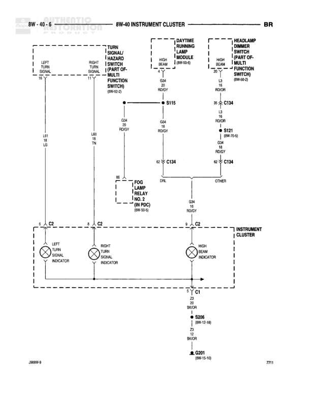

# INSTRUMENT CLUSTER

**Notes:** Diagram shows instrument cluster indicator circuits for turn signals, high beam, and fog lamp. Turn signals are fed from multi-function switch, high beam from both DRL module and headlamp dimmer switch. All indicators share common ground through Z2 circuit to G301.

## Components

| Component | Ref | Connectors | Notes |
|-----------|-----|------------|-------|
| LEFT TURN SIGNAL | Left side of instrument cluster | C2 | Left turn signal indicator |
| RIGHT TURN SIGNAL | Center of instrument cluster | C2 | Right turn signal indicator |
| HIGH BEAM INDICATOR | Right side of instrument cluster | C2 | High beam indicator |
| TURN SIGNAL/HAZARD SWITCH (MULTI FUNCTION SWITCH) | 8W-6-2 |  | Left turn signal output |
| TURN SIGNAL/HAZARD SWITCH (MULTI FUNCTION SWITCH) | 8W-6-2 |  | Right turn signal output |
| DAYTIME RUNNING LAMP MODULE | 8W-20-6 |  | High beam signal output |
| HEADLAMP DIMMER SWITCH (PART OF MULTI FUNCTION SWITCH) | 8W-20-3 |  | High beam signal output |
| FOG LAMP RELAY (LOCATED IN PDC) | 8W-50-6 |  | Fog lamp indicator signal |
| INSTRUMENT CLUSTER | 8W-40-6 | C1, C2 | Main instrument cluster assembly |

## Wires

| From | To | Wire Code | Gauge | Color | Notes |
|------|-----|-----------|-------|-------|-------|
| LEFT TURN SIGNAL SWITCH (8W-6-2) | S115 | L41 | 18 | LG | Left turn signal feed |
| RIGHT TURN SIGNAL SWITCH (8W-6-2) | S115 | L40 | 18 | TN | Right turn signal feed |
| S115 | C134 pin 30 | G34 | 20 | RD/GY | None |
| C134 pin 30 | C134 pin 62 | G34 | 20 | RD/GY | None |
| C134 pin 62 | FOG LAMP RELAY | B6 | None | None | Continues to fog lamp relay |
| DAYTIME RUNNING LAMP MODULE (8W-20-6) | C134 pin 30 | G34 | 20 | RD/GY | High beam feed from DRL module |
| HEADLAMP DIMMER SWITCH (8W-20-3) | S121 | L3 | 18 | RD/OR | High beam feed from dimmer switch |
| S121 | C134 pin 62 | L3 | 18 | RD/OR | To instrument cluster |
| C134 pin 62 | C134 pin 62 | G34 | 20 | RD/GY | Internal cluster connection |
| FOG LAMP RELAY | C134 | G34 | 20 | RD/GY | Fog lamp indicator signal |
| C134 | LEFT TURN SIGNAL INDICATOR | None | None | None | Internal cluster connection via C2 |
| C134 | RIGHT TURN SIGNAL INDICATOR | None | None | None | Internal cluster connection via C2 |
| C134 | HIGH BEAM INDICATOR | None | None | None | Internal cluster connection via C2 |
| INSTRUMENT CLUSTER C1 | S206 | Z2 | 20 | BK/OR | Ground connection from cluster |
| S206 | G301 | Z2 | 12 | BK/OR | Ground to main ground point |

## Splices & Grounds

| ID | Type | Location | Wires Connected | Notes |
|----|------|----------|-----------------|-------|
| S115 | splice | Turn signal circuit junction | L41, L40, G34 | Combines left and right turn signals |
| S121 | splice | High beam circuit junction | L3 | High beam signal distribution (8W-10-6) |
| S206 | splice | Ground splice | Z2 | Instrument cluster ground splice (8W-12-18) |
| G301 | ground | Main ground point |  | Ground reference (8W-15-10) |

## Cross-References

- 8W-6-2
- 8W-20-6
- 8W-20-3
- 8W-50-6
- 8W-10-6
- 8W-12-18
- 8W-15-10
