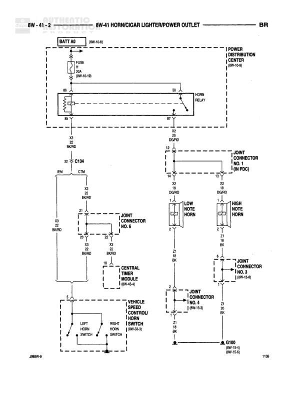

# HORN/CIGAR LIGHTER/POWER OUTLET

**Notes:** This diagram shows the horn circuit with relay control through the Central Timer Module, along with dual-tone horn configuration (low note and high note). The horn switches are integrated into the vehicle speed control/horn switch assembly. Ground connections are distributed through multiple splice points and terminate at G100.

## Components

| Component | Ref | Connectors | Notes |
|-----------|-----|------------|-------|
| BATT 40 | 8W-10-6 |  | Battery feed source |
| FUSE | 8W-10-19 |  | 20A fuse |
| HORN RELAY | Power Distribution Center (8W-10-8) |  | Located in Power Distribution Center |
| CENTRAL TIMER MODULE | 8W-45-1 | C134 | Controls horn timing |
| VEHICLE SPEED CONTROL/HORN SWITCH | 8W-30-3 |  | Left and Right horn switch inputs |
| LOW NOTE HORN | Joint Connector No. 6 |  |  |
| HIGH NOTE HORN | Joint Connector No. 3 (8W-15-6) |  |  |

## Wires

| From | To | Wire Code | Gauge | Color | Notes |
|------|-----|-----------|-------|-------|-------|
| BATT 40 | FUSE | A | 12 | RD |  |
| FUSE | HORN RELAY Pin 30 | A | 12 | RD |  |
| HORN RELAY Pin 86 | BK6RD | Z | 20 | BK/RD |  |
| HORN RELAY Pin 87 | Joint Connector No. 1 | L | 14 | DG/RD |  |
| HORN RELAY Pin 85 | C134 | F | 20 | DG/RD |  |
| C134 Pin 6M | BK6RD | Z | 20 | BK/RD |  |
| C134 | CENTRAL TIMER MODULE | CTM | None |  |  |
| CENTRAL TIMER MODULE | BK6RD | Z | 20 | BK/RD |  |
| CENTRAL TIMER MODULE | Joint Connector No. 6 | L | 20 | TN |  |
| Joint Connector No. 1 | LOW NOTE HORN | L | 14 | DG/RD |  |
| Joint Connector No. 1 | HIGH NOTE HORN | L | 14 | DG/RD |  |
| LOW NOTE HORN | BK6RD | Z | 18 | BK |  |
| HIGH NOTE HORN | Joint Connector No. 3 | Z | 18 | BK |  |
| Joint Connector No. 6 | LEFT HORN SWITCH | L | 20 | TN |  |
| Joint Connector No. 6 | RIGHT HORN SWITCH | L | 20 | TN |  |
| LEFT HORN SWITCH | BK6RD | Z | 20 | BK |  |
| RIGHT HORN SWITCH | BK6RD | Z | 20 | BK |  |
| Joint Connector No. 3 | Joint Connector No. 4 | Z | 18 | BK |  |
| Joint Connector No. 4 | G100 | Z | 18 | BK |  |

## Splices & Grounds

| ID | Type | Location | Wires Connected | Notes |
|----|------|----------|-----------------|-------|
| BK6RD | splice | Multiple locations throughout diagram | Z20, Z20, Z20, Z20 | Common ground splice point |
| G100 | ground | 8W-15-6 |  | Main ground point for horn circuit |

## Cross-References

- 8W-10-6
- 8W-10-19
- 8W-10-8
- 8W-45-1
- 8W-30-3
- 8W-15-6
