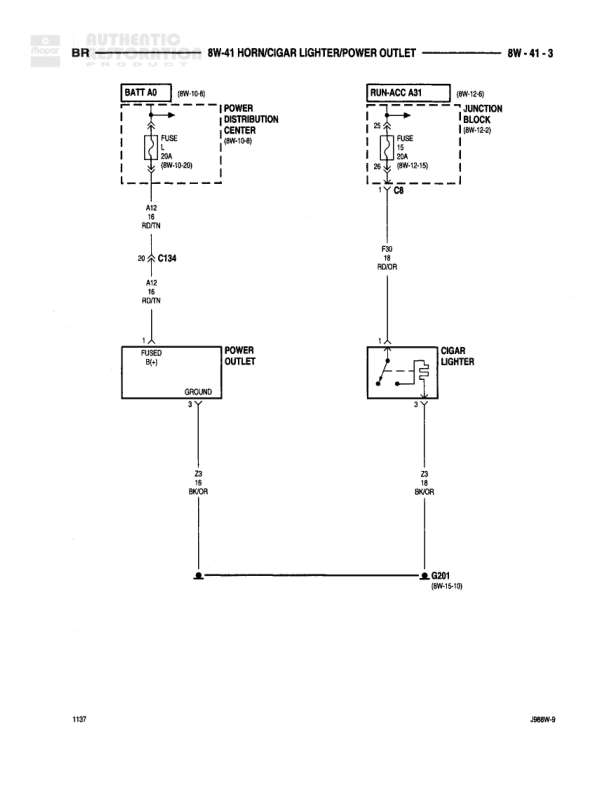

# HORN/CIGAR LIGHTER/POWER OUTLET

**Notes:** Diagram shows power distribution for horn/cigar lighter/power outlet circuits. Power outlet receives constant battery power through FUSE 20, while cigar lighter receives ignition-switched power through FUSE 18. Both share common ground G201.

## Components

| Component | Ref | Connectors | Notes |
|-----------|-----|------------|-------|
| BATT A0 | 8W-10-6 |  | Battery feed source |
| POWER DISTRIBUTION CENTER | 8W-10-6 |  | Contains FUSE 20 |
| RUN-ACC A31 | 8W-12-6 |  | Run-Accessory power source |
| JUNCTION BLOCK | 8W-12-5 |  | Contains FUSE 18 |
| POWER OUTLET | FUSED RN1 |  | Grounded connection |
| CIGAR LIGHTER |  |  | 3-pin connector |

## Wires

| From | To | Wire Code | Gauge | Color | Notes |
|------|-----|-----------|-------|-------|-------|
| BATT A0 | POWER DISTRIBUTION CENTER FUSE 20 | A12 | 20 | WT/OR | From 8W-10-6 |
| POWER DISTRIBUTION CENTER FUSE 20 | C134 | A12 | 20 | RD/TN |  |
| C134 | POWER OUTLET RN1 | A12 | 20 | RD/TN |  |
| POWER OUTLET pin 3 | G201 | Z2 | 18 | BK/OR | Ground wire |
| RUN-ACC A31 | JUNCTION BLOCK FUSE 18 | A31 | 18 | BL/RD | From 8W-12-6 |
| JUNCTION BLOCK FUSE 18 | CIGAR LIGHTER | F20 | 18 | RD/OR |  |
| JUNCTION BLOCK | C8 | A31 | 20 | BL/RD | From 8W-12-5 |
| CIGAR LIGHTER pin 1 | G201 | Z2 | 18 | BK/OR | Ground wire |

## Splices & Grounds

| ID | Type | Location | Wires Connected | Notes |
|----|------|----------|-----------------|-------|
| C134 | connector | Between battery feed and power outlet | A12 | In-line connector |
| C8 | connector | Between junction block and cigar lighter | A31, F20 | In-line connector |
| G201 | ground | Common ground point |  | Shared ground for power outlet and cigar lighter, reference 8W-15-10 |

## Cross-References

- 8W-10-6
- 8W-12-6
- 8W-12-5
- 8W-15-10
