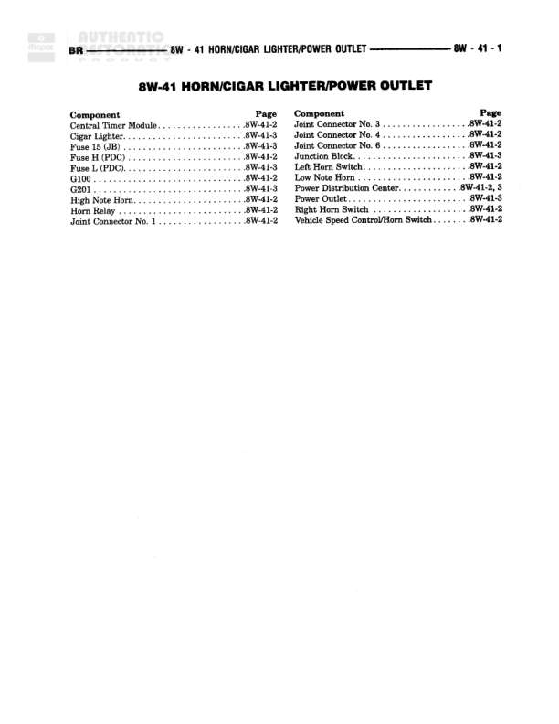

# HORN/CIGAR LIGHTER/POWER OUTLET

**Notes:** This is an index page showing component locations across diagrams 8W-41-2 and 8W-41-3. No actual wiring diagram is shown on this page.

## Components

| Component | Ref | Connectors | Notes |
|-----------|-----|------------|-------|
| Central Timer Module | 8W-41-2 |  | None |
| Cigar Lighter | 8W-41-3 |  | None |
| Fuse 15 (JB) | 8W-41-3 |  | None |
| Fuse H (PDC) | 8W-41-2 |  | None |
| Fuse L (PDC) | 8W-41-3 |  | None |
| G100 | 8W-41-3 |  | None |
| G301 | 8W-41-3 |  | None |
| High Note Horn | 8W-41-2 |  | None |
| Horn Relay | 8W-41-2 |  | None |
| Joint Connector No. 1 | 8W-41-2 |  | None |
| Joint Connector No. 3 | 8W-41-2 |  | None |
| Joint Connector No. 4 | 8W-41-2 |  | None |
| Joint Connector No. 6 | 8W-41-2 |  | None |
| Junction Block | 8W-41-3 |  | None |
| Left Horn Switch | 8W-41-2 |  | None |
| Low Note Horn | 8W-41-2 |  | None |
| Power Distribution Center | 8W-41-2, 3 |  | None |
| Power Outlet | 8W-41-3 |  | None |
| Right Horn Switch | 8W-41-2 |  | None |
| Vehicle Speed Control/Horn Switch | 8W-41-2 |  | None |

## Cross-References

- 8W-41-2
- 8W-41-3
