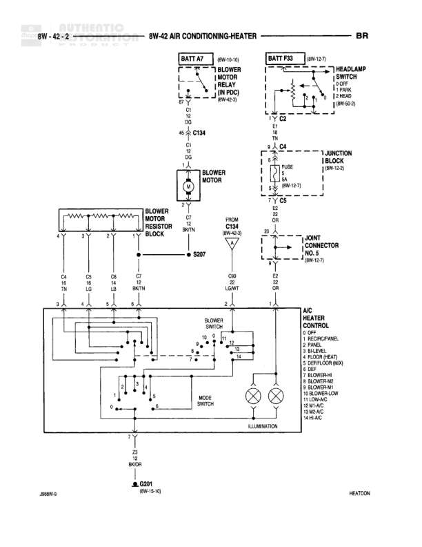

# AIR CONDITIONING-HEATER

**Notes:** Diagram shows air conditioning and heater blower motor control system with resistor block for speed control. Includes illumination circuit for control panel. Multiple switch positions control blower speed, mode selection, and AC functions.

## Components

| Component | Ref | Connectors | Notes |
|-----------|-----|------------|-------|
| BLOWER MOTOR RELAY (IN PDC) | 8W-10-0, 8W-42-3 | C1, C2, C3, C4 | Located in Power Distribution Center |
| BLOWER MOTOR | Local |  | Main blower motor |
| BLOWER MOTOR RESISTOR BLOCK | Local |  | Controls blower speed with resistors |
| BLOWER SWITCH | Local |  | Multi-position switch for blower control |
| MODE SWITCH | Local |  | Controls air distribution mode |
| HEATER CONTROL | Local |  | Panel with multiple functions: OFF, RECIRC/PANEL, AC, BI-LEVEL, FLOOR (HEAT), FLOOR-DEF (MIX), DEFROST, BLOWER-HI, BLOWER-MC, BLOWER-ML, BLOWER-LOW, LO/VAC, MED/VAC, HI/VAC, VT/R-AC |
| HEADLAMP SWITCH | 8W-10-0, 8W-50-2 |  | Controls illumination circuit |
| JUNCTION BLOCK | 8W-10-5 | C4, C5 | Contains FUSE 5A (8W-12-7) |
| JOINT CONNECTOR NO. 5 | 8W-10-7 | B2, D2 | Junction point for connections |
| ILLUMINATION | Local |  | Two bulb symbols shown |

## Wires

| From | To | Wire Code | Gauge | Color | Notes |
|------|-----|-----------|-------|-------|-------|
| BATT A7 | BLOWER MOTOR RELAY C1 | A7 | None | None | Battery feed to relay, references 8W-10-0 |
| BLOWER MOTOR RELAY C3 | Splice C134 | C7 | None | None | None |
| Splice C134 | BLOWER MOTOR | C7 | None | None | None |
| BLOWER MOTOR | BLOWER MOTOR RESISTOR BLOCK | C7 | None | None | Connection point S207 |
| BLOWER MOTOR RESISTOR BLOCK position 1 | BLOWER SWITCH | C4 | None | BR/WT | None |
| BLOWER MOTOR RESISTOR BLOCK position 2 | BLOWER SWITCH | C5 | None | TN/WT | None |
| BLOWER MOTOR RESISTOR BLOCK position 3 | BLOWER SWITCH | C6 | None | WT/BK | None |
| BLOWER MOTOR RESISTOR BLOCK position 4 | BLOWER SWITCH | C7 | None | BR/OR | None |
| BATT F33 | HEADLAMP SWITCH | F33 | None | None | References 8W-12-7 |
| HEADLAMP SWITCH C2 | JUNCTION BLOCK C4 | E2 | None | None | Fuse connection TN |
| JUNCTION BLOCK C5 | JOINT CONNECTOR NO. 5 | E2 | None | None | FUSE 5A (8W-12-7) |
| Splice C134 | JOINT CONNECTOR NO. 5 | C7 | None | BR/OR | FROM C134 (8W-42-3) |
| JOINT CONNECTOR NO. 5 B2 | HEATER CONTROL | B2 | None | D2 | None |
| JOINT CONNECTOR NO. 5 D2 | HEATER CONTROL | D2 | None | None | None |
| HEATER CONTROL | MODE SWITCH | None | None | None | Multiple connection points for control panel |
| HEATER CONTROL | ILLUMINATION | C30 | None | LG/WT | Two bulb connections |
| ILLUMINATION | Ground Z301 | Z2 | None | BK/OR | None |

## Splices & Grounds

| ID | Type | Location | Wires Connected | Notes |
|----|------|----------|-----------------|-------|
| C134 | splice | Between blower motor relay and blower motor/joint connector | C7 | Distributes power from relay |
| S207 | splice | Connection between blower motor and resistor block | C7 | None |
| Z301 | ground | Ground point for illumination circuit |  | References 8W-10-16 |

## Cross-References

- 8W-10-0
- 8W-42-3
- 8W-10-5
- 8W-12-7
- 8W-10-7
- 8W-50-2
- 8W-10-16
