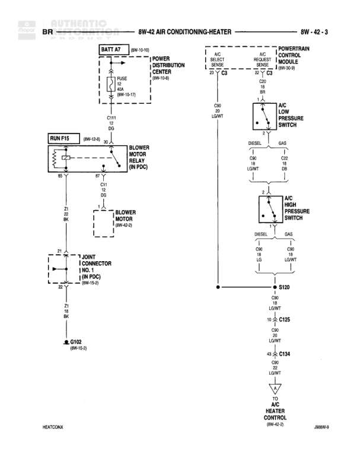

# AIR CONDITIONING-HEATER

**Notes:** This diagram shows the air conditioning and heater system wiring. The blower motor is controlled by a relay in the PDC. The A/C system has separate high and low pressure switches for diesel and gas applications. The A/C request and select switches connect to the Powertrain Control Module for A/C compressor control.

## Components

| Component | Ref | Connectors | Notes |
|-----------|-----|------------|-------|
| BATT AT | 8W-10-10 |  | Battery connection point |
| FUSE | 8W-10-17 |  | Fuse protection for blower circuit |
| RUN F15 | 8W-12-8 |  | Run circuit fuse connection |
| BLOWER MOTOR RELAY | IN PDC |  | Located in Power Distribution Center |
| BLOWER MOTOR | 8W-42-2 |  | Blower motor assembly |
| JOINT CONNECTOR NO. 1 | IN PDC, 8W-10-9 |  | Joint connector in Power Distribution Center |
| POWER DISTRIBUTION CENTER | 8W-10-8 |  | Main power distribution point |
| A/C SELECT SWITCH |  | 23 | Air conditioning select switch |
| A/C REQUEST SWITCH |  | 27 | Air conditioning request switch |
| POWERTRAIN CONTROL MODULE | 8W-30-9 |  | PCM controls A/C operation |
| A/C LOW PRESSURE SWITCH |  |  | Low pressure cutout switch, separate for DIESEL and GAS |
| A/C HIGH PRESSURE SWITCH |  |  | High pressure cutout switch, separate for DIESEL and GAS |
| A/C HEATER CONTROL | 8W-42-2 |  | Air conditioning and heater control module |

## Wires

| From | To | Wire Code | Gauge | Color | Notes |
|------|-----|-----------|-------|-------|-------|
| BATT AT | FUSE | None | None | None | Battery feed to fuse |
| FUSE | C111 (Pin DG) | None | None | None | None |
| RUN F15 | BLOWER MOTOR RELAY (Pin 85) | None | None | None | None |
| BLOWER MOTOR RELAY (Pin 86) | C11 (Pin DG) | None | None | None | None |
| BLOWER MOTOR RELAY (Pin 87) | BLOWER MOTOR | None | None | None | None |
| BLOWER MOTOR RELAY (Pin 30) | Z1 (Pin BK) | Z1 | None | BK | None |
| BLOWER MOTOR | Z1 (Pin BK) | Z1 | None | BK | None |
| C11 (Pin DG) | Joint Connector (Z1 A2) | None | None | None | None |
| Joint Connector (Z1 A2) | G102 | Z1 | None | BK | None |
| POWER DISTRIBUTION CENTER | A/C SELECT SWITCH (Pin 23) | None | 18 | BR | None |
| A/C SELECT SWITCH (Pin 23) | A/C REQUEST SWITCH (Pin 27) | None | 18 | BR | None |
| A/C SELECT SWITCH | A/C LOW PRESSURE SWITCH (DIESEL, Pin 1) | None | 18 | LG/WT | Diesel application |
| A/C SELECT SWITCH | A/C LOW PRESSURE SWITCH (GAS, Pin 1) | None | 18 | LG/WT | Gas application |
| A/C LOW PRESSURE SWITCH (DIESEL, Pin 2) | A/C HIGH PRESSURE SWITCH (DIESEL, Pin 1) | None | 18 | DB | Diesel application |
| A/C LOW PRESSURE SWITCH (GAS, Pin 2) | A/C HIGH PRESSURE SWITCH (GAS, Pin 1) | None | 18 | DB | Gas application |
| A/C HIGH PRESSURE SWITCH (DIESEL, Pin 2) | S120 | None | 18 | LG/WT | Diesel application |
| A/C HIGH PRESSURE SWITCH (GAS, Pin 2) | S120 | None | 18 | LG/WT | Gas application |
| S120 | C125 (Pin 10) | None | 18 | LG/WT | None |
| C125 (Pin 10) | C134 (Pin 43) | None | 18 | LG/WT | None |
| C134 (Pin 43) | A/C HEATER CONTROL | None | None | LG/WT | None |
| C111 (Pin DG) | BLOWER MOTOR RELAY (Pin 30) | None | None | None | None |

## Splices & Grounds

| ID | Type | Location | Wires Connected | Notes |
|----|------|----------|-----------------|-------|
| G102 | ground | 8W-14-3 | Z1 | Ground point for blower motor circuit |
| S120 | splice | In-line | LG/WT from high pressure switches, LG/WT to C125 | Splice point for A/C pressure switch signals |
| C111 | connector | In-line | DG | Connector in blower motor relay circuit |
| C11 | connector | In-line | DG | Connector in blower motor relay ground circuit |
| C125 | connector | In-line | LG/WT | Connector Pin 10 in A/C signal path |
| C134 | connector | In-line | LG/WT | Connector Pin 43 to A/C Heater Control |

## Cross-References

- 8W-10-10
- 8W-10-17
- 8W-12-8
- 8W-42-2
- 8W-10-9
- 8W-10-8
- 8W-30-9
- 8W-14-3
