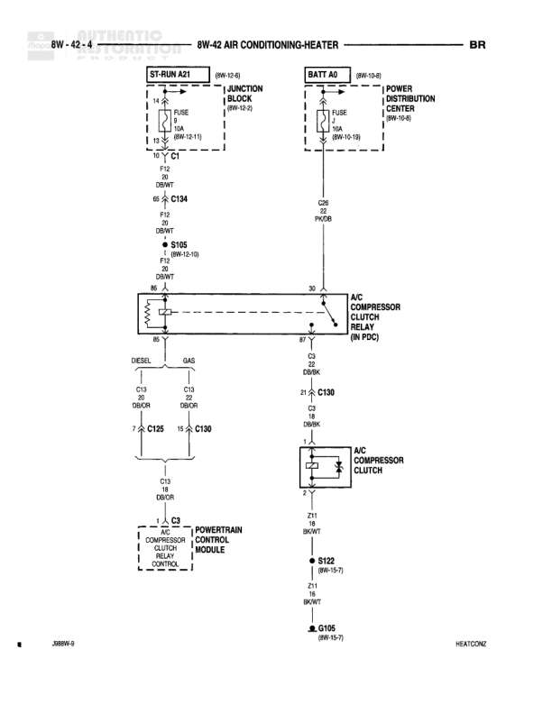

# AIR CONDITIONING-HEATER

**Notes:** Diagram shows AC compressor clutch control circuit with relay in PDC, controlled by Powertrain Control Module. Circuit has provisions for both Diesel and Gas engine configurations.

## Components

| Component | Ref | Connectors | Notes |
|-----------|-----|------------|-------|
| ST-RUN A21 | 8W-13-8 |  | Junction Block |
| BATT 40 | 8W-10-3 |  | Power Distribution Center |
| AC COMPRESSOR CLUTCH RELAY (IN PDC) | on diagram | 86, 30, 87, 85 | Located in Power Distribution Center |
| AC COMPRESSOR CLUTCH | on diagram |  | None |
| POWERTRAIN CONTROL MODULE | 8W-10-18 | C3 | Controls compressor clutch relay |

## Wires

| From | To | Wire Code | Gauge | Color | Notes |
|------|-----|-----------|-------|-------|-------|
| ST-RUN A21 | Junction Block FUSE 10A | A21 | 14 | DB/WT | None |
| Junction Block FUSE 10A | C134 Pin 1 | A21 | 14 | DB/WT | 8W-10-11 |
| C134 Pin 2 | S165 (8W-10-18) | F9 | 20 | DB/WT | None |
| S165 | AC Compressor Clutch Relay Pin 86 | F9 | 20 | DB/WT | None |
| BATT 40 | PDC FUSE 10A | A40 | None | None | 8W-10-18 |
| PDC FUSE 10A | AC Compressor Clutch Relay Pin 30 | A22 | None | PK/DB | None |
| AC Compressor Clutch Relay Pin 87 | C130 Pin 21 | C3 | 20 | DB/OR | None |
| AC Compressor Clutch Relay Pin 85 | C130 Pin 7 | C3 | 18 | DB/OR | None |
| C130 Pin 21 | AC Compressor Clutch | C3 | 18 | DB/OR | None |
| AC Compressor Clutch | S122 (8W-15-7) | Z11 | 18 | BK/WT | None |
| S122 | G105 (8W-15-7) | Z11 | 18 | BK/WT | None |
| C130 Pin 7 | C133 | C13 | 20 | DB/OR | DIESEL |
| C130 Pin 7 | C130 | C13 | 20 | DB/OR | GAS |
| C133 or C130 | Powertrain Control Module C3 | C3 | 18 | DB/OR | Controls compressor clutch relay |

## Splices & Grounds

| ID | Type | Location | Wires Connected | Notes |
|----|------|----------|-----------------|-------|
| S165 | splice | 8W-10-18 | F9 | None |
| S122 | splice | 8W-15-7 | Z11 | None |
| G105 | ground | 8W-15-7 |  | None |

## Cross-References

- 8W-13-8
- 8W-10-3
- 8W-10-11
- 8W-10-18
- 8W-15-7
