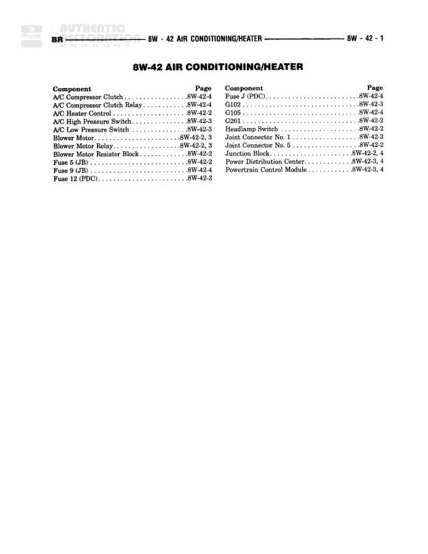

# AIR CONDITIONING/HEATER

**Notes:** This is an index page listing components and their locations across the 8W-42 Air Conditioning/Heater diagram series (pages 8W-42-1 through 8W-42-4). No actual wiring diagram content is shown on this page.

## Components

| Component | Ref | Connectors | Notes |
|-----------|-----|------------|-------|
| A/C Compressor Clutch | 8W-42-4 |  |  |
| A/C Compressor Clutch Relay | 8W-42-4 |  |  |
| A/C Heater Control | 8W-42-2 |  |  |
| A/C High Pressure Switch | 8W-42-3 |  |  |
| A/C Low Pressure Switch | 8W-42-3 |  |  |
| Blower Motor | 8W-42-2, 3 |  |  |
| Blower Motor Relay | 8W-42-2, 3 |  |  |
| Engine Compartment Relay Block | 8W-42-3 |  |  |
| Fuse 5 (JB) | 8W-42-2 |  |  |
| Fuse 9 (JB) | 8W-42-4 |  |  |
| Fuse 12 (PDC) | 8W-42-3 |  |  |
| Fuse 4 (PDC) | 8W-42-3 |  |  |
| G102 | 8W-42-3 |  |  |
| G105 | 8W-42-4 |  |  |
| G201 | 8W-42-2 |  |  |
| Headlamp Switch | 8W-42-2 |  |  |
| Joint Connector No. 1 | 8W-42-2 |  |  |
| Joint Connector No. 5 | 8W-42-2 |  |  |
| Junction Block | 8W-42-2, 4 |  |  |
| Power Distribution Center | 8W-42-3, 4 |  |  |
| Powertrain Control Module | 8W-42-3, 4 |  |  |

## Cross-References

- 8W-42-1
- 8W-42-2
- 8W-42-3
- 8W-42-4
