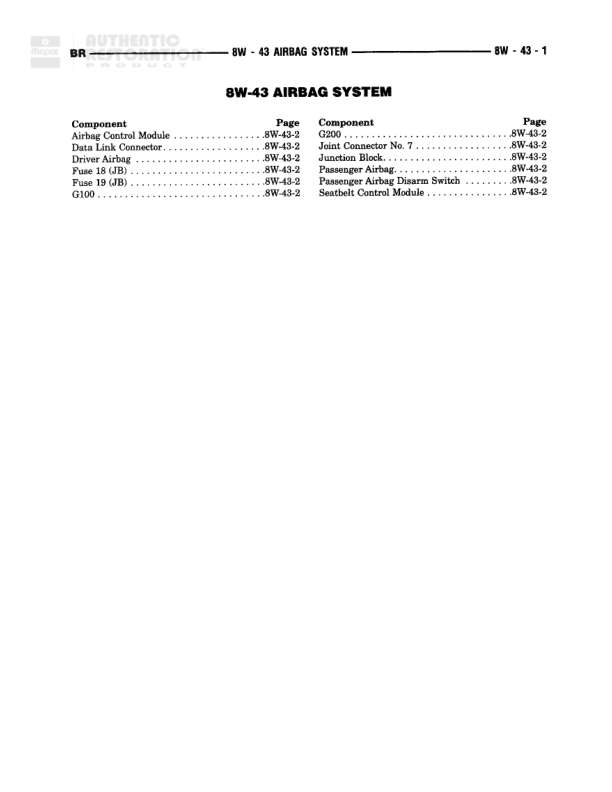

# 8W-43 AIRBAG SYSTEM

**Notes:** This is an index page listing all components in the 8W-43 AIRBAG SYSTEM section with their corresponding page references. All components are located on page 8W-43-2.

## Components

| Component | Ref | Connectors | Notes |
|-----------|-----|------------|-------|
| Airbag Control Module | 8W-43-2 |  |  |
| Data Link Connector | 8W-43-2 |  |  |
| Driver Airbag | 8W-43-2 |  |  |
| Fuse 13 (JB) | 8W-43-2 |  |  |
| Fuse 19 (JB) | 8W-43-2 |  |  |
| G100 | 8W-43-2 |  |  |
| G200 | 8W-43-2 |  |  |
| Joint Connector No. 7 | 8W-43-2 |  |  |
| Junction Block | 8W-43-2 |  |  |
| Passenger Airbag | 8W-43-2 |  |  |
| Passenger Airbag Disable Switch | 8W-43-2 |  |  |
| Seatbelt Control Module | 8W-43-2 |  |  |

## Cross-References

- 8W-43-2
