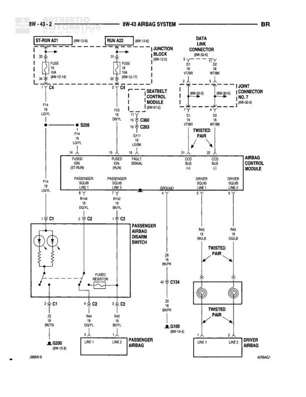

# AIRBAG SYSTEM

**Notes:** This diagram shows the complete airbag system including driver and passenger airbags, seatbelt control module, and airbag control module. The system includes twisted pair wiring for noise immunity, fused resistors for passenger airbag, and a passenger airbag disable switch. The circuit uses data link connections for diagnostics and multiple ground points for safety. Reference 266W-3 and AIRBAG1 noted at bottom of diagram.

## Components

| Component | Ref | Connectors | Notes |
|-----------|-----|------------|-------|
| ST-RUN A21 | 8W-12-40 |  | Starter Run circuit continuation |
| RUN A22 | 8W-12-40 |  | Run circuit continuation |
| JUNCTION BLOCK | 8W-12-3 |  | Contains FUSE 10A and FUSE 10A connections |
| DATA LINK CONNECTOR |  |  | Diagnostic interface |
| SEATBELT CONTROL MODULE | 8W-47-3 | C360, C203 | Controls seatbelt and airbag functions |
| JOINT CONNECTOR NO. 3 | 8W-50-35 |  | Junction point |
| AIRBAG CONTROL MODULE |  |  | Main control module for airbag deployment |
| PASSENGER SQUIB DRIVER |  | C1 | Left side squib driver |
| PASSENGER SQUIB LINE 1 |  | C2 | Right side squib driver |
| PASSENGER AIRBAG DISABLE SWITCH |  | C2 | Manual disable switch for passenger airbag |
| PASSENGER AIRBAG |  | C1, C2 | Passenger side airbag with LINE 1 and LINE 2, includes FUSED RESISTOR |
| DRIVER AIRBAG |  | C134 | Driver side airbag with LINE 1 and LINE 2, twisted pair connections |

## Wires

| From | To | Wire Code | Gauge | Color | Notes |
|------|-----|-----------|-------|-------|-------|
| ST-RUN A21 | C4 | A21 | 14 | RD/WT | FUSE 10A |
| C4 | S208 | F14 | 18 | LG/YL |  |
| S208 | PASSENGER SQUIB DRIVER | F14 | 18 | LG/YL |  |
| RUN A22 | C4 | A22 | 14 | RD/WT | FUSE 10A |
| C4 | Seatbelt Control Module C360 | F23 | 18 | DB/YL |  |
| Seatbelt Control Module C360 | C203 | D113 | None | LG/BK |  |
| Seatbelt Control Module | AIRBAG CONTROL MODULE | D113 | 18 | LG/BK | FUSED SQUIB ION |
| Junction Block | Data Link Connector | VT/BR | None | VT/BR |  |
| Junction Block | Data Link Connector | WT/BK | None | WT/BK |  |
| Joint Connector No. 3 | Airbag Control Module | D1 | None | VT/BR | Twisted pair |
| Joint Connector No. 3 | Airbag Control Module | D2 | None | WT/BK | Twisted pair |
| AIRBAG CONTROL MODULE | C1 Passenger Squib | R144 | 18 | BK/YL |  |
| AIRBAG CONTROL MODULE | C2 Passenger Squib | R142 | 18 | BK/YL |  |
| Passenger Airbag Disable Switch | Passenger Airbag | Z8 | 18 | BK/TN | Twisted |
| C1 | G500 | Z2 | 18 | BK/TN |  |
| C2 | Passenger Airbag LINE 1 | R43 | 18 | DB/YL |  |
| C2 | Passenger Airbag LINE 2 | R42 | 18 | BK/YL |  |
| AIRBAG CONTROL MODULE | Driver Airbag C134 | R43 | 18 | DB/LG | Twisted pair |
| AIRBAG CONTROL MODULE | Driver Airbag C134 | R42 | 18 | DG/LB | Twisted pair |
| Driver Airbag C134 | G100 | Z8 | 18 | BK/TN | Twisted |
| AIRBAG CONTROL MODULE | Ground | GROUND | None | None | FAULT SIGNAL connection |
| Airbag Control Module | Driver Squib | C/D BUS | None | (-) |  |
| Airbag Control Module | Driver Squib | C/D BUS | None | (+) |  |

## Splices & Grounds

| ID | Type | Location | Wires Connected | Notes |
|----|------|----------|-----------------|-------|
| S208 | splice | Between C4 and Passenger Squib Driver | F14 | Power distribution splice |
| G500 | ground | 8W-13-56 |  | Ground point for passenger airbag circuit |
| G100 | ground | 8W-15-41 |  | Ground point for driver airbag circuit |
| C1 | connector | Passenger Squib connection | R144, Z2 | In-line connector for passenger airbag |
| C2 | connector | Passenger Squib and Disable Switch connection | R142, R43, R42 | Multiple connection point |
| C4 | connector | Power distribution point | A21, A22, F14, F23 | Main power distribution connector |
| C360 | connector | Seatbelt Control Module |  | Connector on Seatbelt Control Module |
| C203 | connector | Seatbelt Control Module |  | Connector on Seatbelt Control Module |
| C134 | connector | Driver Airbag connection | R43, R42, Z8 | Driver airbag harness connector |

## Cross-References

- 8W-12-40
- 8W-12-3
- 8W-47-3
- 8W-50-35
- 8W-13-56
- 8W-15-41
