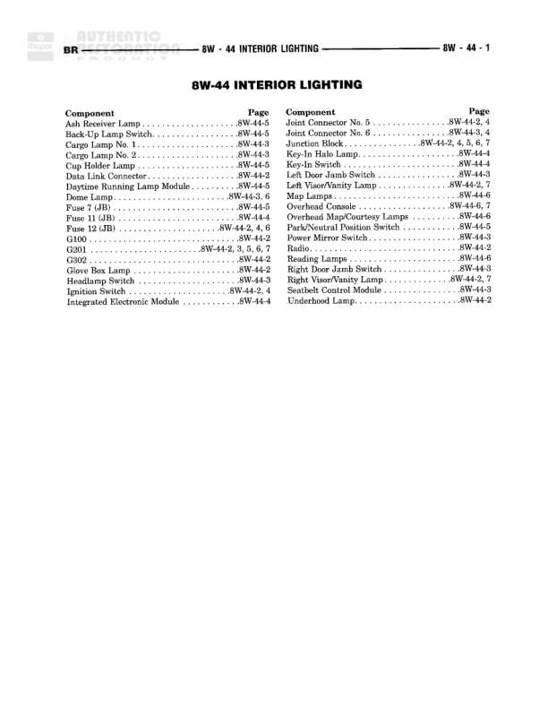

# Interior Lighting - Index Page

**Notes:** This is an index/reference page for the Interior Lighting section (8W-44). It lists all components and their locations across diagrams 8W-44-2 through 8W-44-7. No actual wiring connections are shown on this page.

## Components

| Component | Ref | Connectors | Notes |
|-----------|-----|------------|-------|
| ATC Receiver Lamp | 8W-44-5 |  | Automatic Temperature Control receiver lamp |
| Back-Up Lamp Switch | 8W-44-5 |  |  |
| Cargo Lamp No. 1 | 8W-44-3 |  |  |
| Cargo Lamp No. 2 | 8W-44-3 |  |  |
| Cup Holder Lamp | 8W-44-5 |  |  |
| Data Link Connector | 8W-44-3 |  |  |
| Daytime Running Lamp Module | 8W-44-5 |  |  |
| Fuse 5 (JB) | 8W-44-6 |  | Junction Block fuse |
| Fuse 7 (JB) | 8W-44-5 |  | Junction Block fuse |
| Fuse 11 (JB) | 8W-44-4 |  | Junction Block fuse |
| Fuse 12 (JB) | 8W-44-2, 4, 6 |  | Junction Block fuse |
| G100 | 8W-44-2 |  | Ground point |
| G200 | 8W-44-3, 5, 6, 7 |  | Ground point |
| G302 | 8W-44-2 |  | Ground point |
| Glove Box Lamp | 8W-44-2 |  |  |
| Headlamp Switch | 8W-44-3 |  |  |
| Ignition Switch | 8W-44-2, 4 |  |  |
| Integrated Electronic Module | 8W-44-4 |  |  |
| Joint Connector No. 5 | 8W-44-2 |  |  |
| Joint Connector No. 6 | 8W-44-3, 4 |  |  |
| Junction Block | 8W-44-2, 4, 5, 6, 7 |  |  |
| Key-In Halo Lamp | 8W-44-4 |  |  |
| Key-In Switch | 8W-44-4 |  |  |
| Liftgate Ajar Switch | 8W-44-3 |  |  |
| Left Visor/Vanity Lamp | 8W-44-2, 7 |  |  |
| Map Lamps | 8W-44-6 |  |  |
| Overhead Console | 8W-44-6, 7 |  |  |
| Overhead Map/Courtesy Lamps | 8W-44-6 |  |  |
| Park/Neutral Position Switch | 8W-44-5 |  |  |
| Power Mirror Switch | 8W-44-2 |  |  |
| Radiator Fan | 8W-44-3 |  |  |
| Reading Lamps | 8W-44-6 |  |  |
| Right Door Jamb Switch | 8W-44-3 |  |  |
| Right Visor/Vanity Lamp | 8W-44-2, 7 |  |  |
| Seatbelt Control Module | 8W-44-3 |  |  |
| Underhood Lamps | 8W-44-2 |  |  |

## Cross-References

- 8W-44-2
- 8W-44-3
- 8W-44-4
- 8W-44-5
- 8W-44-6
- 8W-44-7
