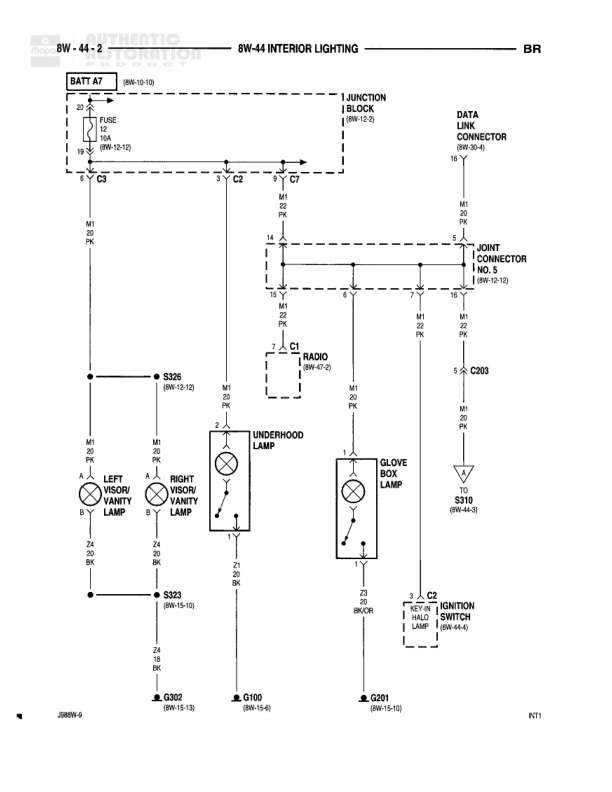

# INTERIOR LIGHTING

**Notes:** BR designation in upper right indicates this is a BR (Base/Right) configuration diagram. Interior lighting circuits for visor courtesy lamps, underhood lamp, glove box lamp, and radio illumination. All lighting circuits powered from M1 20 PK wire with various ground returns (Z3, Z4). Document number 288W-9 shown at bottom. NT1 notation in lower right corner.

## Components

| Component | Ref | Connectors | Notes |
|-----------|-----|------------|-------|
| BATT A7 | 8W-10-10 |  | Battery feed connection |
| JUNCTION BLOCK | 8W-12-2 |  | Main junction block |
| DATA LINK CONNECTOR | 8W-34-4 |  | Diagnostic connector |
| IN JOINT CONNECTOR NO. 5 | 8W-10-12 |  | Interior junction connector |
| RADIO | 8W-47-5 | C1 | Radio/audio unit |
| LEFT VISOR COURTESY LAMP |  |  | Driver side visor lamp |
| RIGHT VISOR COURTESY LAMP |  |  | Passenger side visor lamp |
| UNDERHOOD LAMP |  |  | Engine compartment light |
| GLOVE BOX LAMP |  |  | Glove compartment light |
| LIFT GATE IGNITION SWITCH | 8W-44-6 | C2 | Lift gate illumination switch |

## Wires

| From | To | Wire Code | Gauge | Color | Notes |
|------|-----|-----------|-------|-------|-------|
| BATT A7 | FUSE (8W-13-12) | None | None | None | Power feed to fuse |
| FUSE (8W-13-12) | JUNCTION BLOCK | None | None | None | Protected power to junction block |
| JUNCTION BLOCK | C3 | M1 | 20 | PK | Interior lighting circuit |
| C3 | C2 | M1 | 20 | PK | Interior lighting circuit |
| C2 | C7 | M1 | 20 | PK | Interior lighting circuit |
| C7 | IN JOINT CONNECTOR NO. 5 | M1 | 20 | PK | Interior lighting circuit |
| IN JOINT CONNECTOR NO. 5 | DATA LINK CONNECTOR | M1 | 20 | PK | Data link power |
| IN JOINT CONNECTOR NO. 5 | C2003 | M1 | 20 | PK | Interior lighting feed |
| C3 | S326 (8W-12-12) | M1 | 20 | PK | Splice to courtesy lamps |
| S326 | LEFT VISOR COURTESY LAMP | M1 | 20 | PK | Power to left visor lamp |
| S326 | RIGHT VISOR COURTESY LAMP | M1 | 20 | PK | Power to right visor lamp |
| C2 | RADIO C1 | M1 | 20 | PK | Radio illumination power |
| C2 | UNDERHOOD LAMP | M1 | 20 | PK | Power to underhood lamp |
| C7 | GLOVE BOX LAMP | M1 | 20 | PK | Power to glove box lamp |
| LEFT VISOR COURTESY LAMP | S323 (8W-15-10) | Z4 | 20 | BK | Ground return |
| RIGHT VISOR COURTESY LAMP | S323 | Z4 | 20 | BK | Ground return |
| UNDERHOOD LAMP | G100 (8W-15-6) | Z3 | 20 | BK | Ground to G100 |
| RADIO C1 | G302 (8W-15-13) | Z4 | 20 | BK | Radio ground |
| GLOVE BOX LAMP | C901 (8W-15-10) | Z3 | 20 | BK/OR | Ground to C901 |
| LIFT GATE IGNITION SWITCH C2 | C901 | Z3 | 20 | BK/OR | Ground to C901 |
| C2003 | S110 (8W-44-3) | M1 | 20 | PK | Continues to S110 |

## Splices & Grounds

| ID | Type | Location | Wires Connected | Notes |
|----|------|----------|-----------------|-------|
| S326 | splice | 8W-12-12 | M1 | Visor courtesy lamp splice |
| S323 | splice | 8W-15-10 | Z4 | Visor lamp ground splice |
| G302 | ground | 8W-15-13 |  | Radio ground point |
| G100 | ground | 8W-15-6 |  | Underhood lamp ground |
| C901 | connector | 8W-15-10 | Z3 | Ground connector |

## Cross-References

- 8W-10-10
- 8W-12-2
- 8W-13-12
- 8W-34-4
- 8W-10-12
- 8W-47-5
- 8W-12-12
- 8W-15-10
- 8W-15-13
- 8W-15-6
- 8W-44-6
- 8W-44-3
