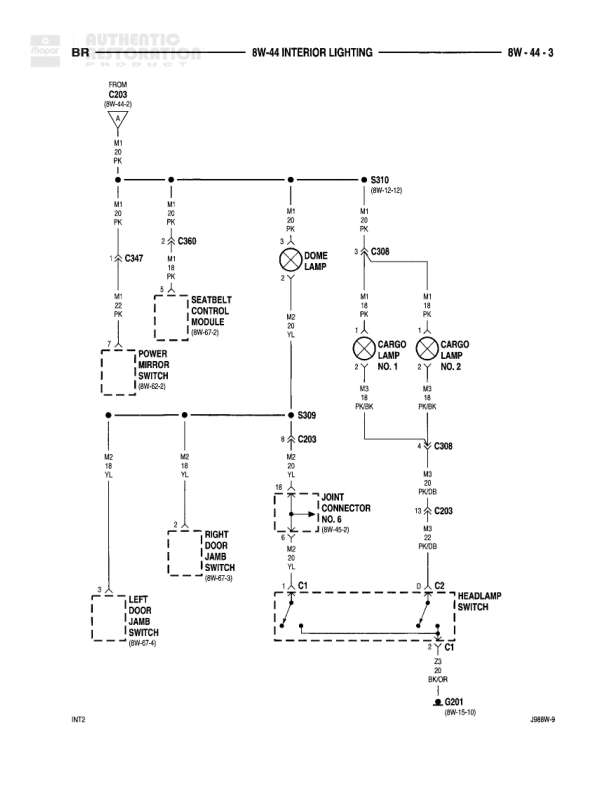

# INTERIOR LIGHTING

**Notes:** INT2 and J08BW-8 notations appear at bottom of diagram. Diagram shows interior lighting circuit including dome lamp, cargo lamps, and door jamb switches. Power mirror switch shares power feed from seatbelt control module.

## Components

| Component | Ref | Connectors | Notes |
|-----------|-----|------------|-------|
| FUSE C203 | 8W-44-3 |  | Main power feed fuse |
| DOME LAMP | 8W-44-3 |  | Interior dome light |
| CARGO LAMP NO. 1 | 8W-44-3 |  | First cargo area lamp |
| CARGO LAMP NO. 2 | 8W-44-3 |  | Second cargo area lamp |
| SEATBELT CONTROL MODULE | 8W-44-3 | C347 | Controls seatbelt warning system |
| POWER MIRROR SWITCH | 8W-45-3 |  | Controls power mirrors |
| RIGHT DOOR JAMB SWITCH | 8W-67-3 |  | Detects right door open/close |
| LEFT DOOR JAMB SWITCH | 8W-67-4 |  | Detects left door open/close |
| HEADLAMP SWITCH | 8W-44-3 | C2 | Main headlamp control switch |

## Wires

| From | To | Wire Code | Gauge | Color | Notes |
|------|-----|-----------|-------|-------|-------|
| FUSE C203 | Junction point | M1 | 20 | PK |  |
| Junction point | S310 | M1 | 20 | PK |  |
| S310 | C360 | M1 | 20 | PK | 8W-0-12 |
| Junction point | C347 | M1 | 20 | PK |  |
| Junction point | DOME LAMP pin 1 | M1 | 20 | PK |  |
| Junction point | C308 | M1 | 20 | PK |  |
| C347 | SEATBELT CONTROL MODULE pin 1 | M1 | 14 | PK |  |
| C347 | POWER MIRROR SWITCH pin 2 | M1 | 14 | PK |  |
| DOME LAMP pin 2 | S309 | M2 | 20 | YL |  |
| C308 | CARGO LAMP NO. 1 pin 1 | M1 | 20 | PK |  |
| C308 | CARGO LAMP NO. 2 pin 1 | M1 | 20 | PK |  |
| CARGO LAMP NO. 1 pin 2 | C308 | M1 | 18 | PK/OR |  |
| CARGO LAMP NO. 2 pin 2 | C308 | M1 | 18 | PK/OR |  |
| C308 | C203 | M1 | 20 | PK/OR |  |
| S309 | Junction point | M2 | 20 | YL |  |
| Junction point | POWER MIRROR SWITCH pin 1 | M2 | 20 | YL |  |
| Junction point | C203 | M2 | 20 | YL |  |
| C203 | JOINT CONNECTOR NO. 6 pin 12 | M2 | 20 | YL | 8W-0-1 |
| JOINT CONNECTOR NO. 6 pin 12 | RIGHT DOOR JAMB SWITCH pin 2 | M2 | 20 | YL |  |
| RIGHT DOOR JAMB SWITCH pin 1 | C1 | None | None | None |  |
| C203 | C203 lower | M3 | 20 | PK/OR |  |
| LEFT DOOR JAMB SWITCH pin 1 | C1 | None | None | None |  |
| C1 | C2 | None | None | None |  |
| C2 | HEADLAMP SWITCH | None | None | None |  |
| C1 | G1 | Z3 | 20 | BK/OR |  |
| G1 | G201 | None | None | BK/OR | 8W-15-10 |

## Splices & Grounds

| ID | Type | Location | Wires Connected | Notes |
|----|------|----------|-----------------|-------|
| S310 | splice | Upper right area of diagram | M1 | Distributes power to multiple circuits |
| S309 | splice | Middle area of diagram | M2 | Combines dome lamp return with switch circuits |
| G1 | ground | Lower portion of diagram near door switches |  | Ground point for door jamb switches |
| G201 | ground | Referenced on 8W-15-10 |  | Main ground connection point |

## Cross-References

- 8W-0-12
- 8W-0-1
- 8W-15-10
- 8W-45-3
- 8W-67-3
- 8W-67-4
