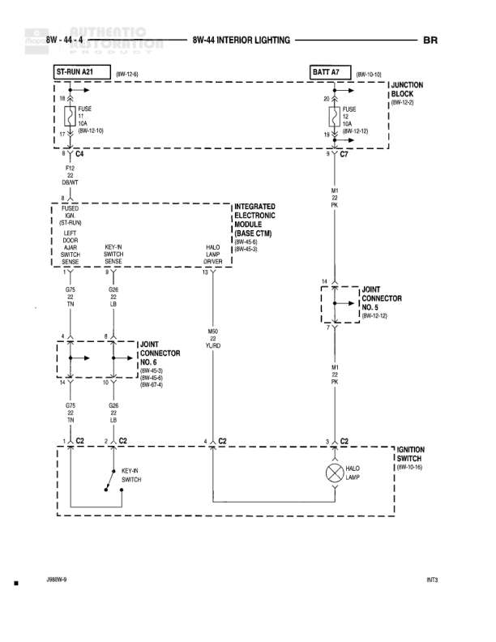

# INTERIOR LIGHTING

**Notes:** Interior lighting circuit showing connections for door jamb switch, key-in switch, halo lamp, and ignition switch. Includes integrated electronic module (Base CTM) with multiple cross-references. Diagram shows both battery feed and start-run power distribution.

## Components

| Component | Ref | Connectors | Notes |
|-----------|-----|------------|-------|
| ST-RUN A21 | 8W-10-8 |  | Start-Run circuit |
| BATT A7 | 8W-10-10 |  | Battery feed |
| JUNCTION BLOCK | 8W-10-3 |  | Contains FUSE 15A |
| FUSED B+ PWR | Component group |  | Contains LEFT DOOR JAMB SWITCH SENSE |
| LEFT DOOR JAMB SWITCH SENSE | Component in fused group |  |  |
| KEY-IN SWITCH SENSE | Component |  |  |
| HALO LAMP DRIVER | Component |  |  |
| INTEGRATED ELECTRONIC MODULE (BASE CTM) | 8W-40-6, 8W-40-9 |  | Integrated Electronic Module - Base CTM |
| JOINT CONNECTOR NO. 5 | 8W-10-12 | 8W-45-3, 8W-45-4, 8W-87-1 |  |
| JOINT CONNECTOR NO. 1 | 8W-40-3 | 8W-45-2, 8W-45-6 |  |
| KEY-IN SWITCH | Component |  |  |
| HALO LAMP | Component |  | Light bulb symbol |
| IGNITION SWITCH | 8W-10-10 |  |  |

## Wires

| From | To | Wire Code | Gauge | Color | Notes |
|------|-----|-----------|-------|-------|-------|
| FUSE 15A | C4 | F12 | None | OR/WT | From ST-RUN A21 |
| C4 | FUSED B+ PWR | F12 | None | DB/WT |  |
| FUSE 15A (JB) | C7 | M1 | None | PK | From BATT A7 |
| C7 | JOINT CONNECTOR NO. 5 | M1 | None | PK |  |
| LEFT DOOR JAMB SWITCH SENSE | JOINT CONNECTOR NO. 1 | G25 | None | TN | Pin 4 |
| KEY-IN SWITCH SENSE | JOINT CONNECTOR NO. 1 | G26 | None | LB | Pin 8 |
| HALO LAMP DRIVER | HALO LAMP | M50 | None | YL/RD |  |
| JOINT CONNECTOR NO. 1 | C2 | G25 | None | TN | From pin 4 |
| JOINT CONNECTOR NO. 1 | C2 | G26 | None | LB | From pin 8 |
| JOINT CONNECTOR NO. 5 | C2 | M1 | None | PK |  |
| C2 | KEY-IN SWITCH | None | None | None | Connection from C2 junction |
| C2 | HALO LAMP | None | None | None | Connection from C2 junction |
| C2 | IGNITION SWITCH | None | None | None | Connection from C2 junction |

## Splices & Grounds

| ID | Type | Location | Wires Connected | Notes |
|----|------|----------|-----------------|-------|
| C4 | splice | Between ST-RUN A21 and fused components | F12 | In-line connector |
| C7 | splice | Between BATT A7 and JOINT CONNECTOR NO. 5 | M1 | In-line connector |
| C2 | splice | Bottom of diagram, connects to multiple components | G25, G26, M1 | Common ground/ignition junction point |

## Cross-References

- 8W-10-8
- 8W-10-10
- 8W-10-3
- 8W-10-12
- 8W-40-6
- 8W-40-9
- 8W-40-3
- 8W-45-3
- 8W-45-4
- 8W-87-1
- 8W-45-2
- 8W-45-6
