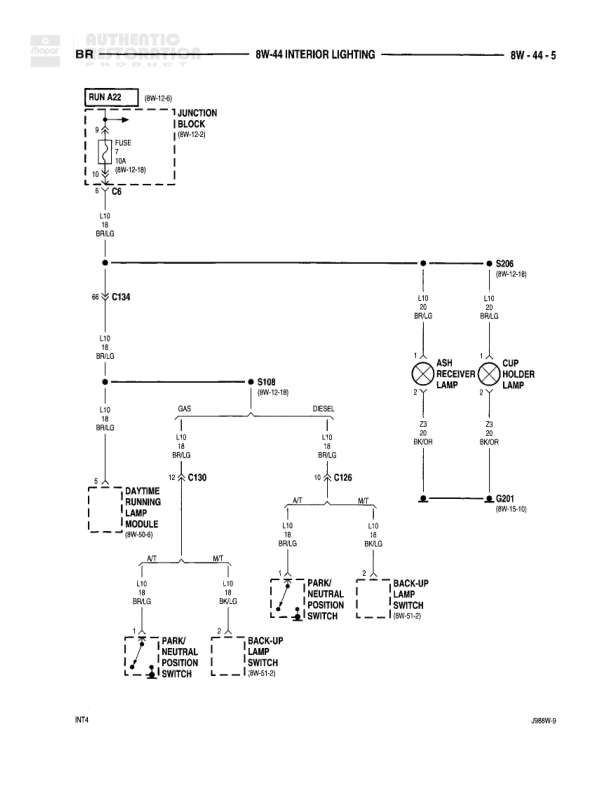

# INTERIOR LIGHTING

**Notes:** Diagram shows interior lighting circuits including ash receiver lamp, cup holder lamp, and connections to park/neutral position switches and back-up lamp switches. Circuit splits for automatic transmission (A/T) and manual transmission (N/T) configurations, with separate paths for GA/G and DIESEL variants. Document reference N74, 2668W-9.

## Components

| Component | Ref | Connectors | Notes |
|-----------|-----|------------|-------|
| JUNCTION BLOCK | 8W-10-9 |  | Contains FUSE 5A and RUN A22 circuit |
| DAYTIME RUNNING LAMP MODULE | 8W-90-9 |  | Connected via A/T circuit |
| ASH RECEIVER LAMP | not specified |  | 2-terminal component |
| CUP HOLDER LAMP | not specified |  | 2-terminal component |
| PARK/NEUTRAL POSITION SWITCH | 8W-51-3 |  | Two switches shown in diagram |
| BACK-UP LAMP SWITCH | 8W-51-3 |  | Two switches shown in diagram |

## Wires

| From | To | Wire Code | Gauge | Color | Notes |
|------|-----|-----------|-------|-------|-------|
| RUN A22 | JUNCTION BLOCK FUSE 5A | None | None | BK/LB | 8W-15-B |
| JUNCTION BLOCK | S206 | None | None | BR/LG | L10 wire |
| JUNCTION BLOCK | C134 | None | None | BR/LG | L10 wire, 6S connector |
| C134 | S108 | None | None | BR/LG | L12 wire, 8W-15-16 |
| S108 | C130 | None | None | BR/LG | L10 wire, GA/G branch |
| S108 | C125 | None | None | BR/LG | L10 wire, DIESEL branch |
| S206 | ASH RECEIVER LAMP pin 1 | None | None | BR/LG | L10 wire, 8W-15-16 |
| S206 | CUP HOLDER LAMP pin 1 | None | None | BR/LG | L10 wire, 8W-15-16 |
| ASH RECEIVER LAMP pin 2 | G301 | None | None | BK/OR | Z3 wire, 8W-15-10 |
| CUP HOLDER LAMP pin 2 | G301 | None | None | BK/OR | Z3 wire, 8W-15-10 |
| C130 | PARK/NEUTRAL POSITION SWITCH (left) | None | None | BR/LG | L10 wire, A/T connection |
| C130 | PARK/NEUTRAL POSITION SWITCH (left) | None | None | BR/LG | L10 wire, N/T connection |
| C125 | PARK/NEUTRAL POSITION SWITCH (right) | None | None | BR/LG | L10 wire, A/T connection |
| C125 | BACK-UP LAMP SWITCH (right) | None | None | BR/LG | L10 wire, N/T connection |
| PARK/NEUTRAL POSITION SWITCH (left) | BACK-UP LAMP SWITCH (left) | None | None | BR/LG | L10 wire, connected via A/T and N/T paths |
| C130 | DAYTIME RUNNING LAMP MODULE | None | None | BR/LG | L10 wire, A/T connection |

## Splices & Grounds

| ID | Type | Location | Wires Connected | Notes |
|----|------|----------|-----------------|-------|
| S206 | splice | Between junction block and lamps | L10 | Feeds ASH RECEIVER LAMP and CUP HOLDER LAMP, reference 8W-15-16 |
| S108 | splice | Between C134 and switches | L10, L12 | Splits to GA/G and DIESEL branches, reference 8W-15-16 |
| G301 | ground | Common ground for lamps |  | Ground point for ASH RECEIVER and CUP HOLDER lamps, reference 8W-15-10 |

## Cross-References

- 8W-10-9
- 8W-15-B
- 8W-90-9
- 8W-15-16
- 8W-51-3
- 8W-15-10
