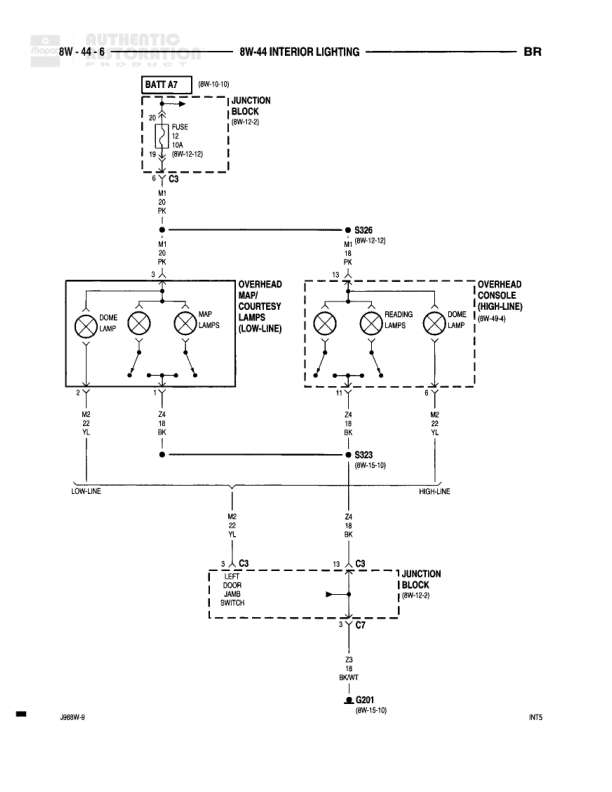

# INTERIOR LIGHTING

**Notes:** Diagram shows interior lighting circuits for both low-line (overhead map & courtesy lamps) and high-line (overhead console) configurations. Circuit uses M1 for power distribution and Z4/Z3 for ground returns. Door jamb switch controls lighting through junction block.

## Components

| Component | Ref | Connectors | Notes |
|-----------|-----|------------|-------|
| BATT AT | 8W-10-10 |  | Battery feed connection |
| JUNCTION BLOCK | 8W-12-0 |  | Top junction block |
| DOME LAMP | Overhead map & courtesy lamps (low-line) |  | Part of overhead map & courtesy lamps low-line assembly |
| MAP LAMPS | Overhead map & courtesy lamps (low-line) |  | Two map lamps in low-line assembly |
| DOME LAMP | Overhead console (high-line) |  | Part of overhead console high-line assembly |
| READING LAMPS | Overhead console (high-line) |  | Two reading lamps in high-line assembly |
| DOOR JAMB SWITCH | C4 | C4 | Left door jamb switch |
| JUNCTION BLOCK | 8W-12-0 |  | Bottom junction block |

## Wires

| From | To | Wire Code | Gauge | Color | Notes |
|------|-----|-----------|-------|-------|-------|
| BATT AT (8W-10-10) | JUNCTION BLOCK | None | None | None | Battery feed to junction block |
| JUNCTION BLOCK | FUSE 1 | None | None | None | 10A fuse |
| FUSE 1 | Splice point | None | 20 | PK | 8W-12-12 |
| Splice point M1 | S326 splice | M1 | 20 | PK | 8W-12-12 |
| S326 | OVERHEAD MAP & COURTESY LAMPS pin 3 | M1 | 20 | PK | Low-line |
| S326 | OVERHEAD CONSOLE pin 13 | M1 | 20 | PK | High-line |
| OVERHEAD MAP & COURTESY LAMPS pin 2 | S323 splice | Z4 | 22 | BK | Low-line dome lamp ground |
| OVERHEAD MAP & COURTESY LAMPS pin 1 | S323 splice | Z4 | 18 | BK | Low-line map lamps ground |
| OVERHEAD CONSOLE pin 11 | S323 splice | Z4 | 18 | BK | High-line reading lamps ground |
| OVERHEAD CONSOLE pin 4 | S323 splice | Z4 | 22 | BK | High-line dome lamp ground |
| S323 | G2 | Z4 | 18 | BK | 8W-15-16, connection to ground |
| G2 | DOOR JAMB SWITCH C4 | None | None | None | Ground side of door switch |
| DOOR JAMB SWITCH C4 | JUNCTION BLOCK | None | None | None | Switch return to junction block |
| JUNCTION BLOCK | G7 | Z3 | 20 | BK/WT | Junction block ground |
| G7 | G201 | Z3 | 20 | BK/WT | 8W-15-10, final ground connection |

## Splices & Grounds

| ID | Type | Location | Wires Connected | Notes |
|----|------|----------|-----------------|-------|
| M1 | splice | Between fuse and lighting circuits | M1 | 20 PK wire splice feeding both low-line and high-line circuits |
| S326 | splice | 8W-12-12 | M1 | Distributes power to both overhead lighting assemblies |
| S323 | splice | 8W-15-16 | Z4 | Collects grounds from all overhead lamps |
| G2 | ground | Near door jamb switch |  | Intermediate ground connection |
| G7 | ground | At junction block |  | Junction block ground point |
| G201 | ground | 8W-15-10 |  | Final chassis ground |

## Cross-References

- 8W-10-10
- 8W-12-0
- 8W-12-12
- 8W-15-16
- 8W-15-10
