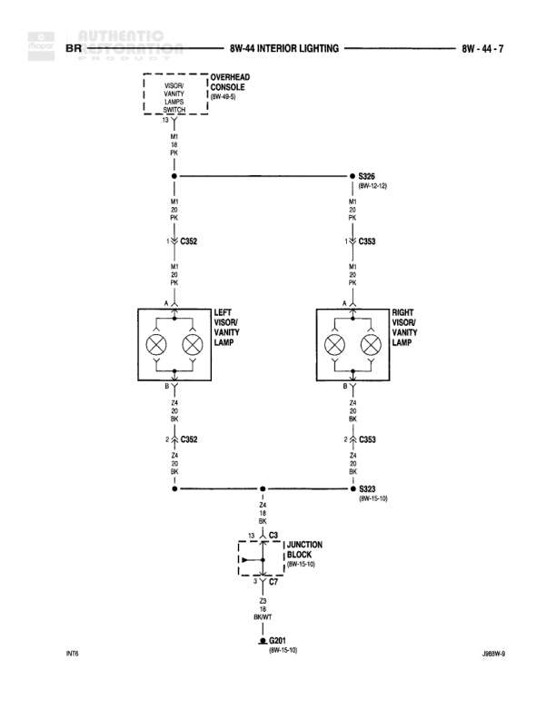

# INTERIOR LIGHTING

**Notes:** This diagram shows the visor vanity lamp circuit with overhead console dimmer control. Both left and right visor lamps are dual-bulb configurations connected through individual connectors (C352 and C353) and share a common ground path through splice S323.

## Components

| Component | Ref | Connectors | Notes |
|-----------|-----|------------|-------|
| OVERHEAD CONSOLE DIMMER SWITCH | 8W-44-7 | C352 | Contains Visor Vanity Dimmer Switch |
| LEFT VISOR/VANITY LAMP | 8W-44-7 | C352 | Dual bulb configuration |
| RIGHT VISOR/VANITY LAMP | 8W-44-7 | C353 | Dual bulb configuration |
| JUNCTION BLOCK | 8W-15-10 | C7 | None |

## Wires

| From | To | Wire Code | Gauge | Color | Notes |
|------|-----|-----------|-------|-------|-------|
| OVERHEAD CONSOLE DIMMER SWITCH | C352 | M | 18 | PK | None |
| C352 | LEFT VISOR/VANITY LAMP | M | 20 | PK | None |
| OVERHEAD CONSOLE DIMMER SWITCH | S325 | M | 20 | PK | None |
| S325 | C353 | M | 20 | PK | None |
| C353 | RIGHT VISOR/VANITY LAMP | M | 20 | PK | None |
| LEFT VISOR/VANITY LAMP | C352 | Z | 20 | BK | None |
| C352 | S323 | Z | 20 | BK | None |
| RIGHT VISOR/VANITY LAMP | C353 | Z | 20 | BK | None |
| C353 | S323 | Z | 20 | BK | None |
| S323 | C7 | Z4 | 18 | BK | None |
| C7 | G201 | Z3 | 12 | BK/WT | None |

## Splices & Grounds

| ID | Type | Location | Wires Connected | Notes |
|----|------|----------|-----------------|-------|
| S325 | splice | 8W-10-13 | M | Connects overhead console to right visor lamp |
| S323 | splice | 8W-15-10 | Z | Connects both visor lamps to ground circuit |
| G201 | ground | 8W-15-10 |  | Main ground point |

## Cross-References

- 8W-10-13
- 8W-15-10
- JBBW-6
