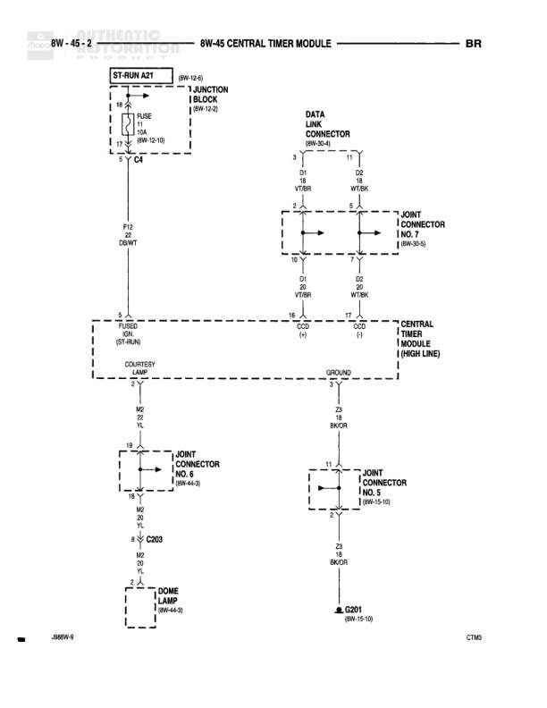

# 8W-45 CENTRAL TIMER MODULE

**Notes:** This diagram shows the Central Timer Module (High Line) connections including data link, courtesy lamp, and dome lamp circuits. The module interfaces with various joint connectors and the junction block.

## Components

| Component | Ref | Connectors | Notes |
|-----------|-----|------------|-------|
| ST-RUN A21 | 8W-12-6 |  | Junction block reference |
| JUNCTION BLOCK | 8W-12-6 |  | Contains fuse and connections |
| DATA LINK CONNECTOR | 8W-30-8 |  | 16-pin connector |
| CENTRAL TIMER MODULE (HIGH LINE) | Central location on diagram |  | Main module with multiple connections |
| JOINT CONNECTOR NO. 7 | 8W-30-5 |  |  |
| JOINT CONNECTOR NO. 6 | 8W-46-6 |  |  |
| JOINT CONNECTOR NO. 5 | 8W-15-10 |  |  |
| COURTESY LAMP | ST-RUN section |  |  |
| DOME LAMP | 8W-45-8 |  |  |

## Wires

| From | To | Wire Code | Gauge | Color | Notes |
|------|-----|-----------|-------|-------|-------|
| ST-RUN A21 FUSE 10A | C4 | A21 | 10 | RD | 8W-12-10 |
| C4 | C12 DGWT | None | None | None |  |
| C12 DGWT | FORD (ST-RUN) | None | None | None |  |
| DATA LINK CONNECTOR Pin 9 | D1 VT/BR | D1 | 18 | VT/BR |  |
| DATA LINK CONNECTOR Pin 11 | D2 WT/BK | D2 | 18 | WT/BK |  |
| D1 VT/BR | CENTRAL TIMER MODULE DGD (X) | D1 | 18 | VT/BR |  |
| D2 WT/BK | CENTRAL TIMER MODULE DGD (1) | D2 | 18 | WT/BK |  |
| CENTRAL TIMER MODULE | COURTESY LAMP | None | None | None | Connection through FORD ST-RUN |
| COURTESY LAMP | GROUND | Z3 | 18 | BK/GR |  |
| COURTESY LAMP | JOINT CONNECTOR NO. 6 | M6 | 20 | PK |  |
| JOINT CONNECTOR NO. 6 | C203 | M6 | 20 | PK |  |
| C203 | DOME LAMP | M6 | 20 | PK |  |
| DOME LAMP | G201 | Z3 | 18 | BK/GR |  |
| GROUND | JOINT CONNECTOR NO. 5 | Z3 | 18 | BK/GR |  |
| JOINT CONNECTOR NO. 5 | G201 | Z3 | 18 | BK/GR |  |

## Splices & Grounds

| ID | Type | Location | Wires Connected | Notes |
|----|------|----------|-----------------|-------|
| C4 | connector | Between Junction Block and DGWT connection | A21 |  |
| C12 | connector | DGWT connection point |  |  |
| C203 | connector | Between Joint Connector No. 6 and Dome Lamp | M6 |  |
| G201 | ground | 8W-15-10 |  | Shared ground for dome lamp circuit |

## Cross-References

- 8W-12-6
- 8W-12-10
- 8W-30-8
- 8W-30-5
- 8W-46-6
- 8W-15-10
- 8W-45-8
