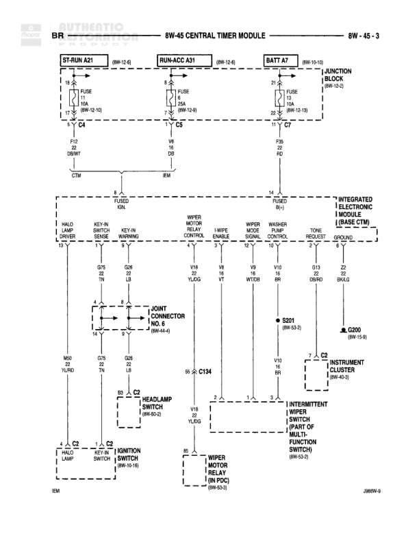

# CENTRAL TIMER MODULE

**Notes:** This diagram shows the Central Timer Module (CTM) and its connections to various relays and the Integrated Electronic Module (IEM/BCM). The CTM controls starter, run/acc, and battery relay functions. The IEM handles wiper motor control, washer pump control, and other body control functions. Document reference: 388W-3

## Components

| Component | Ref | Connectors | Notes |
|-----------|-----|------------|-------|
| STARTER RELAY | 8W-12-6 | C4 | Contains FUSE 10A (8W-12-10) |
| RUN/ACC RELAY | 8W-12-6 | C5 | Contains FUSE 5A (8W-12-6) |
| BATTERY RELAY | 8W-10-10 | C7 | Contains FUSE 15A (8W-12-13), Junction Block (8W-10-10) |
| CENTRAL TIMER MODULE | CTM |  | Main control module |
| INTEGRATED ELECTRONIC MODULE (BODY CONTROLLER MODULE) | IEM or BCM |  | Also referred to as BASE CTM |
| JOINT CONNECTOR | 8W-44-6 |  | Connection point for multiple circuits |
| HEADLAMP SWITCH | 8W-60-2 | C2 | None |
| IGNITION SWITCH | 8W-10-16 | C2 | None |
| WIPER MOTOR RELAY (IN PDC) | 8W-52-5 |  | Located in Power Distribution Center |
| INSTRUMENT CLUSTER | 8W-40-3 | C2 | None |
| INTERMITTENT WIPER RELAY (PART OF MULTI-FUNCTION SWITCH) | 8W-52-3 |  | None |

## Wires

| From | To | Wire Code | Gauge | Color | Notes |
|------|-----|-----------|-------|-------|-------|
| STARTER RELAY C4 F37 | CTM | None | 20 | BR/YL | START |
| RUN/ACC RELAY C5 V8 | IEM | None | 20 | OR | None |
| BATTERY RELAY C7 F25 | IEM | None | 18 | RD | None |
| CTM HALO LAMP DRIVER | JOINT CONNECTOR M60 | M1 | 22 | YL/RD | None |
| CTM KEY-IN AUDIBLE SENSE | JOINT CONNECTOR D79 | D1 | 22 | TN | None |
| CTM BRAKE WARNING | JOINT CONNECTOR G35 | G6 | 20 | LB | None |
| IEM WIPER MOTOR LOW SPEED CONTROL | WIPER MOTOR RELAY V19 | V3 | 18 | YL/DG | None |
| IEM WIPER HI SPEED ENABLE | WIPER MOTOR RELAY V19 | V4 | 18 | VT | None |
| IEM WIPER PARK SIGNAL | INTERMITTENT WIPER RELAY V19 | V5 | 18 | WT/DB | None |
| IEM WASHER PUMP CONTROL | V10 | V1 | 18 | BR | None |
| IEM WASHER REQUEST | J3 | J2 | 20 | DB/RD | None |
| IEM GROUND | G200 (8W-13-2) | Z2 | 20 | BK/LB | None |
| JOINT CONNECTOR M60 | HALO LAMP | M1 | 22 | YL/RD | None |
| JOINT CONNECTOR D79 | IGNITION SWITCH C2 | D1 | 22 | TN | BATT IN |
| JOINT CONNECTOR G35 | HEADLAMP SWITCH C2 | G6 | 20 | LB | None |
| S5 | C134 | V3 | None | YL/DG | None |
| C134 | HEADLAMP SWITCH C2 J3 | None | None | None | None |
| V10 | INTERMITTENT WIPER RELAY V18 | V1 | 18 | BR | None |
| J3 | INSTRUMENT CLUSTER C2 | J2 | 20 | DB/RD | None |
| S201 | G200 | Z2 | 20 | BK/LB | 8W-53-2 |

## Splices & Grounds

| ID | Type | Location | Wires Connected | Notes |
|----|------|----------|-----------------|-------|
| S5 | splice | Between CTM and Wiper Motor Relay | V3 | Connects wiper motor low speed control circuit |
| S201 | splice | 8W-53-2 | Z2 | Ground circuit splice |
| G200 | ground | 8W-13-2 |  | Main ground point for IEM |
| C134 | connector | In-line connector between S5 and headlamp switch | V3 | None |

## Cross-References

- 8W-12-6
- 8W-12-10
- 8W-10-10
- 8W-12-13
- 8W-44-6
- 8W-60-2
- 8W-10-16
- 8W-52-5
- 8W-40-3
- 8W-52-3
- 8W-13-2
- 8W-53-2
