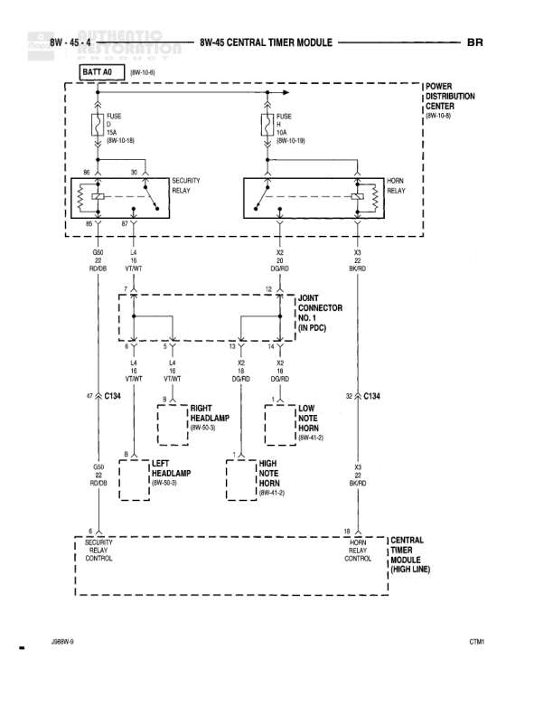

# 8W-45 CENTRAL TIMER MODULE

**Notes:** Diagram shows Central Timer Module (High Line) controlling security and horn relays with connections to headlamps and horns. Power distribution flows from battery and PDC through relays to various components.

## Components

| Component | Ref | Connectors | Notes |
|-----------|-----|------------|-------|
| BATT A0 | 8W-10-8 |  | Battery feed source |
| SECURITY RELAY | 8W-45-4 |  | Contains fuse 15A (8W-10-18) |
| HORN RELAY | 8W-45-4 |  | Contains fuse 10A (8W-10-19) |
| POWER DISTRIBUTION CENTER | 8W-10-8 |  | Power source for relays |
| JOINT CONNECTOR NO. 1 | 8W PDC |  | Junction connector |
| RIGHT HEADLAMP | 8W-50-3 | C134 |  |
| LEFT HEADLAMP | 8W-50-3 | C134 |  |
| LOW NOTE HORN | 8W-41-2 | C134 |  |
| HIGH NOTE HORN | 8W-41-2 |  |  |
| SECURITY RELAY CONTROL | 8W-45-4 |  | Control side of security relay |
| HORN RELAY CONTROL | 8W-45-4 |  | Control side of horn relay |
| CENTRAL TIMER MODULE (HIGH LINE) | 8W-45-4 |  | Main timer module |

## Wires

| From | To | Wire Code | Gauge | Color | Notes |
|------|-----|-----------|-------|-------|-------|
| BATT A0 | SECURITY RELAY (Fuse) | A | None | None | Power feed to security relay fuse |
| POWER DISTRIBUTION CENTER | HORN RELAY (Fuse) | A | None | None | Power feed to horn relay fuse |
| SECURITY RELAY | JOINT CONNECTOR NO. 1 (Pin 30) | J2 | 18 | RD/DB |  |
| SECURITY RELAY | JOINT CONNECTOR NO. 1 (Pin 18) | J4 | 18 | VT/WT |  |
| HORN RELAY | JOINT CONNECTOR NO. 1 (Pin 30) | J2 | 18 | DG/RD |  |
| HORN RELAY | JOINT CONNECTOR NO. 1 (Pin 8) | J2 | 18 | BK/RD |  |
| JOINT CONNECTOR NO. 1 (Pin 14) | C134 | L4 | 18 | VT/WT | To right headlamp |
| JOINT CONNECTOR NO. 1 (Pin 14) | LEFT HEADLAMP | L4 | 18 | VT/WT |  |
| JOINT CONNECTOR NO. 1 (Pin 8) | LOW NOTE HORN | K2 | 18 | DG/RD |  |
| JOINT CONNECTOR NO. 1 (Pin 8) | HIGH NOTE HORN | K2 | 18 | DG/RD |  |
| RIGHT HEADLAMP | G20 | None | None | None | Ground connection |
| LEFT HEADLAMP | G20 | None | None | None | Ground connection |
| HIGH NOTE HORN | K2 |  | 18 | BK/RD | Ground connection |
| SECURITY RELAY CONTROL | CENTRAL TIMER MODULE | J5 | 18 | None | Control signal |
| HORN RELAY CONTROL | CENTRAL TIMER MODULE | J6 | 18 | None | Control signal |

## Splices & Grounds

| ID | Type | Location | Wires Connected | Notes |
|----|------|----------|-----------------|-------|
| G20 | ground | Left side, connected to headlamps |  | Ground point for headlamps |
| K2 | ground | Right side, connected to horns |  | Ground point for high note horn |

## Cross-References

- 8W-10-8
- 8W-10-18
- 8W-10-19
- 8W-50-3
- 8W-41-2
