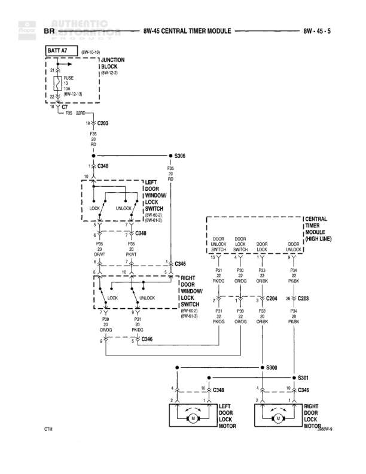

# Central Timer Module - Door Locks

**Notes:** This diagram shows the door lock control system with central timer module. The system includes left and right door window lock switches, door lock motors, and the central timer module (CTM) for high-line configuration. Power is distributed from battery through fuse 23 and junction block.

## Components

| Component | Ref | Connectors | Notes |
|-----------|-----|------------|-------|
| Battery | BATT A7 |  | 8W-10-10 |
| Junction Block | 8W-10-9 |  | Main power distribution |
| Central Timer Module | 8W-45 | C346, C348 | Main control module for door locks |
| Left Door Window Lock Switch | 8W-60-2 | C346 | Lock and unlock positions |
| Right Door Window Lock Switch | 8W-61-3 | C346 | Lock and unlock positions |
| Central Timer Module (High Line) | CTM | C203, C204 | Door unlock/lock logic control |
| Left Door Lock Motor | 8W-60-9 | C348 | Motor for left door lock actuation |
| Right Door Lock Motor | 8W-60-9 | C348 | Motor for right door lock actuation |

## Wires

| From | To | Wire Code | Gauge | Color | Notes |
|------|-----|-----------|-------|-------|-------|
| BATT A7 | FUSE 23/RD | A | 12 | RD | 8W-10-10 |
| FUSE 23/RD | Junction Block | A | 12 | RD | 8W-10-9 |
| Junction Block | C203 | None | 18 | RD | None |
| C203 | S306 | None | 20 | RD | None |
| S306 | C348 | None | 20 | RD | None |
| C348 Pin 10 | Left Door Window Lock Switch LOCK | None | None | None | None |
| C348 Pin 10 | Left Door Window Lock Switch UNLOCK | None | None | None | None |
| Left Door Window Lock Switch LOCK Pin 8 | C346 P50 OR/VT | None | 20 | OR/VT | None |
| Left Door Window Lock Switch UNLOCK Pin 9 | C346 P60 PK/VT | None | 20 | PK/VT | None |
| C346 P50 OR/VT | Right Door Window Lock Switch LOCK | None | 20 | OR/VT | None |
| C346 P60 PK/VT | Right Door Window Lock Switch UNLOCK | None | 20 | PK/VT | None |
| Right Door Window Lock Switch LOCK Pin 7 | C346 | None | 20 | OR/VT | None |
| Right Door Window Lock Switch UNLOCK Pin 8 | C346 | None | 20 | PK/VT | None |
| C346 | CTM P21 PK/DG | None | 20 | PK/DG | Door Unlock Lock |
| C346 | CTM P20 OR/DG | None | 20 | OR/DG | Door Lock Lock |
| C346 | CTM P13 OR/BK | None | 20 | OR/BK | Door Lock |
| C346 | CTM P14 PK/BK | None | 20 | PK/BK | Door Unlock |
| CTM C204 | C203 | None | 18 | None | None |
| C346 | S300 | None | 20 | None | None |
| S300 | S301 | None | None | None | None |
| S300 | C348 Pin 4 | None | 20 | None | Left Door Lock Motor |
| S301 | C348 Pin 4 | None | 20 | None | Right Door Lock Motor |
| C348 Pin 12 | Left Door Lock Motor | None | 20 | None | None |
| C348 Pin 12 | Right Door Lock Motor | None | 20 | None | None |

## Splices & Grounds

| ID | Type | Location | Wires Connected | Notes |
|----|------|----------|-----------------|-------|
| S306 | splice | Between C203 and C348 | RD from C203, RD to C348 | Power distribution splice |
| S300 | splice | Between C346 and door lock motors | From C346, To S301, To left door lock motor | Door lock motor common connection |
| S301 | splice | Between S300 and right door lock motor | From S300, To right door lock motor | Right door lock motor connection |

## Cross-References

- 8W-10-10
- 8W-10-9
- 8W-60-2
- 8W-61-3
- 8W-60-9
