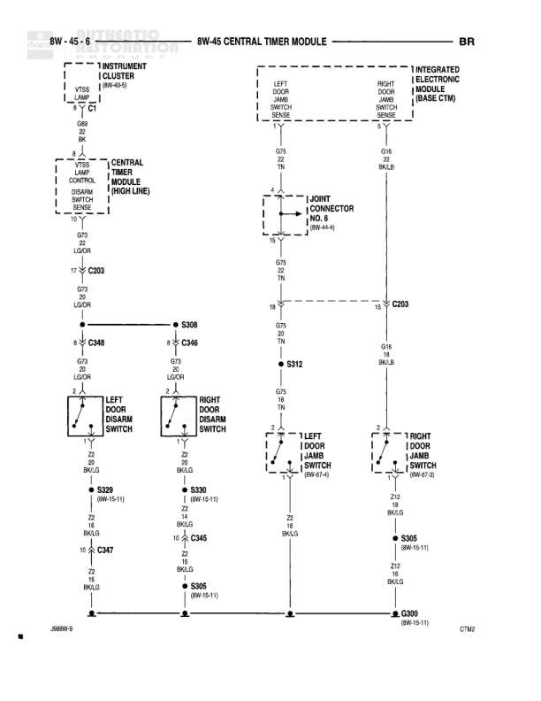

# BW-4G CENTRAL TIMER MODULE

**Notes:** Diagram shows Central Timer Module (High Line) and Integrated Electronic Module (Base CTM) configurations. Door jamb switches and door lock switches interface with the central timer module for illumination and door lock control. Ground connections are consolidated through splice points.

## Components

| Component | Ref | Connectors | Notes |
|-----------|-----|------------|-------|
| Instrument Cluster | 8W-45-5 | C1 | Includes VTSS Illum and Dbl |
| Central Timer Module (High Line) | 8W-45-6 | C203, C348, C347 | Main control module |
| Integrated Electronic Module (Base CTM) | None | C203 | Base model configuration |
| Left Door Jamb Switch | 8W-15-11 | S329 | None |
| Right Door Jamb Switch | 8W-15-11 | S330 | None |
| Left Front Jamb Switch | 8W-67-4 |  | None |
| Right Front Jamb Switch | 8W-67-3 |  | None |
| Door Lock Switch | 8W-45-4 |  | None |
| Left Door Lock Switch | None |  | None |
| Right Door Lock Switch | None |  | None |
| J Joint Connector | 8W-45-6 | C303 | None |

## Wires

| From | To | Wire Code | Gauge | Color | Notes |
|------|-----|-----------|-------|-------|-------|
| Instrument Cluster C1 | Central Timer Module C203 | G73 | 22 | LG/OR | VTSS Illum |
| Instrument Cluster C1 | Central Timer Module C203 | G73 | 22 | LG/OR | Dbl |
| Door Lock Switch | Central Timer Module C348 | G73 | 22 | LG/OR | None |
| Central Timer Module C348 | S308 | G73 | 22 | LG/OR | None |
| S308 | C346 | G73 | 22 | LG/OR | None |
| Central Timer Module C347 | Left Door Jamb Switch | Z2 | 22 | BK/LG | None |
| Central Timer Module C347 | Right Door Jamb Switch | Z2 | 22 | BK/LG | None |
| Left Door Jamb Switch S329 | S305 | G73 | 16 | BK/LG | None |
| Right Door Jamb Switch S330 | C345 | Z2 | 22 | BK/LG | None |
| C345 | S305 | Z2 | 22 | BK/LG | None |
| Left Door Lock Switch | J Joint Connector | G75 | 18 | TN | None |
| Right Door Lock Switch | J Joint Connector | G75 | 18 | TN | None |
| J Joint Connector | S312 | G75 | 18 | TN | None |
| S312 | Integrated Electronic Module C203 | G75 | 18 | TN | None |
| Left Front Jamb Switch | Ground | Z2 | 18 | BK/LG | None |
| Right Front Jamb Switch | S305 | Z2 | 18 | BK/LG | None |
| S305 | Ground C300 | Z2 | 18 | BK/LG | None |
| J Joint Connector | Integrated Electronic Module C203 | G75 | 18 | TN | None |

## Splices & Grounds

| ID | Type | Location | Wires Connected | Notes |
|----|------|----------|-----------------|-------|
| S308 | splice | Between C348 and C346 | G73 | None |
| S329 | splice | 8W-15-11 | Z2, G73 | Left Door Jamb Switch connection |
| S330 | splice | 8W-15-11 | Z2, G73 | Right Door Jamb Switch connection |
| S305 | splice | 8W-15-11 | Z2 | Combines door jamb switch grounds |
| S312 | splice | Between J Joint Connector and C203 | G75 | None |
| C300 | ground | 8W-15-11 |  | CTM2 ground point |
| 268W-9 | ground | Bottom left of diagram |  | Ground connection point |

## Cross-References

- 8W-45-5
- 8W-45-4
- 8W-15-11
- 8W-67-4
- 8W-67-3
