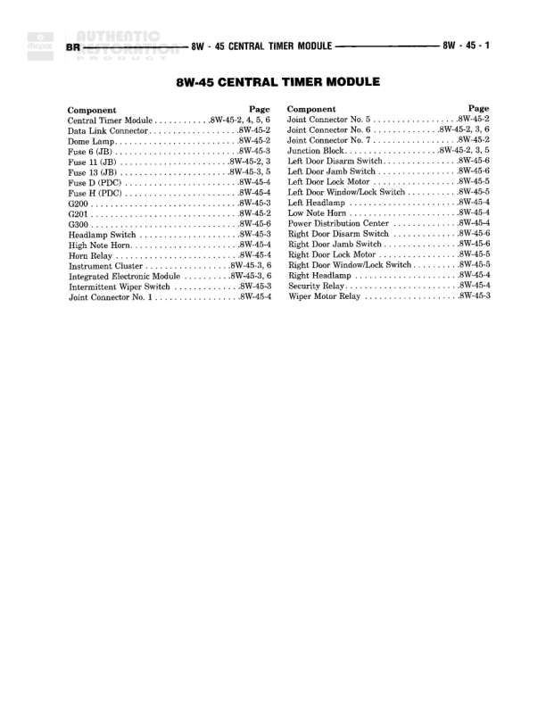

# CENTRAL TIMER MODULE

**Notes:** This is an index page for the Central Timer Module wiring diagrams, showing the location of all components across multiple diagram pages (8W-45-1 through 8W-45-6). No actual wiring connections are shown on this page.

## Components

| Component | Ref | Connectors | Notes |
|-----------|-----|------------|-------|
| Central Timer Module | 8W-45-2, 4, 5, 6 |  | Main component of this diagram section |
| Data Link Connector | 8W-45-2 |  | None |
| Door Lamp | 8W-45-2 |  | None |
| Fuse 6 (JB) | 8W-45-3 |  | Junction Block fuse |
| Fuse 11 (JB) | 8W-45-2, 3 |  | Junction Block fuse |
| Fuse 12 (JB) | 8W-45-4 |  | Junction Block fuse |
| Fuse D (PDC) | 8W-45-4 |  | Power Distribution Center fuse |
| Fuse H (PDC) | 8W-45-4 |  | Power Distribution Center fuse |
| G200 | 8W-45-3 |  | Ground point |
| G201 | 8W-45-2 |  | Ground point |
| Hazard Switch | 8W-45-4 |  | None |
| Headlamp Switch | 8W-45-3 |  | None |
| High Note Horn | 8W-45-4 |  | None |
| Horn Relay | 8W-45-4 |  | None |
| Instrument Cluster | 8W-45-4, 6 |  | None |
| Integrated Electronic Module | 8W-45-3, 6 |  | None |
| Intermittent Wiper Switch | 8W-45-3 |  | None |
| Joint Connector No. 1 | 8W-45-4 |  | None |
| Joint Connector No. 5 | 8W-45-3, 6 |  | None |
| Joint Connector No. 6 | 8W-45-2, 3, 6 |  | None |
| Joint Connector No. 7 | 8W-45-2 |  | None |
| Junction Block | 8W-45-2, 3, 5 |  | None |
| Left Door Disarm Switch | 8W-45-6 |  | None |
| Left Door Jamb Switch | 8W-45-6 |  | None |
| Left Door Lock Motor | 8W-45-5 |  | None |
| Left Door Window/Lock Switch | 8W-45-5 |  | None |
| Left Headlamp | 8W-45-4 |  | None |
| Low Note Horn | 8W-45-4 |  | None |
| Power Distribution Center | 8W-45-4 |  | None |
| Right Door Disarm Switch | 8W-45-6 |  | None |
| Right Door Jamb Switch | 8W-45-6 |  | None |
| Right Door Lock Motor | 8W-45-5 |  | None |
| Right Door Window/Lock Switch | 8W-45-5 |  | None |
| Right Headlamp | 8W-45-4 |  | None |
| Security Relay | 8W-45-4 |  | None |
| Wiper Motor Relay | 8W-45-3 |  | None |

## Splices & Grounds

| ID | Type | Location | Wires Connected | Notes |
|----|------|----------|-----------------|-------|
| G200 | ground | Referenced on 8W-45-3 |  | None |
| G201 | ground | Referenced on 8W-45-2 |  | None |

## Cross-References

- 8W-45-2
- 8W-45-3
- 8W-45-4
- 8W-45-5
- 8W-45-6
