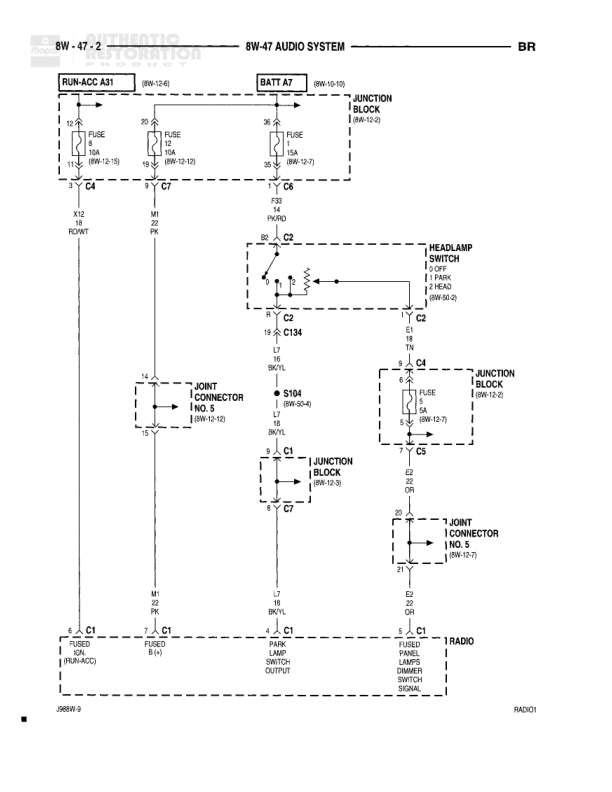

# 8W-47 AUDIO SYSTEM

**Notes:** This diagram shows the audio system power distribution including battery feed, run/accessory feed, and illumination control through the headlamp switch. The system includes multiple junction points (C1, C2, C4, C5, C7) that distribute power to the instrument cluster and radio. Wire colors include PK (Pink), WT (White), TN (Tan), GY/RD (Gray/Red), and BK (Black).

## Components

| Component | Ref | Connectors | Notes |
|-----------|-----|------------|-------|
| RUN/ACC A31 | 8W-13-0 |  | Run/Accessory power input |
| BATT A7 | 8W-10-0 |  | Battery power input |
| HEADLAMP SWITCH | 8W-40-2 | C2 | OFF, PARK, HEAD positions |
| JOINT CONNECTOR NO. 5 | 8W-12-10 |  | Upper connector |
| JOINT CONNECTOR NO. 5 | 8W-10-7 |  | Lower connector |
| INSTRUMENT CLUSTER | 8W-40-2 | C1 | ODO display |
| FUSED B(+) |  | C1 | Fused battery power |
| PARK LAMP SWITCH OUTPUT |  | C1 | Park lamp output |
| RADIO INSTRUMENT PANEL LAMPS HEADLAMP SWITCH SIGNAL | 8W-40-1 | C1 | Radio illumination control |

## Wires

| From | To | Wire Code | Gauge | Color | Notes |
|------|-----|-----------|-------|-------|-------|
| RUN/ACC A31 | FUSE 3A | P33 | 20 | PK | RUN-13-0 |
| FUSE 3A (RUN/ACC A31) | FUSE 15A | P33 | 18 | PK | 8W-13-19 |
| RUN/ACC A31 | C4 | K12 | 18 | GY/RD | RCVIT |
| BATT A7 | JUNCTION BLOCK | None | None | None | 8W-10-0, 8W-10-21 |
| BATT A7 | FUSE 10A | P33 | 20 | PK |  |
| FUSE 10A (BATT A7) | FUSE 15A | P33 | 18 | PK | 8W-13-17 |
| C4 | M1 | M1 | 18 | PK | IG; PR |
| C4 | HEADLAMP SWITCH | C2 | 18 | WT |  |
| HEADLAMP SWITCH C2 | C2 | None | 12 | CT34 | L7, L2, 8A/YL |
| C2 | C4 | None | 18 | TN | E1 |
| C4 | JUNCTION BLOCK | None | 18 | TN | FUSE 15A, 8W-12-17, 8W-12-0 |
| HEADLAMP SWITCH | S104 | None | 18 | TN | 8W-50-24 |
| C4 | JOINT CONNECTOR NO. 5 | C2 | 18 | WT | 8W-12-10 |
| JOINT CONNECTOR NO. 5 | C1 | None | 18 | WT |  |
| C7 | JUNCTION BLOCK | L7 | 18 | TN | 8W-13-0 |
| JUNCTION BLOCK C5 | JOINT CONNECTOR NO. 5 | Z0 | 18 | BK | E2, GR |
| M1 | C1 (INSTRUMENT CLUSTER) | M1 | 18 | PK | IG; IG; PR |
| L7 | C1 (PARK LAMP SWITCH OUTPUT) | L7 | 18 | TN | 8A/YL |
| C1 (JOINT CONNECTOR NO. 5) | RADIO | E2 | 18 | GR |  |

## Splices & Grounds

| ID | Type | Location | Wires Connected | Notes |
|----|------|----------|-----------------|-------|
| S104 | splice | Between headlamp switch and junction block | TN | Reference 8W-50-24 |
| C1 | connector | Multiple junction point |  | Connects to Instrument Cluster, Fused B(+), Park Lamp Switch Output, and Radio |
| C2 | connector | Headlamp switch connections |  | Multiple connections related to headlamp switch |
| C4 | connector | Upper junction area |  | Multiple wire junction point |
| C5 | connector | Junction block connection |  | Ground connection point |
| C7 | connector | Between headlamp switch and junction block |  | L7 circuit connection |

## Cross-References

- 8W-13-0
- 8W-10-0
- 8W-40-2
- 8W-12-10
- 8W-10-7
- 8W-40-1
- 8W-10-21
- 8W-13-17
- 8W-13-19
- 8W-12-17
- 8W-12-0
- 8W-50-24
