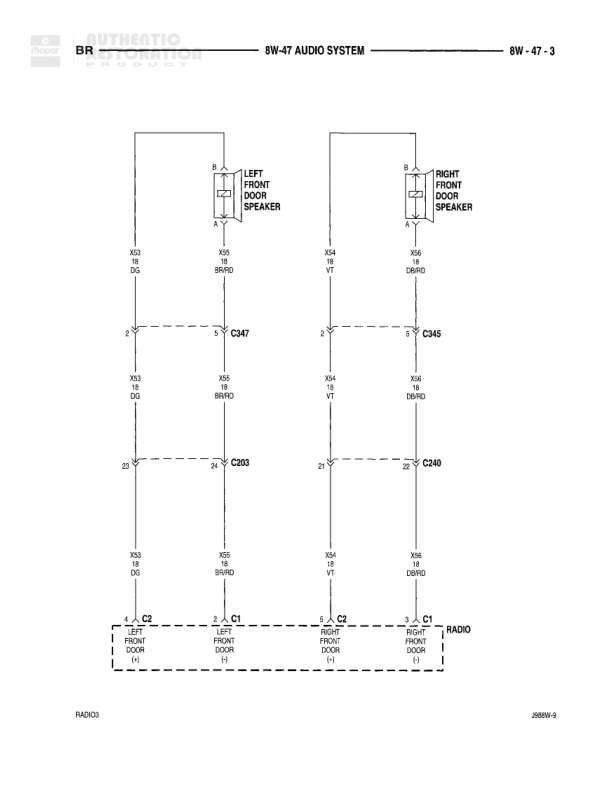

# AUDIO SYSTEM - FRONT DOOR SPEAKERS TO RADIO CONNECTION

**Notes:** This diagram shows speaker wiring from left and right front door speakers to the radio unit. All connections use 18-gauge wire. The radio unit also has connections to left and right rear door speakers (shown but not detailed in this diagram). Reference diagram 8W-47 for complete audio system context. Bottom reference shows RADIO3 and 48BW-9.

## Components

| Component | Ref | Connectors | Notes |
|-----------|-----|------------|-------|
| LEFT FRONT DOOR SPEAKER | left side, upper | C047, C203 | Two-wire speaker connection |
| RIGHT FRONT DOOR SPEAKER | right side, upper | C045, C240 | Two-wire speaker connection |
| RADIO | bottom center | C1 (LEFT REAR DOOR), C1 (LEFT FRONT DOOR), C1 (RIGHT FRONT DOOR), C1 (RIGHT REAR DOOR) | Central radio unit with connections to all door speakers |

## Wires

| From | To | Wire Code | Gauge | Color | Notes |
|------|-----|-----------|-------|-------|-------|
| LEFT FRONT DOOR SPEAKER (top pin) | C047 (top) | X53 | 18 | DG | None |
| LEFT FRONT DOOR SPEAKER (bottom pin) | C047 (bottom) | X55 | 18 | BR/YD | None |
| C047 (top) | C203 (top) | X53 | 18 | DG | None |
| C047 (bottom) | C203 (bottom) | X55 | 18 | BR/YD | None |
| C203 (top) | RADIO (LEFT FRONT DOOR, C1 top) | X53 | 18 | DG | None |
| C203 (bottom) | RADIO (LEFT FRONT DOOR, C1 bottom) | X55 | 18 | BR/YD | None |
| RIGHT FRONT DOOR SPEAKER (top pin) | C045 (top) | X52 | 18 | VT | None |
| RIGHT FRONT DOOR SPEAKER (bottom pin) | C045 (bottom) | X54 | 18 | DB/RD | None |
| C045 (top) | C240 (top) | X54 | 18 | VT | None |
| C045 (bottom) | C240 (bottom) | X58 | 18 | DB/RD | None |
| C240 (top) | RADIO (RIGHT FRONT DOOR, C1 top) | X54 | 18 | VT | None |
| C240 (bottom) | RADIO (RIGHT FRONT DOOR, C1 bottom) | X58 | 18 | DB/RD | None |

## Cross-References

- 8W-47
