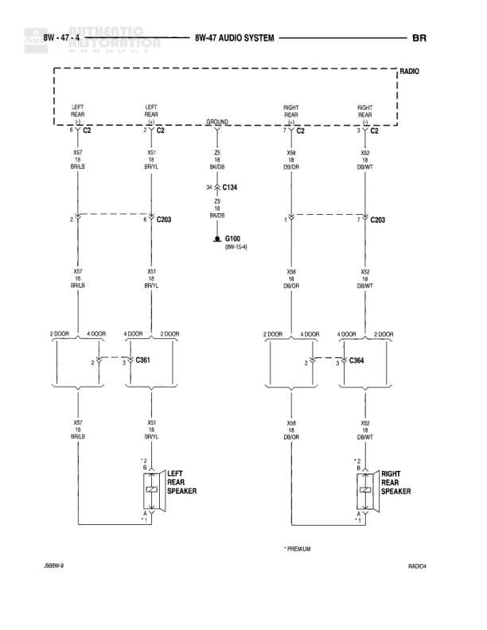

# Audio System - Rear Speakers (Premium)

**Notes:** Premium audio system rear speaker wiring. Speakers are 3 OHM impedance. Diagram shows connections from radio to left and right rear speakers through central splice C203.

## Components

| Component | Ref | Connectors | Notes |
|-----------|-----|------------|-------|
| Radio | RADIO | C2, C4 | Premium audio system |
| Left Rear Speaker | LEFT REAR SPEAKER |  | Located at rear left position |
| Right Rear Speaker | RIGHT REAR SPEAKER |  | Located at rear right position |

## Wires

| From | To | Wire Code | Gauge | Color | Notes |
|------|-----|-----------|-------|-------|-------|
| Radio C2 Pin 10 (LEFT REAR) | C203 | X57 | 18 | BR/LB | None |
| Radio C2 Pin 3 (LEFT REAR) | C203 | X51 | 18 | BR/YL | None |
| Radio C4 Pin 7 (RIGHT REAR) | C203 | X98 | 18 | DB/OR | None |
| Radio C4 Pin 5 (RIGHT REAR) | C203 | X32 | 18 | DB/WT | None |
| Radio C4 Pin 8 (GROUND) | C134 | Z2 | 18 | BK/DB | None |
| C134 | G100 | Z2 | 18 | BK/DB | None |
| C203 | C361 Pin 2 | X57 | 18 | BR/LB | None |
| C203 | C361 Pin 1 | X51 | 18 | BR/YL | None |
| C361 Pin 2 | Left Rear Speaker Pin 2 | X57 | 18 | BR/LB | None |
| C361 Pin 1 | Left Rear Speaker Pin 1 | X51 | 18 | BR/YL | None |
| C203 | C364 Pin 2 | X98 | 18 | DB/OR | None |
| C203 | C364 Pin 1 | X32 | 18 | DB/WT | None |
| C364 Pin 2 | Right Rear Speaker Pin 2 | X98 | 18 | DB/OR | None |
| C364 Pin 1 | Right Rear Speaker Pin 1 | X32 | 18 | DB/WT | None |

## Splices & Grounds

| ID | Type | Location | Wires Connected | Notes |
|----|------|----------|-----------------|-------|
| C134 | splice | Near radio connector | Z2 | Ground circuit splice |
| C203 | splice | Central distribution point for rear speaker circuits | X57, X51, X98, X32 | Main splice for rear speaker wiring |
| G100 | ground | (8W-15-4) |  | Main ground point reference |
| C361 | connector | Left rear speaker connection | X57, X51 | 2-pin connector for left rear speaker |
| C364 | connector | Right rear speaker connection | X98, X32 | 2-pin connector for right rear speaker |

## Cross-References

- 8W-15-4
