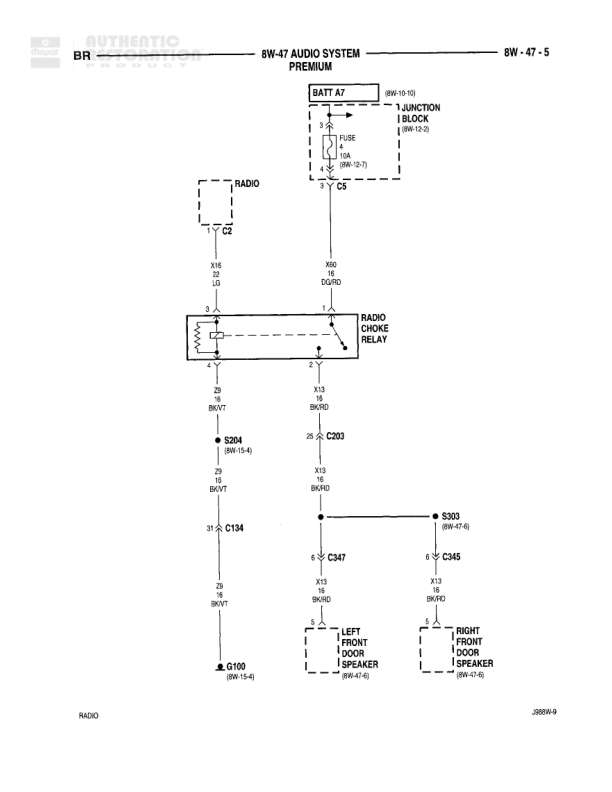

# AUDIO SYSTEM - PREMIUM

**Notes:** Premium audio system diagram showing tweeter and front door speaker connections. Includes woofer connections (C1, C2) to radio unit. All speakers connect through various splices to ground G100.

## Components

| Component | Ref | Connectors | Notes |
|-----------|-----|------------|-------|
| LEFT TWEETER | X32 9C/RD | C347 | Located in left front door area |
| RIGHT TWEETER | X32 LB/RD | C345 | Located in right front door area |
| LEFT FRONT DOOR SPEAKER | Front Door | C347 | Main speaker |
| RIGHT FRONT DOOR SPEAKER | Front Door | C345 | Main speaker |
| RADIO CHOKE RELAY | 8W-47-28 | C203 | Premium radio relay |
| LEFT FRONT WOOFER | 8W-47-6 J86W-9 | C2, C1 | Connects to radio |
| RIGHT FRONT WOOFER | 8W-47-6 J86W-9 | C2, C1 | Connects to radio |
| RADIOS | J86W-9 |  | Main radio unit reference |

## Wires

| From | To | Wire Code | Gauge | Color | Notes |
|------|-----|-----------|-------|-------|-------|
| X01 YL/BK | C347 pin 1 | X01 | None | YL/BK | Left tweeter connection |
| C347 pin 5 | S347 (to C203) | X02 | 20 | LB/BK | None |
| C203 pin 26 | S303 | None | 16 | BR/RD | From radio choke relay |
| S303 | C345 | None | None | None | Connection to right side |
| X02 LB/BK | C345 pin 5 | X02 | 20 | LB/BK | Right tweeter connection |
| C347 pin 2 | S302 | Z9 | 20 | BK/VT | None |
| C345 pin 2 | S302 | Z9 | 20 | BK/VT | None |
| C347 pin 3 | S304 | X33 | 18 | DG | None |
| C345 pin 1 | C203 | Z9 | 20 | VT | None |
| S304 | C134 | Z9 | 16 | BK/VT | Split to ground connection (8W1-15-4) |
| C134 | G100 | Z9 | 16 | BK/VT | Ground connection (8W1-15-4) |
| X33 18 DG | C1 LEFT FRONT WOOFER | X33 | 18 | DG | None |
| X35 18 BR/RD | C1 LEFT FRONT WOOFER | X35 | 18 | BR/RD | None |
| X34 18 VT | C1 RIGHT FRONT WOOFER | X34 | 18 | VT | None |
| X36 18 DB/RD | C1 RIGHT FRONT WOOFER | X36 | 18 | DB/RD | None |

## Splices & Grounds

| ID | Type | Location | Wires Connected | Notes |
|----|------|----------|-----------------|-------|
| S347 | splice | Near left front speaker | X02 | Connects to C203 |
| S303 | splice | Center of diagram | BR/RD from C203 | Distributes signal to both sides |
| S302 | splice | Center below speakers | Z9 | Connects both speaker grounds |
| S304 | splice | Lower center | X33, Z9 | Reference: 8W1-15-4 |
| C134 | connector | Lower center | Z9 | Reference: 8W1-15-4 |
| G100 | ground | Bottom center of diagram |  | Reference: 8W1-15-4 |
| C203 | connector | Top center, radio choke relay | X02, BR/RD, Z9 | Pin 26 referenced |

## Cross-References

- 8W-47-6
- 8W-47-28
- 8W1-15-4
