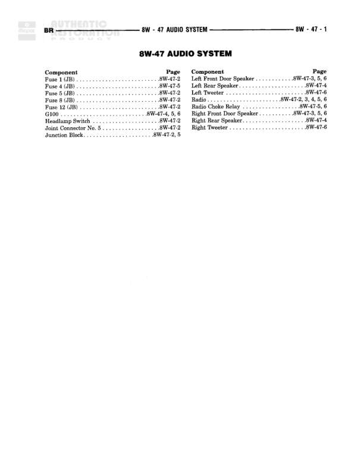

# AUDIO SYSTEM

**Notes:** This is an index/contents page for the Audio System section 8W-47, listing all components and their corresponding diagram page references. No actual wiring diagram is shown on this page.

## Components

| Component | Ref | Connectors | Notes |
|-----------|-----|------------|-------|
| Fuse 1 (JB) | 8W-47-2 |  | Junction Block fuse |
| Fuse 4 (JB) | 8W-47-5 |  | Junction Block fuse |
| Fuse 5 (JB) | 8W-47-2 |  | Junction Block fuse |
| Fuse 8 (JB) | 8W-47-5 |  | Junction Block fuse |
| Fuse 12 (JB) | 8W-47-2 |  | Junction Block fuse |
| Ground | 8W-47-2 |  |  |
| Headlamp Switch | 8W-47-2 |  |  |
| Joint Connector No. 5 | 8W-47-2 |  |  |
| Junction Block | 8W-47-2, 5 |  |  |
| Left Front Door Speaker | 8W-47-3, 5, 6 |  |  |
| Left Rear Speaker | 8W-47-4 |  |  |
| Left Tweeter | 8W-47-6 |  |  |
| Radio | 8W-47-2, 3, 4, 5, 6 |  |  |
| Radio Choke Relay | 8W-47-5, 6 |  |  |
| Right Front Door Speaker | 8W-47-3, 5, 6 |  |  |
| Right Rear Speaker | 8W-47-4 |  |  |
| Right Tweeter | 8W-47-6 |  |  |

## Cross-References

- 8W-47-2
- 8W-47-3
- 8W-47-4
- 8W-47-5
- 8W-47-6
