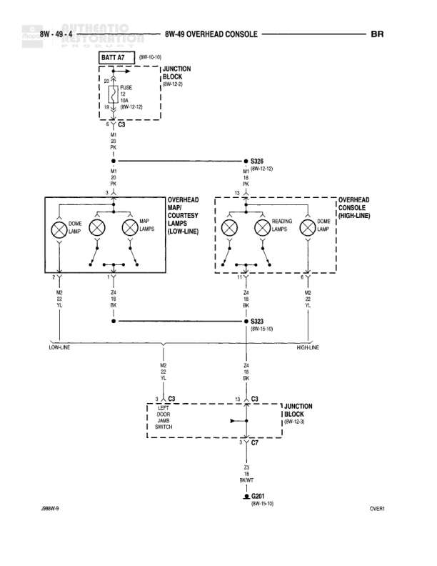

# Overhead Console

**Notes:** Diagram shows overhead console wiring including battery feed through readlamp switch, ambient temperature sensor connections, park lamp switch output, and ground paths. Multiple junction blocks interconnect the circuits.

## Components

| Component | Ref | Connectors | Notes |
|-----------|-----|------------|-------|
| Battery Feed | BATT FD |  | Power source at top of diagram |
| Readlamp Switch | 8W-50-2 | C2 | 1 PARK |
| Junction Block | 8W-52-1 | C1, C3 | Main junction block |
| Junction Block | 8W-12-3 | C1, C3 | Secondary junction block |
| Junction Block | 8W-15-8 | C3, C7 | Lower junction block |
| Ambient Temperature Sensor | Overhead Console |  | 2-pin sensor with resistor symbol |
| Overhead Console | Main component |  | Contains ambient temperature sensor, park lamp switch output, and ground connections |

## Wires

| From | To | Wire Code | Gauge | Color | Notes |
|------|-----|-----------|-------|-------|-------|
| BATT FD | Readlamp Switch C2 pin 1 | P1 | 18 | PK | From 8W-50-2 |
| Readlamp Switch C2 pin 2 | C134 | P1 | 18 | PK | None |
| C134 | Junction Block C1 (8W-52-1) | P1 | 18 | BK/YL | S104 reference |
| Junction Block C3 (8W-52-1) | OTHERS | L3 | 18 | BK/YL | LIGHTING PACKAGE |
| Junction Block C3 (8W-52-1) | S322 | L3 | 18 | BK/YL | 8W-52-7 |
| S322 | Park Lamp Switch Output | L3 | 18 | BK/YL | None |
| Junction Block C1 (8W-12-3) pin 3 | Ambient Temperature Sensor C31 | G31 | 20 | VT/LG | None |
| Junction Block C1 (8W-12-3) pin 14 | Junction Block C3 (8W-12-3) pin 5 | C1 | None | None | Internal junction block connection |
| Junction Block C3 (8W-12-3) pin 5 | Ambient Temperature Sensor C31 | G31 | 20 | VT/LG | None |
| Ambient Temperature Sensor C32 | Junction Block C3 (8W-12-3) | G32 | 20 | BK/YL | None |
| Junction Block C3 (8W-12-3) | Junction Block C1 (8W-12-3) | G32 | 20 | BK/LB | None |
| Park Lamp Switch Output | Ground | Z2 | 18 | BK/LG | None |
| Ground | Junction Block C3 (8W-15-8) | Z2 | 18 | BK/LG | None |
| Junction Block C7 (8W-15-8) | G300 | Z2 | 18 | BK/LG | 8W-15-9 |

## Splices & Grounds

| ID | Type | Location | Wires Connected | Notes |
|----|------|----------|-----------------|-------|
| C134 | connector | Between readlamp switch and junction block | P1 | In-line connector |
| S104 | splice | Reference at junction block C1 | P1 | 8W-52-4 |
| S322 | splice | Between junction block and overhead console | L3 | 8W-52-7 |
| G300 | ground | End of ground circuit |  | 8W-15-9 |
| C3 | connector | Junction Block 8W-15-8 | Z2 | In-line connector |

## Cross-References

- 8W-50-2
- 8W-52-1
- 8W-52-4
- 8W-52-7
- 8W-12-3
- 8W-15-8
- 8W-15-9
