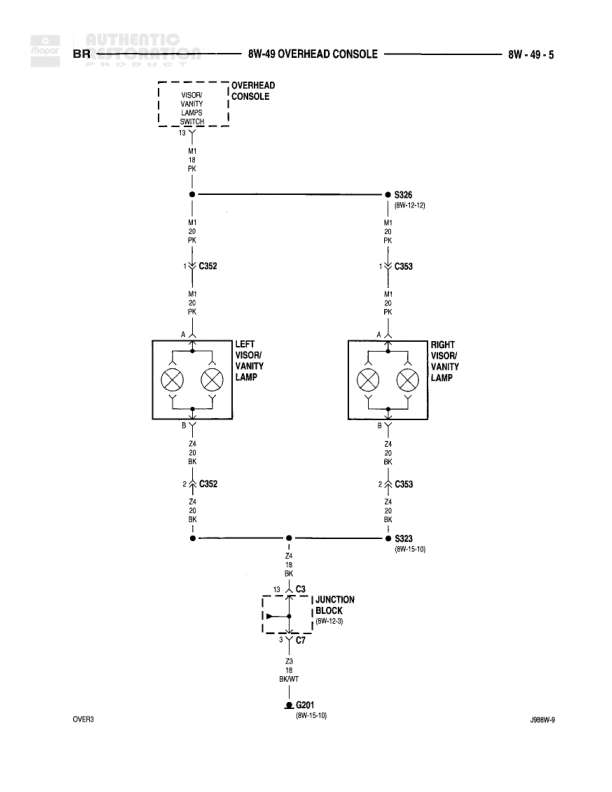

# OVERHEAD CONSOLE

**Notes:** Diagram shows overhead console wiring for both low-line (map/courtesy lamps) and high-line (reading lamps) configurations. Low-line uses M2 (interior lighting) circuit while high-line uses Z4 (ground) circuit. Door jamb switch controls operation.

## Components

| Component | Ref | Connectors | Notes |
|-----------|-----|------------|-------|
| BATT A7 | 8W-10-10 |  | Battery feed connection |
| JUNCTION BLOCK | 8W-10-3 | C3, C7 | Contains FUSE 14 |
| OVERHEAD MAP COURTESY LAMPS (LOW-LINE) | diagram location |  | Contains DOME LAMP, MAP LAMP, and MAP LAMP (LOW-LINE) |
| OVERHEAD CONSOLE (HIGH-LINE) | diagram location |  | Contains READING LAMPS and DOME LAMP |
| LEFT DOOR JAMB SWITCH | diagram location | C3 | Door jamb switch |

## Wires

| From | To | Wire Code | Gauge | Color | Notes |
|------|-----|-----------|-------|-------|-------|
| BATT A7 | JUNCTION BLOCK FUSE 14 | A7 | 20 | PK | None |
| JUNCTION BLOCK (8W-10-3) | S326 | A7 | 20 | PK | None |
| S326 | OVERHEAD MAP COURTESY LAMPS (pin L3) | A7 | 20 | PK | None |
| S326 | OVERHEAD CONSOLE HIGH-LINE (pin L3) | A7 | 20 | PK | None |
| OVERHEAD MAP LAMPS pin 1 | OVERHEAD MAP LAMPS pin 2 | M2 | 22 | YL | LOW-LINE internal connection |
| OVERHEAD MAP LAMPS pin 2 | S323 | M2 | 22 | YL | None |
| OVERHEAD CONSOLE HIGH-LINE pin 2 | S323 | Z4 | 20 | BK | None |
| OVERHEAD MAP LAMPS pin 3 | S323 | Z4 | 24 | BK | None |
| S323 | C3 | M2 | 22 | YL | LOW-LINE path |
| S323 | C3 | Z4 | 20 | BK | HIGH-LINE path |
| C3 | LEFT DOOR JAMB SWITCH | M2 | 22 | YL | None |
| C3 | JUNCTION BLOCK C7 | Z4 | 20 | BK | None |
| JUNCTION BLOCK C7 | G201 | Z4 | 18 | BK/WT | None |

## Splices & Grounds

| ID | Type | Location | Wires Connected | Notes |
|----|------|----------|-----------------|-------|
| S326 | splice | Near overhead console area | A7 | Ref: 8W-12-12. Splits power feed to low-line and high-line overhead consoles |
| S323 | splice | Near overhead console area | M2, Z4 | Ref: 8W-15-10. Combines low-line and high-line ground/switch paths |
| C3 | connector | Near left door jamb switch | M2, Z4 | In-line connector |
| C7 | connector | Junction block | Z4 | Junction block connector |
| G201 | ground | Ground point |  | Ref: 8W-15-10. Main ground for overhead console circuit |

## Cross-References

- 8W-10-10
- 8W-10-3
- 8W-12-12
- 8W-15-10
