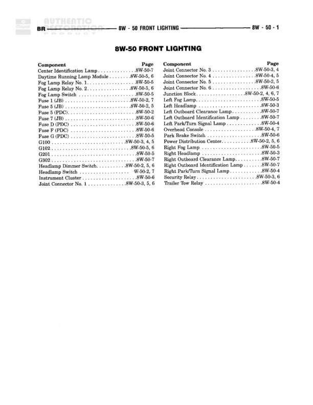

# 8W-50 FRONT LIGHTING

**Notes:** This is an index page for the 8W-50 Front Lighting section, listing all components and their corresponding page references within this diagram series.

## Components

| Component | Ref | Connectors | Notes |
|-----------|-----|------------|-------|
| Cavity Identification Lamp | 8W-50-7 |  |  |
| Daytime Running Lamp Module | 8W-50-5, 6 |  |  |
| Fog Lamp Relay No. 1 | 8W-50-5 |  |  |
| Fog Lamp Relay No. 2 | 8W-50-5, 6 |  |  |
| Fog Lamp Switch | 8W-50-5 |  |  |
| Fuse 1 (JB) | 8W-50-2 |  |  |
| Fuse 3 (JB) | 8W-50-2, 5 |  |  |
| Fuse 5 (PDC) | 8W-50-2 |  |  |
| Fuse 7 (JB) | 8W-50-6 |  |  |
| Fuse 10 (PDC) | 8W-50-6 |  |  |
| Fuse P (PDC) | 8W-50-6 |  |  |
| Fuse Q (PDC) | 8W-50-5 |  |  |
| G101 | 8W-50-2, 5, 6 |  |  |
| G102 | 8W-50-5, 6 |  |  |
| G201 | 8W-50-5 |  |  |
| G902 | 8W-50-7 |  |  |
| Headlamp Dimmer Switch | 8W-50-2, 5, 6 |  |  |
| Headlamp Switch | 8W-50-2 |  |  |
| Instrument Cluster | 8W-50-6 |  |  |
| Joint Connector No. 1 | 8W-50-3, 5, 6 |  |  |
| Joint Connector No. 3 | 8W-50-3 |  |  |
| Joint Connector No. 4 | 8W-50-4, 5 |  |  |
| Joint Connector No. 5 | 8W-50-2, 5 |  |  |
| Joint Connector No. 6 | 8W-50-6 |  |  |
| Junction Block | 8W-50-2, 4, 6 |  |  |
| Left Fog Lamp | 8W-50-5 |  |  |
| Left Headlamp | 8W-50-3 |  |  |
| Left Outboard Clearance Lamp | 8W-50-7 |  |  |
| Left Outboard Identification Lamp | 8W-50-7 |  |  |
| Left Park/Turn Signal Lamp | 8W-50-4 |  |  |
| Overhead Console | 8W-50-6 |  |  |
| Park Brake Switch | 8W-50-6 |  |  |
| Powertrain Control Module | 8W-50-2, 5, 6 |  |  |
| Right Fog Lamp | 8W-50-5 |  |  |
| Right Headlamp | 8W-50-3 |  |  |
| Right Outboard Clearance Lamp | 8W-50-7 |  |  |
| Right Outboard Identification Lamp | 8W-50-7 |  |  |
| Right Park/Turn Signal Lamp | 8W-50-4 |  |  |
| Security Relay | 8W-50-3, 6 |  |  |
| Trailer Tow Relay | 8W-50-4 |  |  |

## Cross-References

- 8W-50-2
- 8W-50-3
- 8W-50-4
- 8W-50-5
- 8W-50-6
- 8W-50-7
