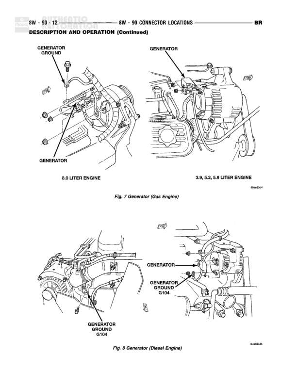

# Generator Connector Locations - Gas and Diesel Engines

**Notes:** This diagram shows physical connector locations for generators on different engine types. Fig 7 shows gas engine generator locations (8.0L and 3.9/5.2/5.9L configurations). Fig 8 shows diesel engine generator location. No wiring connections are shown, only component and ground point locations.

## Components

| Component | Ref | Connectors | Notes |
|-----------|-----|------------|-------|
| Generator | 8.0 LITER ENGINE |  | 8.0 liter gas engine configuration |
| Generator | 3.9, 5.2, 5.9 LITER ENGINE |  | 3.9, 5.2, 5.9 liter gas engine configuration |
| Generator | DIESEL ENGINE |  | Diesel engine configuration |
| Generator Ground | 8.0 LITER ENGINE |  | Ground point for 8.0 liter gas engine generator |
| Generator Ground G104 | DIESEL ENGINE |  | Ground point for diesel engine generator |

## Splices & Grounds

| ID | Type | Location | Wires Connected | Notes |
|----|------|----------|-----------------|-------|
| G104 | ground | Diesel engine generator mounting area |  | Generator ground for diesel engine applications |

## Cross-References

- 8W-90
