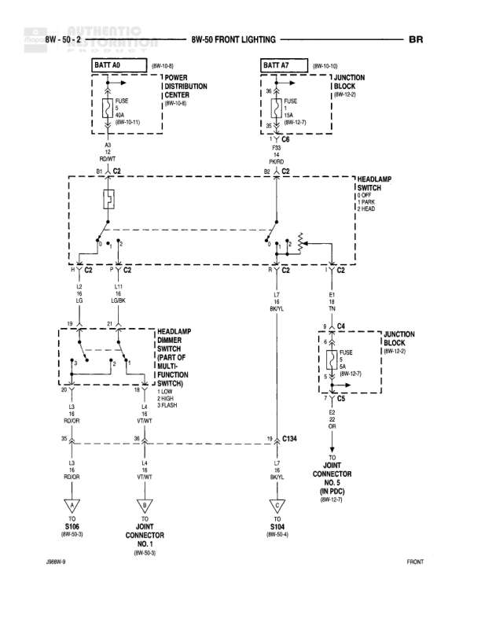

# FRONT LIGHTING

**Notes:** This diagram shows the front lighting system including headlamp switch with OFF/PARK/HEAD positions, dimmer switch with LO/DR and 2 FINISH/3 FLASH positions. Power comes from two sources: BATT A0 through PDC and BATT A7 through Junction Block. The headlamp dimmer switch is part of the multi-function switch.

## Components

| Component | Ref | Connectors | Notes |
|-----------|-----|------------|-------|
| Power Distribution Center | 8W-10-6 |  | BATT A0 |
| Junction Block | 8W-10-3 |  | BATT A7 |
| Headlamp Switch |  | C2, C4 | OFF, PARK, HEAD positions |
| Headlamp Dimmer Switch |  | C2 | Part of Multi-Function Switch |
| Left Headlamp | FRONT |  | RD/OR and VT/WT connections |
| Right Headlamp | FRONT |  | VT/WT connection |
| Door Jamb Connector | 8W-15-7 | C134 | In PDC |

## Wires

| From | To | Wire Code | Gauge | Color | Notes |
|------|-----|-----------|-------|-------|-------|
| BATT A0 | FUSE 40A (8W-10-11) | A3 | None | None | Power Distribution Center |
| FUSE 40A | Headlamp Switch C2 Pin RD/WT | A3 | None | RD/WT |  |
| BATT A7 | FUSE 15A (8W-52-7) | P33 | None | None | Junction Block |
| FUSE 15A (8W-52-7) | C5 | P8/20 | None | None |  |
| C5 | Headlamp Switch C2 | P8/20 | None | None |  |
| Headlamp Switch C2 Pin 1 | C2 | L2 | 18 | BR/YL |  |
| Headlamp Switch C2 Pin 17 | C2 | L7 | 18 | BR/YL |  |
| Headlamp Switch C2 Pin B1 | C4 Connector (8W-12-5) | B1 | 18 | TN | To Junction Block via C5 and FUSE 5A (8W-12-5) |
| Headlamp Dimmer Switch Pin 16 (LO/DR) | C2 | L8 | 18 | RD/OR |  |
| Headlamp Dimmer Switch Pin 14 (VT/WT) | C2 | L4 | 18 | VT/WT | 2 FINISH, 3 FLASH |
| C2 L8 | S106 (8W-60-3) | L8 | 18 | RD/OR |  |
| C2 L4 | Joint Connector No. 1 (8W-50-5) | L4 | 18 | VT/WT |  |
| C2 | C134 | L9 | 18 | BR/YL |  |
| C134 | S104 (8W-60-4) | L9 | 18 | BR/YL | Door Jamb Connector in PDC |

## Splices & Grounds

| ID | Type | Location | Wires Connected | Notes |
|----|------|----------|-----------------|-------|
| S106 | splice | 8W-60-3 | L8 | Left headlamp low beam connection |
| S104 | splice | 8W-60-4 | L9 | Right headlamp connection |
| C5 | connector | Between Junction Block and Headlamp Switch | P8/20, B1 | Junction point |

## Cross-References

- 8W-10-6
- 8W-10-3
- 8W-10-11
- 8W-52-7
- 8W-12-5
- 8W-60-3
- 8W-50-5
- 8W-60-4
- 8W-15-7
