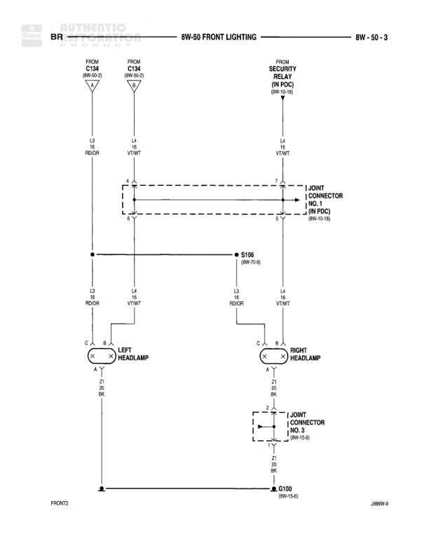

# FRONT LIGHTING

**Notes:** Diagram shows front lighting circuit for headlamps with connections from PDC (Power Distribution Center). Security alarm feeds into the circuit. Left and right headlamps have separate ground paths that merge at different points. Joint Connector NO. 1 is located in PDC at 8W-10-15. Joint Connector NO. 3 is located at 8W-13-6.

## Components

| Component | Ref | Connectors | Notes |
|-----------|-----|------------|-------|
| LEFT HEADLAMP | 8W-50-3 | C (connector with pins C, B, A) | Left side headlamp assembly |
| RIGHT HEADLAMP | 8W-50-3 | C (connector with pins C, B, A) | Right side headlamp assembly |

## Wires

| From | To | Wire Code | Gauge | Color | Notes |
|------|-----|-----------|-------|-------|-------|
| C134 (8W-10-4) | JOINT CONNECTOR NO. 1 (IN PDC) | L3 | 16 | RD/OR | From diagram 8W-10-4 |
| C134 (8W-10-4) | JOINT CONNECTOR NO. 1 (IN PDC) | L4 | 16 | YT/WT | From diagram 8W-10-4 |
| SECURITY ALARM (IN PDC) (8W-12-16) | JOINT CONNECTOR NO. 1 (IN PDC) | L4 | 16 | YT/WT | From Security Alarm in PDC |
| JOINT CONNECTOR NO. 1 (IN PDC) | LEFT HEADLAMP pin C | L3 | 16 | RD/OR | Via splice connection |
| JOINT CONNECTOR NO. 1 (IN PDC) | RIGHT HEADLAMP pin C | L3 | 16 | RD/OR | Via splice connection |
| JOINT CONNECTOR NO. 1 (IN PDC) | LEFT HEADLAMP pin B | L4 | 16 | YT/WT | Via splice connection |
| JOINT CONNECTOR NO. 1 (IN PDC) | RIGHT HEADLAMP pin B | L4 | 16 | YT/WT | Via splice connection |
| LEFT HEADLAMP pin A | FRONT2 | Z1 | 20 | BK | Ground connection from left headlamp |
| RIGHT HEADLAMP pin A | JOINT CONNECTOR NO. 3 | Z1 | 20 | BK | Ground connection from right headlamp |
| JOINT CONNECTOR NO. 3 | G100 | Z1 | 18 | BK | Ground to G100 |

## Splices & Grounds

| ID | Type | Location | Wires Connected | Notes |
|----|------|----------|-----------------|-------|
| S106 | splice | Between JOINT CONNECTOR NO. 1 and headlamps | L3 | Referenced as 8W-7-18 |
| G100 | ground | FRONT2 area |  | Referenced as 8W-12-6, main ground point |
| FRONT2 | ground | Front ground location |  | Ground point for left headlamp |

## Cross-References

- 8W-10-4
- 8W-12-16
- 8W-10-15
- 8W-7-18
- 8W-12-6
- 8W-13-6
