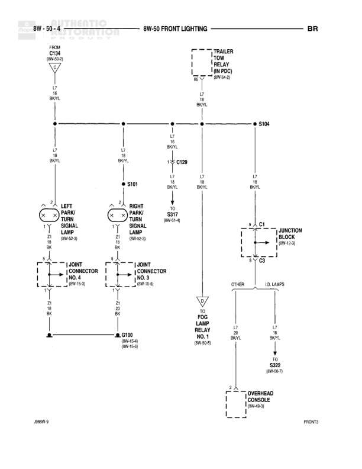

# FRONT LIGHTING

**Notes:** Diagram shows front lighting distribution including park/turn signal lamps, junction block connections, and trailer tow lighting. I.D. LAMPS designation indicates identification/marker lamps.

## Components

| Component | Ref | Connectors | Notes |
|-----------|-----|------------|-------|
| LEFT PARK/TURN SIGNAL LAMP | 8W-50-8 | C1, C2 | None |
| RIGHT PARK/TURN SIGNAL LAMP | 8W-50-8 | C1, C2 | None |
| J/OINT CONNECTOR NO. 4 | 8W-15-6 |  | None |
| J/OINT CONNECTOR NO. 3 | 8W-15-6 |  | None |
| FOG LAMP RELAY NO. 1 | 8W-50-5 |  | None |
| JUNCTION BLOCK | 8W-12-1 | C1, C8 | None |
| OVERHEAD CONSOLE | 8W-49-3 |  | None |
| TRAILER TOW (4 PIN PDC) | 8W-64-2 |  | None |

## Wires

| From | To | Wire Code | Gauge | Color | Notes |
|------|-----|-----------|-------|-------|-------|
| C134 (8W-50-2) | S104 | L7 | 18 | BK/YL | None |
| S104 | LEFT PARK/TURN SIGNAL LAMP | L4 | 18 | BK/YL | None |
| S104 | RIGHT PARK/TURN SIGNAL LAMP | L4 | 18 | BK/YL | None |
| S104 | C129 | L7 | 18 | BK/YL | None |
| C129 | S101 | L7 | 18 | BK/YL | None |
| S101 | S317 (8W-51-4) | L7 | 18 | BK/YL | None |
| S104 | TRAILER TOW (4 PIN PDC) | L7 | 18 | BK/YL | None |
| S104 | JUNCTION BLOCK C1 | L7 | 18 | BK/YL | None |
| LEFT PARK/TURN SIGNAL LAMP Z1 | J/OINT CONNECTOR NO. 4 | Z1 | 20 | BK | None |
| RIGHT PARK/TURN SIGNAL LAMP Z1 | J/OINT CONNECTOR NO. 3 | Z1 | 20 | BK | None |
| J/OINT CONNECTOR NO. 4 | G100 (8W-15-4) | Z1 | 20 | BK | None |
| J/OINT CONNECTOR NO. 3 | G100 (8W-15-4) | Z1 | 20 | BK | None |
| JUNCTION BLOCK C8 | FOG LAMP RELAY NO. 1 | L7 | 18 | BK/YL | TO |
| JUNCTION BLOCK C8 | S322 (8W-50-1) | L7 | 16 | BK/YL | I.D. LAMPS, OTHER |
| S322 | OVERHEAD CONSOLE | None | None | None | None |

## Splices & Grounds

| ID | Type | Location | Wires Connected | Notes |
|----|------|----------|-----------------|-------|
| S104 | splice | Front lighting circuit | L7, L4 | Main distribution point for front lighting |
| S101 | splice | Between C129 and S317 | L7 | None |
| S317 | splice | 8W-51-4 | L7 | None |
| S322 | splice | 8W-50-1 | L7 | None |
| C129 | connector | Between S104 and S101 | L7 | None |
| G100 | ground | 8W-15-4 |  | Ground point for park/turn signal lamps |

## Cross-References

- 8W-50-2
- 8W-50-8
- 8W-15-6
- 8W-50-5
- 8W-12-1
- 8W-49-3
- 8W-64-2
- 8W-51-4
- 8W-15-4
- 8W-50-1
