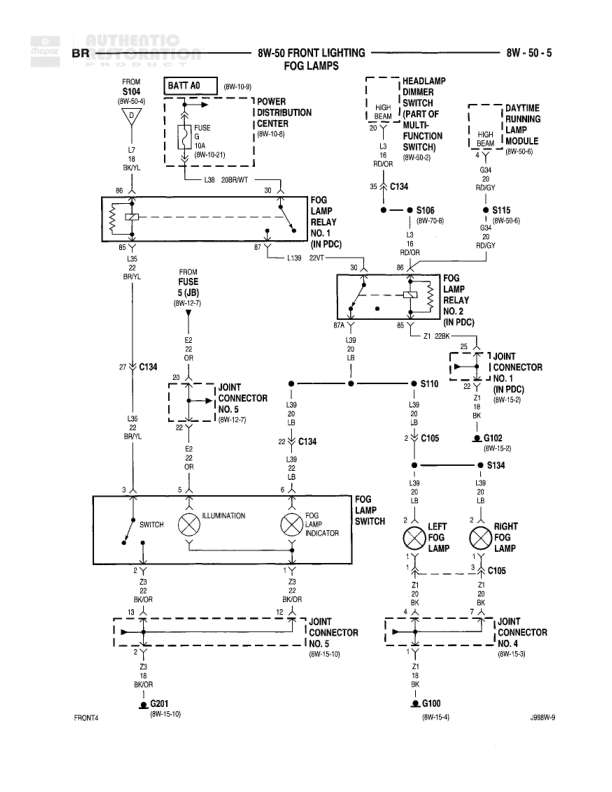

# FRONT LIGHTING - FOG LAMPS

**Notes:** This diagram shows the fog lamp circuit including battery feed, fuse protection, dual relay control (Relay No. 1 and No. 2 in PDC), integration with headlamp dimmer switch and daytime running lamps module, fog lamp switch with illumination, indicator light, and both left and right fog lamps with their respective grounds. The circuit uses multiple joint connectors and splices to distribute power and control signals.

## Components

| Component | Ref | Connectors | Notes |
|-----------|-----|------------|-------|
| Battery | S104 (8W-52-5) |  | Battery feed source |
| Fuse | BATT 40 (8W-10-1) |  | 10A fuse, 18W-(0-21) |
| Power Distribution Center | 8W-10-1 |  | Contains Fuse 5 (JB) |
| Fog Lamp Relay No. 1 | In PDC | 30, 85, 86, 87 | Located in Power Distribution Center |
| Fog Lamp Relay No. 2 | In PDC | 87A, 87 | Located in Power Distribution Center |
| Headlamp Dimmer Switch | Part of Multi-Function Switch, 8W-40-3 |  | High/Low Beam control |
| Daytime Running Lamps Module | 8W-50-7 |  | DRL control, ON = HGND |
| Fog Lamp Switch | Located in instrument panel | SWITCH, ILLUMINATION | Controls fog lamp operation |
| Fog Lamp Indicator | In instrument cluster |  | Indicator light for fog lamps on |
| Left Fog Lamp | Front left fog lamp assembly |  | Ground at G201 (8W-15-10) |
| Right Fog Lamp | Front right fog lamp assembly |  | Ground at G100 (8W-15-4) |

## Wires

| From | To | Wire Code | Gauge | Color | Notes |
|------|-----|-----------|-------|-------|-------|
| S104 | BATT 40 Fuse | A2 | 12 | RD/YL |  |
| BATT 40 Fuse | Power Distribution Center | A2 | 12 | RD/YL |  |
| Power Distribution Center | Fog Lamp Relay No. 1 (30) | L38 | None | DB/RWT |  |
| Fog Lamp Relay No. 1 (30) | C134 | L38 | None | DB/RWT |  |
| Headlamp Dimmer Switch | S106 (8W-70-6) | L4 | 18 | BK/OR |  |
| S106 | Fog Lamp Relay No. 2 (87A) | L39 | 20 | DB/WT |  |
| Daytime Running Lamps Module | S115 (8W-50-8) | L21 | 18 | GY/OR | ON = HGND |
| S115 | Fog Lamp Relay No. 2 (87) | L21 | 20 | GY/OR |  |
| Fog Lamp Relay No. 2 | Fog Lamp Relay No. 1 (85) | L39 | 20 | DB/WT |  |
| Fog Lamp Relay No. 1 (86) | S10 | L39 | 20 | DB/WT |  |
| Fuse 5 (JB) | C134 | E2 | 20 | GY |  |
| C134 | Joint Connector No. 5 | E2 | 20 | GY |  |
| Joint Connector No. 5 | Fog Lamp Switch (ILLUMINATION) | E2 | 20 | GY |  |
| S10 | Joint Connector No. 3 (8W-14-2) | L39 | 20 | DB/WT |  |
| Joint Connector No. 3 | Fog Lamp Switch | L39 | 20 | DB/WT |  |
| Fog Lamp Switch | C134 | L39 | 20 | DB/WT |  |
| C134 | Fog Lamp Indicator | L39 | 20 | DB/WT |  |
| C134 | C105 | L38 | None | DB/WT |  |
| C105 | C102 (8W-13-2) | L38 | None | DB/WT |  |
| C102 | S134 | L38 | None | DB/WT |  |
| S134 | Left Fog Lamp | L38 | None | DB/WT |  |
| S134 | Right Fog Lamp | L38 | None | DB/WT |  |
| Left Fog Lamp | Joint Connector No. 5 (8W-10-10) | Z2 | 20 | BK/OR |  |
| Joint Connector No. 5 | G201 | Z2 | 20 | BK/OR |  |
| Right Fog Lamp | Joint Connector No. 4 (8W-10-3) | Z2 | 20 | BK/OR |  |
| Joint Connector No. 4 | G100 | Z2 | 20 | BK/OR |  |
| Fog Lamp Switch (SWITCH) | Ground | Z2 | None | BK/OR | Switch ground connection |
| Fog Lamp Indicator | Ground | Z2 | None | BK/OR | Indicator ground connection |

## Splices & Grounds

| ID | Type | Location | Wires Connected | Notes |
|----|------|----------|-----------------|-------|
| S104 | splice | 8W-52-5 | A2 | Battery feed splice |
| S106 | splice | 8W-70-6 | L4, L39 | Headlamp dimmer circuit splice |
| S115 | splice | 8W-50-8 | L21 | DRL module splice |
| S10 | splice | Near fog lamp relay | L39 | Fog lamp control splice |
| S134 | splice | Front of vehicle | L38 | Splits power to left and right fog lamps |
| C134 | splice | Central connection point | L38, L39, E2 | Main distribution point for fog lamp circuits |
| C105 | connector | Between C134 and C102 | L38 | In-line connector |
| C102 | connector | 8W-13-2 | L38 | In-line connector |
| G201 | ground | 8W-15-10 |  | Ground for left fog lamp |
| G100 | ground | 8W-15-4 |  | Ground for right fog lamp |

## Cross-References

- 8W-52-5
- 8W-10-1
- 8W-40-3
- 8W-50-7
- 8W-70-6
- 8W-50-8
- 8W-14-2
- 8W-13-2
- 8W-10-10
- 8W-10-3
- 8W-15-10
- 8W-15-4
