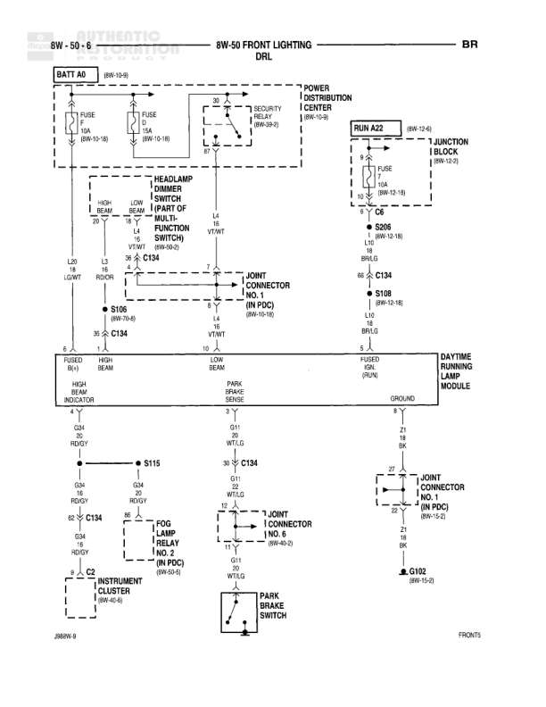

# 8W-50 FRONT LIGHTING - DRL

**Notes:** This diagram shows the Daytime Running Lamp (DRL) system with connections to headlamp controls, security relay, and park brake switch. The system uses the multi-function switch for headlamp dimmer control and includes indicators for low and high beam operation. Ground paths route through multiple joint connectors in the PDC.

## Components

| Component | Ref | Connectors | Notes |
|-----------|-----|------------|-------|
| Battery | BATT 40 |  | Power source at 8W-10-0 |
| Security Relay | 8W-50-0 |  | Located in Power Distribution Center |
| Headlamp Dimmer Switch (Part of Multi-Function Switch) | 8W-50-9 | C134 | Controls headlamp beam selection |
| Daytime Running Lamp Module | FRONT5 | C134 | Controls DRL operation |
| Junction Block | 8W-15-6 |  | Contains FUSE and RUN A22 |
| Headlamp Connector No. 1 (IN PDC) | 8W-10-10 |  | Located in Power Distribution Center |
| Headlamp Low Beam Indicator | FUSED IGN (RUN) |  | Indicator light |
| Headlamp High Beam Indicator | HIGH BEAM INDICATOR |  | Indicator light |
| Instrument Cluster | 8W-40-40 | C2 | Displays indicators |
| Park Brake Switch | FRONT5 |  | Monitors park brake status for DRL |
| Headlamp Relay No. 2 (IN PDC) | 8W-50-9 |  | Controls headlamp circuit |
| Joint Connector No. 8 (IN PDC) | 8W-06-2 |  | Wiring junction point |
| Joint Connector No. 9 (IN PDC) | 8W-15-2 |  | Wiring junction point |

## Wires

| From | To | Wire Code | Gauge | Color | Notes |
|------|-----|-----------|-------|-------|-------|
| BATT 40 | FUSE 10A (8W-10-18) | A | None | None | Battery feed |
| FUSE 10A | Security Relay | A | None | None | None |
| BATT 40 | FUSE 15A (8W-10-18) | A | None | None | Battery feed |
| Security Relay | Headlamp Dimmer Switch | L4 | 14 | VT/WT | None |
| Headlamp Dimmer Switch L9 (LOW) | S106 | None | None | None | None |
| Headlamp Dimmer Switch L3 (HIGH) | C134 | None | None | None | None |
| S106 (8W-70-9) | C134 | None | 20 | None | None |
| Junction Block FUSE (8W-12-18) | RUN A22 (8W-15-6) | K | None | None | None |
| RUN A22 | C6 | K | None | None | None |
| C6 | S268 (8W-10-18) | None | None | LG/RD | None |
| S268 | C134 | None | 20 | BR/LG | None |
| C134 | S108 (8W-15-18) | None | 20 | BR/LG | None |
| Headlamp Connector No. 1 L4 | C134 | L4 | 14 | VT/WT | None |
| DRL Module FUSED IGN (RUN) | LOW BEAM | None | None | None | None |
| DRL Module HIGH BEAM INDICATOR | PARK BRAKE SENSE | None | None | None | None |
| DRL Module C30 | S115 | None | None | G34 18 WT/LG RD/GY | None |
| S115 | C134 | None | 20 | G34 G11 20 WT/LG | None |
| DRL Module G34 | C134 | None | None | G34 18 RD/GY | None |
| C134 | Headlamp Relay No. 2 (IN PDC) | None | 20 | G34 G11 20 WT/LG | None |
| C134 | Joint Connector No. 8 | None | None | G11 20 WT/LG | None |
| Joint Connector No. 8 | Joint Connector No. 9 | None | None | Z1 20 | None |
| Joint Connector No. 9 Z7 | G102 (8W-15-2) | Z7 | None | None | None |
| Instrument Cluster C2 G34 | S115 | G34 | 18 | RD/GY | None |
| Park Brake Switch | DRL Module | None | None | GROUND | None |

## Splices & Grounds

| ID | Type | Location | Wires Connected | Notes |
|----|------|----------|-----------------|-------|
| S106 | splice | 8W-70-9 | L9 from Dimmer Switch, C134 connection | None |
| S268 | splice | 8W-10-18 | K circuit from RUN A22, BR/LG to C134 | LG/RD to BR/LG transition |
| S108 | splice | 8W-15-18 | BR/LG from C134 | None |
| S115 | splice | Between DRL Module and C134 | G34 from Instrument Cluster, WT/LG to C134, RD/GY to DRL Module | None |
| G102 | ground | 8W-15-2 |  | Ground point for Joint Connector No. 9 |

## Cross-References

- 8W-10-0
- 8W-10-10
- 8W-10-18
- 8W-12-18
- 8W-15-2
- 8W-15-6
- 8W-15-18
- 8W-40-40
- 8W-50-0
- 8W-50-9
- 8W-70-9
- 8W-06-2
