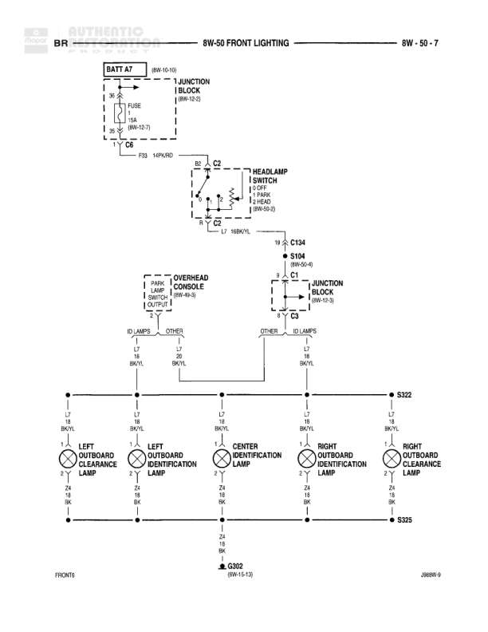

# FRONT LIGHTING

**Notes:** Front lighting circuit for BR (presumably BR trim level) showing battery feed through junction block, headlamp switch control, and distribution to five front lamps (two clearance, three identification). All lamps share common ground at G302. J989W-9 notation appears in bottom right corner.

## Components

| Component | Ref | Connectors | Notes |
|-----------|-----|------------|-------|
| JUNCTION BLOCK | 8W-42-2 | C6, C2, C3 | Main power distribution for front lighting |
| HEADLAMP SWITCH | 8W-50-5 | C2, C3 | Controls headlamps and parking lamps |
| OVERHEAD CONSOLE | 8W-49-3 |  | Park Switch & Output controls ID lamps and dome lamps |
| LEFT OUTBOARD CLEARANCE LAMP |  |  |  |
| LEFT OUTBOARD IDENTIFICATION LAMP |  |  |  |
| CENTER IDENTIFICATION LAMP |  |  |  |
| RIGHT OUTBOARD IDENTIFICATION LAMP |  |  |  |
| RIGHT OUTBOARD CLEARANCE LAMP |  |  |  |

## Wires

| From | To | Wire Code | Gauge | Color | Notes |
|------|-----|-----------|-------|-------|-------|
| BATT A2 (8W-10-10) | JUNCTION BLOCK C6 | A2 | 10 | RD | Battery feed to junction block |
| JUNCTION BLOCK | FUSE 14A (8W-12-7) | A2 | 10 | RD |  |
| JUNCTION BLOCK C6 | F33 14PKD | F33 | 14 | PK/DB |  |
| F33 14PKD | HEADLAMP SWITCH C2 | F33 | 14 | PK/DB |  |
| HEADLAMP SWITCH C2 | HEADLAMP SWITCH C3 | L7 | 18 | WT/VL |  |
| HEADLAMP SWITCH C3 | C134 | L7 | 18 | WT/VL |  |
| C134 | S104 (8W-50-4) | L7 | 18 | WT/VL |  |
| S104 | JUNCTION BLOCK C3 (8W-42-3) | L9 | 18 | BR/VL |  |
| JUNCTION BLOCK C3 | Overhead Console ID LAMPS | None | None | OTHER |  |
| JUNCTION BLOCK C3 | Overhead Console ID LAMPS | None | None | OTHER |  |
| Overhead Console ID LAMPS | S322 | L2 | 18 | BK/VL | Left branch |
| Overhead Console ID LAMPS | S322 | L2 | 18 | BK/VL | Right branch |
| S322 | LEFT OUTBOARD CLEARANCE LAMP | L2 | 18 | BK/VL |  |
| S322 | LEFT OUTBOARD IDENTIFICATION LAMP | L2 | 18 | BK/VL |  |
| S322 | CENTER IDENTIFICATION LAMP | L2 | 18 | BK/VL |  |
| S322 | RIGHT OUTBOARD IDENTIFICATION LAMP | L2 | 18 | BK/VL |  |
| S322 | RIGHT OUTBOARD CLEARANCE LAMP | L2 | 18 | BK/VL |  |
| LEFT OUTBOARD CLEARANCE LAMP | S325 | Z1 | 18 | BK |  |
| LEFT OUTBOARD IDENTIFICATION LAMP | S325 | Z1 | 18 | BK |  |
| CENTER IDENTIFICATION LAMP | S325 | Z1 | 18 | BK |  |
| RIGHT OUTBOARD IDENTIFICATION LAMP | S325 | Z1 | 18 | BK |  |
| RIGHT OUTBOARD CLEARANCE LAMP | S325 | Z1 | 18 | BK |  |
| S325 | G302 (8W-1-1-12) | Z1 | 18 | BK |  |

## Splices & Grounds

| ID | Type | Location | Wires Connected | Notes |
|----|------|----------|-----------------|-------|
| C134 | connector | Between headlamp switch and S104 | L7 |  |
| S104 | splice | 8W-50-4 | L7, L9 | Splits headlamp switch output to junction block |
| S322 | splice | Distribution point for front lamps | L2 | Distributes power to all five front lamps |
| S325 | splice | Ground collection point for front lamps | Z1 | Collects ground from all five front lamps |
| G302 | ground | 8W-1-1-12 |  | Main ground point for front lighting |

## Cross-References

- 8W-10-10
- 8W-42-2
- 8W-12-7
- 8W-50-5
- 8W-50-4
- 8W-42-3
- 8W-49-3
- 8W-1-1-12
