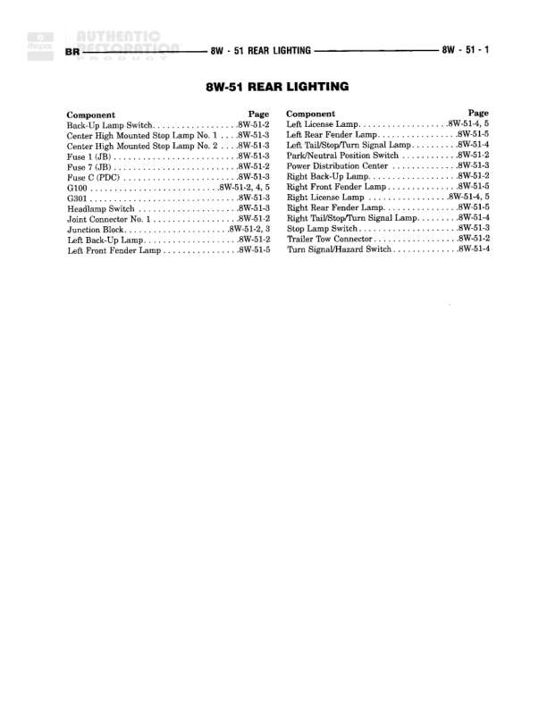

# REAR LIGHTING

**Notes:** This is an index page for the Rear Lighting section. It lists all components and their corresponding diagram page references within the 8W-51 series. No actual wiring connections are shown on this page.

## Components

| Component | Ref | Connectors | Notes |
|-----------|-----|------------|-------|
| Back-Up Lamp Switch | 8W-51-3 |  |  |
| Center High Mounted Stop Lamp No. 1 | 8W-51-3 |  |  |
| Center High Mounted Stop Lamp No. 2 | 8W-51-3 |  |  |
| Fuse 1 (JB) | 8W-51-3 |  |  |
| Fuse 7 (JB) | 8W-51-2 |  |  |
| Fuse C (PDC) | 8W-51-3 |  |  |
| G100 | 8W-51-2, 4, 5 |  |  |
| G101 | 8W-51-4 |  |  |
| Headlamp Switch | 8W-51-3 |  |  |
| Joint Connector No. 1 | 8W-51-2 |  |  |
| Junction Block | 8W-51-2, 3 |  |  |
| Left Back-Up Lamp | 8W-51-2 |  |  |
| Left Front Fender Lamp | 8W-51-5 |  |  |
| Left Rear Fender Lamp | 8W-51-5 |  |  |
| Left Tail/Stop/Turn Signal Lamp | 8W-51-4 |  |  |
| Park/Neutral Position Switch | 8W-51-2 |  |  |
| Power Distribution Center | 8W-51-3 |  |  |
| Right Back-Up Lamp | 8W-51-4 |  |  |
| Right Front Fender Lamp | 8W-51-5 |  |  |
| Right Rear Fender Lamp | 8W-51-5 |  |  |
| Right Tail/Stop/Turn Signal Lamp | 8W-51-4 |  |  |
| Stop Lamp Switch | 8W-51-3 |  |  |
| Trailer Tow Connector | 8W-51-2 |  |  |
| Turn Signal/Hazard Switch | 8W-51-4 |  |  |

## Splices & Grounds

| ID | Type | Location | Wires Connected | Notes |
|----|------|----------|-----------------|-------|
| G100 | ground | Referenced in diagrams 8W-51-2, 4, 5 |  |  |
| G101 | ground | Referenced in diagram 8W-51-4 |  |  |

## Cross-References

- 8W-51-2
- 8W-51-3
- 8W-51-4
- 8W-51-5
