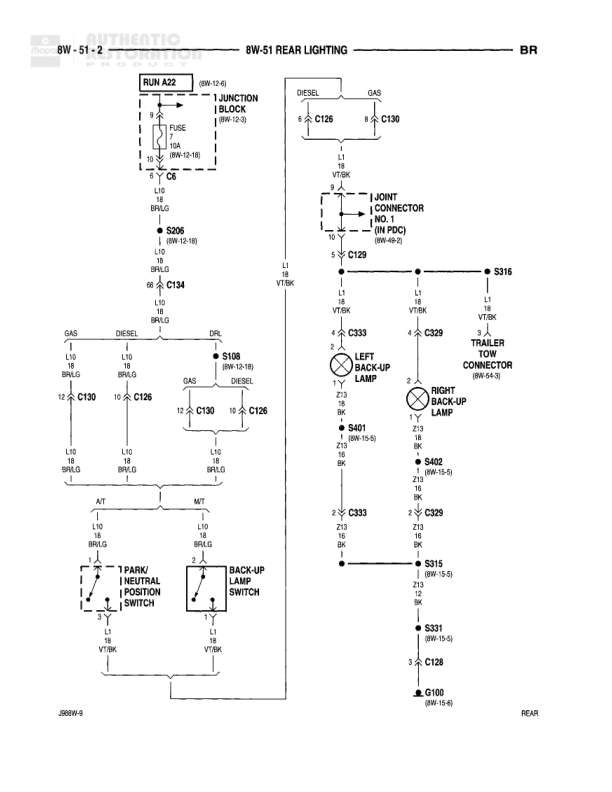

# REAR LIGHTING

**Notes:** Diagram shows rear lighting back-up lamp circuit with separate paths for GAS and DIESEL variants, and provisions for A/T (Park/Neutral Position Switch) and M/T (Back-up Lamp Switch). Includes trailer tow connector circuit. Document reference: 2869W-5

## Components

| Component | Ref | Connectors | Notes |
|-----------|-----|------------|-------|
| RUN A22 | 8W-12-6 |  | Junction Block reference |
| JUNCTION BLOCK | 8W-12-3 |  | Contains FUSE 10A (8W-12-18) |
| LEFT BACK-UP LAMP | Component |  | None |
| RIGHT BACK-UP LAMP | Component |  | None |
| PARK/NEUTRAL POSITION SWITCH | A/T Component |  | Automatic Transmission |
| BACK-UP LAMP SWITCH | M/T Component |  | Manual Transmission |
| TRAILER TOW CONNECTOR | 8W-49-2 |  | None |
| J JOINT CONNECTOR | Component (IN PDC) |  | In PDC, reference 8W-49-2 |

## Wires

| From | To | Wire Code | Gauge | Color | Notes |
|------|-----|-----------|-------|-------|-------|
| RUN A22 | FUSE (Junction Block) | A22 | 10 | RD | None |
| FUSE (Junction Block) | C6 | L16 | 18 | BR/LG | None |
| C6 | S206 | L16 | 18 | BR/LG | 8W-15-10 |
| C6 | C134 | L16 | 18 | BR/LG | 69 |
| C134 | S108 | L16 | 18 | BR/LG | GAS/DIESEL |
| S108 | C126 | L16 | 18 | BR/LG | GAS, pin 12 |
| S108 | C126 | L16 | 18 | BR/LG | DIESEL, pin 10 |
| C126 | C130 | L16 | 18 | BR/LG | GAS, pin 12 |
| C126 | C128 | L16 | 18 | BR/LG | DIESEL, pin 10 |
| C130 | DIESEL connection | L16 | 18 | BR/LG | None |
| C128 | GAS connection | L16 | 18 | BR/LG | None |
| DIESEL | C126 | None | None | None | VT/BK |
| GAS | C130 | None | None | None | VT/BK |
| J JOINT CONNECTOR | C129 | L3 | 18 | VT/BK | VT/BK connection |
| C129 | S316 | L3 | 18 | VT/BK | None |
| S316 | C333 | L3 | 18 | VT/BK | None |
| S316 | C329 | L3 | 18 | VT/BK | None |
| C333 | LEFT BACK-UP LAMP | Z13 | 16 | BK | None |
| C329 | TRAILER TOW CONNECTOR | Z13 | 16 | BK | None |
| LEFT BACK-UP LAMP | S401 | Z13 | 16 | BK | 8W-15-8 |
| TRAILER TOW CONNECTOR | S402 | Z13 | 16 | BK | 8W-15-8 |
| C333 | S315 | Z13 | 16 | BK | None |
| C329 | S315 | Z13 | 16 | BK | None |
| S315 | S331 | Z13 | 12 | BK | 8W-15-8 |
| S331 | C128 | Z13 | 12 | BK | 8W-15-8 |
| C128 | G100 | Z13 | 12 | BK | 8W-15-8, REAR |
| PARK/NEUTRAL POSITION SWITCH | L1 connection | L16 | 18 | BR/LG | A/T |
| BACK-UP LAMP SWITCH | L1 connection | L16 | 18 | BR/LG | M/T |
| PARK/NEUTRAL POSITION SWITCH | VT/BK connection | L3 | 18 | VT/BK | A/T |
| BACK-UP LAMP SWITCH | VT/BK connection | L3 | 18 | VT/BK | M/T |

## Splices & Grounds

| ID | Type | Location | Wires Connected | Notes |
|----|------|----------|-----------------|-------|
| S206 | splice | 8W-15-10 | L16 | None |
| S108 | splice | Central distribution point | L16 | DIESEL/GAS split |
| S316 | splice | Back-up lamp circuit | L3 | None |
| S401 | splice | 8W-15-8 | Z13 | Left back-up lamp ground |
| S402 | splice | 8W-15-8 | Z13 | Trailer tow connector ground |
| S315 | splice | Back-up lamp ground junction | Z13 | 8W-15-8 |
| S331 | splice | Main ground junction | Z13 | 8W-15-8 |
| G100 | ground | REAR |  | 8W-15-8, 12 gauge BK |
| C6 | connector | Junction block output | L16 | None |
| C134 | connector | Pin 69 | L16 | None |
| C126 | connector | GAS/DIESEL split point | L16 | Pin 12 (GAS) or Pin 10 (DIESEL) |
| C130 | connector | GAS branch | L16 | Pin 12 |
| C128 | connector | DIESEL branch and ground return | L16, Z13 | Pin 10 |
| C129 | connector | J Joint Connector output | L3 | None |
| C333 | connector | Left back-up lamp | L3, Z13 | None |
| C329 | connector | Right back-up lamp/Trailer | L3, Z13 | None |

## Cross-References

- 8W-12-6
- 8W-12-3
- 8W-12-18
- 8W-15-10
- 8W-15-8
- 8W-49-2
