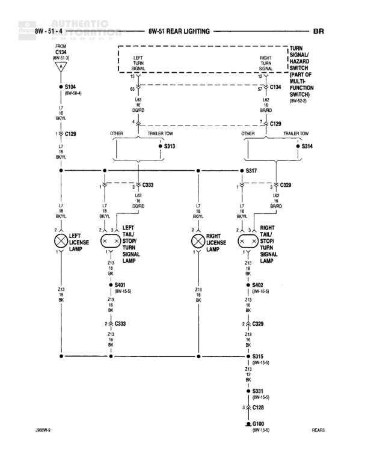

# REAR LIGHTING

**Notes:** Diagram shows rear lighting system including license lamps and tail/stop/turn signal lamps. System includes connections to turn signal/hazard warning switch (multifunction switch) and trailer tow connections. Document reference: J1669W-3

## Components

| Component | Ref | Connectors | Notes |
|-----------|-----|------------|-------|
| TURN SIGNAL/HAZARD WARNING SWITCH (MULTIFUNCTION SWITCH) | 8W-54-2 | C134 | Located in steering column |
| LEFT LICENSE LAMP | None |  | None |
| LEFT TAIL/STOP/TURN SIGNAL LAMP | None |  | None |
| RIGHT LICENSE LAMP | None |  | None |
| RIGHT TAIL/STOP/TURN SIGNAL LAMP | None |  | None |

## Wires

| From | To | Wire Code | Gauge | Color | Notes |
|------|-----|-----------|-------|-------|-------|
| C134 (8W-51-2) | S104 (8W-60-4) | L6 | 18 | BK/YL | None |
| S104 (8W-60-4) | C129 | L6 | 18 | BK/YL | None |
| C134 Pin 63 | LEFT TURN SIGNAL | L8 | 18 | DG/RD | None |
| C134 Pin 67 | RIGHT TURN SIGNAL | L8 | 18 | BR/RD | None |
| LEFT TURN SIGNAL | C129 | None | None | None | Labeled OTHER and TRAILER TOW on diagram |
| RIGHT TURN SIGNAL | C129 | None | None | None | Labeled OTHER and TRAILER TOW on diagram |
| C129 | S313 | None | None | None | Left side connection |
| C129 | S314 | None | None | None | Right side connection |
| S313 | S317 and C233 | L40 | 18 | DG/RD | None |
| S314 | S317 and C239 | L40 | 18 | BR/RD | None |
| S317 | C233 | L7 | 18 | BK/YL | None |
| S317 | C239 | L7 | 18 | BK/YL | None |
| C233 Pin 1 | LEFT LICENSE LAMP | L7 | 18 | BK/YL | None |
| C233 Pin 3 | LEFT TAIL/STOP/TURN SIGNAL LAMP | L40 | 18 | DG/RD | None |
| C239 Pin 1 | RIGHT LICENSE LAMP | L7 | 18 | BK/YL | None |
| C239 Pin 3 | RIGHT TAIL/STOP/TURN SIGNAL LAMP | L40 | 18 | BR/RD | None |
| LEFT LICENSE LAMP | S402 (8W-15-5) | Z13 | 18 | BK | None |
| LEFT TAIL/STOP/TURN SIGNAL LAMP Pin 2 | S333 | Z13 | 18 | BK | None |
| S333 | S402 (8W-15-5) | Z13 | 18 | BK | None |
| RIGHT LICENSE LAMP | S402 (8W-15-5) | Z13 | 18 | BK | None |
| RIGHT TAIL/STOP/TURN SIGNAL LAMP Pin 2 | C329 | Z13 | 18 | BK | None |
| C329 | S318 (8W-15-5) | Z13 | 18 | BK | None |
| S318 (8W-15-5) | S331 (8W-15-5) | Z12 | 16 | BK | None |
| S331 (8W-15-5) | C128 | Z1 | 12 | BK | None |
| C128 | G100 (8W-15-5) | Z1 | 12 | BK | None |

## Splices & Grounds

| ID | Type | Location | Wires Connected | Notes |
|----|------|----------|-----------------|-------|
| S104 | splice | 8W-60-4 | L6 | None |
| S313 | splice | Left side rear lighting circuit | L40 | Connects left turn signal to tail/stop/turn lamp |
| S314 | splice | Right side rear lighting circuit | L40 | Connects right turn signal to tail/stop/turn lamp |
| S317 | splice | Center rear lighting circuit | L7 | Distributes tail lamp power to left and right sides |
| S333 | splice | Left tail/stop/turn signal lamp ground circuit | Z13 | None |
| S402 | splice | 8W-15-5 | Z13 | Ground splice for license lamps and left tail lamp |
| S318 | splice | 8W-15-5 | Z13, Z12 | Ground splice for right tail lamp |
| S331 | splice | 8W-15-5 | Z12, Z1 | Ground splice consolidation |
| G100 | ground | 8W-15-5 |  | Main ground point for rear lighting |

## Cross-References

- 8W-51-2
- 8W-60-4
- 8W-54-2
- 8W-15-5
