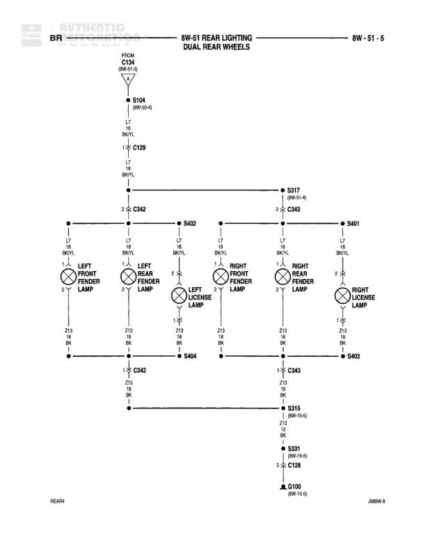

# REAR LIGHTING - DUAL REAR WHEELS

**Notes:** Dual rear wheel configuration. Diagram shows rear lighting circuits including fender lamps and license lamps on both left and right sides. JBBW-9 reference at bottom right.

## Components

| Component | Ref | Connectors | Notes |
|-----------|-----|------------|-------|
| LEFT FRONT FENDER LAMP | Left side |  | Dual rear wheel configuration |
| LEFT REAR FENDER LAMP | Left side |  | Dual rear wheel configuration |
| LEFT LICENSE LAMP | Left side |  | Dual rear wheel configuration |
| RIGHT FRONT FENDER LAMP | Right side |  | Dual rear wheel configuration |
| RIGHT REAR FENDER LAMP | Right side |  | Dual rear wheel configuration |
| RIGHT LICENSE LAMP | Right side |  | Dual rear wheel configuration |

## Wires

| From | To | Wire Code | Gauge | Color | Notes |
|------|-----|-----------|-------|-------|-------|
| C134 (8W-51-3) | S104 | L7 | 18 | BK/YL |  |
| S104 | C129 | L7 | 18 | BK/YL |  |
| C129 | C342 Pin 2 | L7 | 18 | BK/YL |  |
| C342 Pin 2 | S402 | L7 | 18 | BK/YL |  |
| C342 Pin 2 | LEFT FRONT FENDER LAMP | L7 | 18 | BK/YL |  |
| C342 Pin 2 | LEFT REAR FENDER LAMP | L7 | 18 | BK/YL |  |
| S402 | LEFT LICENSE LAMP | L7 | 18 | BK/YL |  |
| S402 | S317 | L7 | 18 | BK/YL |  |
| S317 | C343 Pin 2 | L7 | 18 | BK/YL |  |
| C343 Pin 2 | S401 | L7 | 18 | BK/YL |  |
| C343 Pin 2 | RIGHT FRONT FENDER LAMP | L7 | 18 | BK/YL |  |
| C343 Pin 2 | RIGHT REAR FENDER LAMP | L7 | 18 | BK/YL |  |
| S401 | RIGHT LICENSE LAMP | L7 | 18 | BK/YL |  |
| LEFT FRONT FENDER LAMP | C342 Pin 1 | Z13 | 18 | BK | Ground |
| LEFT REAR FENDER LAMP | S404 | Z13 | 18 | BK | Ground |
| LEFT LICENSE LAMP | S404 | Z13 | 18 | BK | Ground |
| S404 | C342 Pin 1 | Z13 | 18 | BK | Ground |
| C342 Pin 1 | S315 | Z13 | 18 | BK | Ground |
| S315 | S202 | Z13 | 18 | BK | Ground |
| S202 | C126 | Z13 | 18 | BK | Ground |
| C126 | G100 | Z13 | 18 | BK | Ground |
| RIGHT FRONT FENDER LAMP | C343 Pin 1 | Z13 | 18 | BK | Ground |
| RIGHT REAR FENDER LAMP | S403 | Z13 | 18 | BK | Ground |
| RIGHT LICENSE LAMP | S403 | Z13 | 18 | BK | Ground |
| S403 | C343 Pin 1 | Z13 | 18 | BK | Ground |
| C343 Pin 1 | S315 | Z13 | 18 | BK | Ground |

## Splices & Grounds

| ID | Type | Location | Wires Connected | Notes |
|----|------|----------|-----------------|-------|
| S104 | splice | 8W-50-4 | L7 | Continues to C129 |
| S317 | splice | 8W-51-6 | L7 | Connects left and right circuits |
| S402 | splice | Left side | L7 | Splits to license lamp and right side |
| S401 | splice | Right side | L7 | Splits to right lamps |
| S404 | splice | Left side | Z13 | Ground splice for left rear lamps |
| S403 | splice | Right side | Z13 | Ground splice for right rear lamps |
| S315 | splice | 8W-15-5 | Z13 | Ground splice connecting left and right circuits |
| S202 | splice | 8W-15-5 | Z13 | Ground splice |
| G100 | ground | 8W-15-5 |  | Main ground point |

## Cross-References

- 8W-51-3
- 8W-50-4
- 8W-51-6
- 8W-15-5
