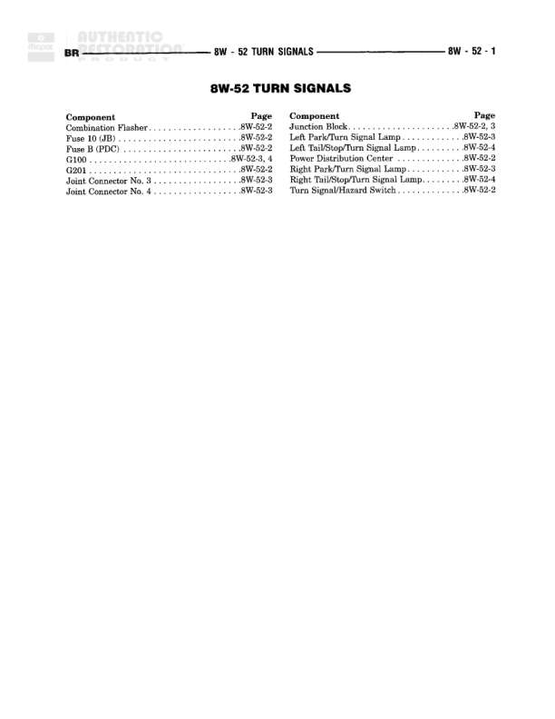

# 8W-52 TURN SIGNALS

**Notes:** This is an index page for the 8W-52 TURN SIGNALS diagram section. It lists all components and their corresponding page references within this diagram set. The actual wiring connections, splices, and detailed component information would be found on the referenced pages (8W-52-2, 8W-52-3, and 8W-52-4).

## Components

| Component | Ref | Connectors | Notes |
|-----------|-----|------------|-------|
| Combination Flasher | 8W-52-2 |  | Index page reference |
| Fuse 10 (JB) | 8W-52-2 |  | Index page reference |
| Fuse 14 | 8W-52-2 |  | Index page reference |
| G100 | 8W-52-3, 4 |  | Ground point reference |
| G201 | 8W-52-2 |  | Ground point reference |
| Joint Connector No. 3 | 8W-52-3 |  | Index page reference |
| Joint Connector No. 4 | 8W-52-3 |  | Index page reference |
| Junction Block | 8W-52-3 |  | Index page reference |
| Left Park/Turn Signal Lamp | 8W-52-3 |  | Index page reference |
| Left Tail/Stop/Turn Signal Lamp | 8W-52-4 |  | Index page reference |
| Power Distribution Center | 8W-52-2 |  | Index page reference |
| Right Park/Turn Signal Lamp | 8W-52-3 |  | Index page reference |
| Right Tail/Stop/Turn Signal Lamp | 8W-52-4 |  | Index page reference |
| Turn Signal/Hazard Switch | 8W-52-2 |  | Index page reference |

## Cross-References

- 8W-52-2
- 8W-52-3
- 8W-52-4
