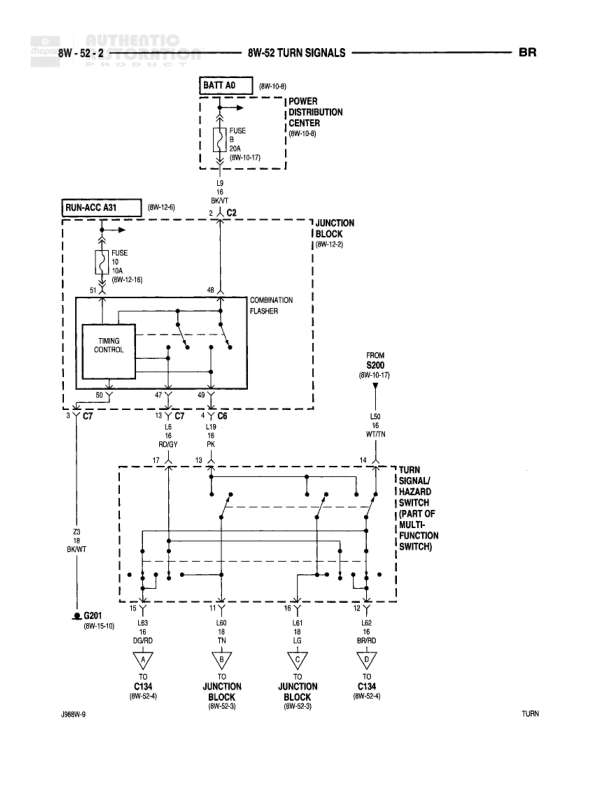

# TURN SIGNALS

**Notes:** This diagram shows the turn signal circuit including battery feed through the power distribution center, timing control with combination flasher in the RUN-ACC module, and distribution to turn signal lamps through the multi-function switch. Reference J1699-0 for additional information. Designation BR appears in top right corner.

## Components

| Component | Ref | Connectors | Notes |
|-----------|-----|------------|-------|
| BATT A0 | 8W-10-0 |  | Battery feed source |
| POWER DISTRIBUTION CENTER | 8W-10-1 |  | Contains FUSE 20A |
| RUN-ACC A31 | 8W-15-0 |  | Contains FUSE 10A and TIMING CONTROL module with COMBINATION FLASHER |
| JUNCTION BLOCK | 8W-10-2 | C7 | None |
| TURN SIGNAL/HAZARD LAMP SWITCH (PART OF MULTI-FUNCTION SWITCH) | None |  | None |
| FROM S200 | 8W-12-17 |  | Connection point |

## Wires

| From | To | Wire Code | Gauge | Color | Notes |
|------|-----|-----------|-------|-------|-------|
| BATT A0 | POWER DISTRIBUTION CENTER | A | None | None | Battery feed to PDC |
| POWER DISTRIBUTION CENTER FUSE 20A | RUN-ACC A31 | A | 12 | BK/YL | 8W-10-17 |
| RUN-ACC A31 FUSE 10A | JUNCTION BLOCK | L9 | 18 | BK/YL | 8W-10-16, pin B1 |
| JUNCTION BLOCK pin 48 | COMBINATION FLASHER | None | None | None | Internal connection |
| COMBINATION FLASHER | TIMING CONTROL pin 87 | None | None | None | Internal connection |
| TIMING CONTROL pin 87 | TIMING CONTROL pin 49 Y | None | None | None | Internal connection |
| TIMING CONTROL pin 49 Y | C7 pin 85 Y | None | None | None | Internal connection |
| C7 | L8 PK RD/WT | L8 | 18 | RD/WT | None |
| L8 RD/WT | TURN SIGNAL/HAZARD LAMP SWITCH pin 19 BK/WT | L8 | 18 | RD/WT | None |
| TURN SIGNAL/HAZARD LAMP SWITCH pin 19 BK/WT | pin 10 L19 PK | L19 | 18 | PK | None |
| L19 PK | L40 JUNCTION BLOCK | L19 | 18 | PK | Pin L40 |
| TURN SIGNAL/HAZARD LAMP SWITCH | pin 11 L40 WT/TN | L40 | 18 | WT/TN | None |
| L40 WT/TN | FROM S200 | L40 | 18 | WT/TN | 8W-12-17 |
| TURN SIGNAL/HAZARD LAMP SWITCH | pin 12 Y L41 LG | L41 | 18 | LG | None |
| L41 LG | JUNCTION BLOCK | L41 | 18 | LG | None |
| TURN SIGNAL/HAZARD LAMP SWITCH | pin 13 L42 BR/RD | L42 | 18 | BR/RD | None |
| L42 BR/RD | C134 | L42 | 18 | BR/RD | 8W-53-4 |
| L40 JUNCTION BLOCK | C134 | L40 | 18 | WT/TN | 8W-53-4 |
| JUNCTION BLOCK | C134 | L19 | 18 | PK | 8W-53-4 |
| L41 JUNCTION BLOCK | C134 | L41 | 18 | LG | 8W-53-4 |

## Splices & Grounds

| ID | Type | Location | Wires Connected | Notes |
|----|------|----------|-----------------|-------|
| G301 | ground | Below RUN-ACC A31 |  | 8W-10-10 |

## Cross-References

- 8W-10-0
- 8W-10-1
- 8W-10-2
- 8W-10-10
- 8W-10-16
- 8W-10-17
- 8W-12-17
- 8W-15-0
- 8W-53-3
- 8W-53-4
