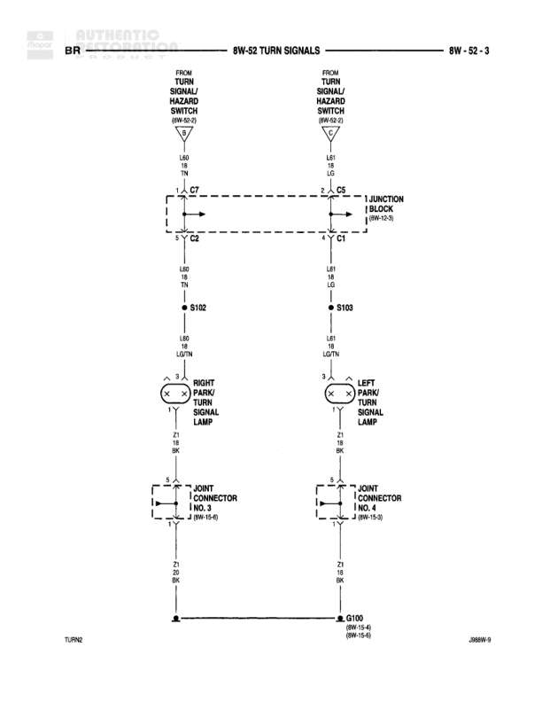

# TURN SIGNALS

**Notes:** Diagram shows turn signal circuit from turn signal/hazard switch through junction block to front park/turn signal lamps. Ground connections route through joint connectors to common ground G100. Reference: 2B8W-9, TURN2

## Components

| Component | Ref | Connectors | Notes |
|-----------|-----|------------|-------|
| Turn Signal/Hazard Switch | Left side | C7 | Left turn signal control |
| Turn Signal/Hazard Switch | Right side | C5 | Right turn signal control |
| Junction Block | Center | C7, C5, C4, C1 | Central connection point |
| Right Park/Turn Signal Lamp | Left bottom |  | Front right turn signal |
| Left Park/Turn Signal Lamp | Right bottom |  | Front left turn signal |
| Joint Connector No. 5 | Left rear circuit |  | J NO. 5, 2 (BW-15-6) |
| Joint Connector No. 4 | Right rear circuit |  | J NO. 4, 5 (BW-15-5) |

## Wires

| From | To | Wire Code | Gauge | Color | Notes |
|------|-----|-----------|-------|-------|-------|
| Turn Signal/Hazard Switch (Left) | C7 | L40 | 18 | LB | None |
| Turn Signal/Hazard Switch (Right) | C5 | L41 | 18 | LB | None |
| C7 | Junction Block | None | None | None | Dashed line connection |
| C5 | Junction Block | None | None | None | Dashed line connection |
| C4 | S102 | L40 | 18 | LB | None |
| C1 | S103 | L41 | 18 | LB | None |
| S102 | Right Park/Turn Signal Lamp pin 1 | L40 | 18 | LB/TN | None |
| S103 | Left Park/Turn Signal Lamp pin 1 | L41 | 18 | LB/TN | None |
| Right Park/Turn Signal Lamp pin 2 | Joint Connector No. 5 | Z1 | 18 | BK | None |
| Left Park/Turn Signal Lamp pin 2 | Joint Connector No. 4 | Z1 | 18 | BK | None |
| Joint Connector No. 5 | G100 | Z1 | 18 | BK | None |
| Joint Connector No. 4 | G100 | Z1 | 18 | BK | None |

## Splices & Grounds

| ID | Type | Location | Wires Connected | Notes |
|----|------|----------|-----------------|-------|
| S102 | splice | Left circuit, below C4 | L40 | Splits to right park/turn signal lamp |
| S103 | splice | Right circuit, below C1 | L41 | Splits to left park/turn signal lamp |
| G100 | ground | Bottom center |  | Common ground point, (8W-15-6) (8W-15-6) |

## Cross-References

- 8W-15-6
- 8W-15-5
